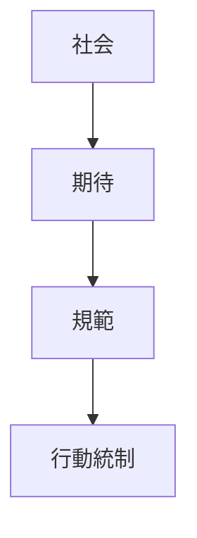

# 規範構造

規範構造とは、社会において何が適切で何が逸脱かを定める期待とルールの構造である。

---

# 基本構造

---

# 規範の機能

- 行動予測可能性
- 協力の促進
- 秩序維持
- 逸脱の抑制

---

# 規範の種類

- 慣習
- 道徳
- 礼儀
- 法
- 組織規則

---

# 関連

[[02_zettelkasten/01_knowledge/world_model/pattern/social/structure/社会統合構造]]  
[[02_zettelkasten/01_knowledge/world_model/pattern/state/structure/制度構造]]