# Kernel - Principle / Law Correspondence

| Kernel  | 定義（メタ）                   | 対応する Principle / Law / Rule         | 主な分野          | 代表的 Mechanism   |
| ------- | ------------------------ | ----------------------------------- | ------------- | --------------- |
| 保存      | ある量が変換されても総量として維持される     | エネルギー保存則、運動量保存則、質量保存則、電荷保存則、熱力学第一法則 | 物理、工学、経済      | 資源配分、収支均衡、蓄積    |
| 平衡      | 系が相殺・調整され、変化が止まるか安定する    | 力学的平衡、化学平衡、熱平衡、ナッシュ均衡、市場均衡          | 物理、経済、社会      | 価格調整、制度安定、恒常性   |
| 拡散      | 量・情報・影響が濃淡差や接続に応じて広がる    | フィックの法則、熱伝導則、情報拡散、感染拡大モデル           | 物理、生物、社会、情報   | 口コミ、炎上、模倣、伝播    |
| フィードバック | 出力が入力へ戻り、系の挙動を調整・増幅する    | 負のフィードバック、正のフィードバック、サイバネティクス制御原理    | システム、生物、社会、心理 | 学習、制御、自己強化、安定化  |
| 相互作用    | 複数主体・要素が互いに影響し合う         | 作用反作用の法則、相互依存、戦略的相互作用、ゲーム理論         | 物理、社会、経済      | 交渉、競争、協力、干渉     |
| 情報      | 不確実性を減らす差異・信号・記述         | ベイズ更新、シャノン情報量、シグナリング理論、情報非対称        | 数学、情報、経済、認知   | 学習、推論、期待形成、認知   |
| 制約      | 行為や変化の可能域を限定する条件         | 制約最適化、予算制約、保存制約、境界条件、資源制約           | 数学、経済、工学、社会   | 選択、設計、適応、ボトルネック |
| 最適化     | 複数選択肢の中で目的関数を最良化する       | 最小作用の原理、効用最大化、費用最小化、最適制御            | 物理、経済、工学      | 意思決定、経路選択、設計改善  |
| 非線形     | 入力と出力が比例せず、閾値・増幅・相転移が起こる | カオス理論、収穫逓減、相転移、臨界現象                 | 数学、物理、社会      | バブル、炎上、感情増幅、崩壊  |
| 対称性     | 変換しても本質が不変である            | 相対性原理、ゲージ対称性、ネーターの定理、対称性保存          | 物理、数学         | 保存則の導出、構造の不変性   |
| 変換      | ある形式・状態・表現が別の形へ写される      | エネルギー変換、相転移、関数変換、表現変換               | 物理、数学、情報      | 翻訳、制度変換、転化、代謝   |
| 階層      | 要素がレベル差をもって組織化される        | 階層組織論、スケール分離、上位下位関係                 | 生物、社会、組織、システム | 統治、分業、命令系統、抽象化  |
| ネットワーク  | 要素が結節点と連結によって構成される       | グラフ理論、六次の隔たり、中心性、スモールワールド           | 数学、社会、情報      | 伝播、連結、媒介、支配     |
| 自己組織化   | 外部の強い中央制御なしに秩序が形成される     | 自己組織化原理、散逸構造、創発                     | 物理、生物、社会      | 群れ形成、市場形成、都市形成  |
| 創発      | 部分の単純相互作用から上位秩序が現れる      | 創発論、散逸構造論、複雑系                       | システム、生物、社会    | 規範形成、秩序形成、文化形成  |
| 適応      | 環境や条件に応じて内部状態や行動が変化する    | 進化論、自然選択、学習理論、期待調整                  | 生物、心理、社会、経済   | 学習、制度進化、戦略変更    |
| 選択      | 複数可能性から一部が採用される          | 自然選択、合理的選択、淘汰、意思決定理論                | 生物、経済、心理      | 採用、不採用、競争、淘汰    |
| 因果      | ある条件・事象が別の事象を生む          | 因果律、十分条件・必要条件、介入主義的因果               | 哲学、科学一般       | 説明、予測、介入、設計     |
| 確率      | 結果が確定でなく分布として記述される       | 大数の法則、中心極限定理、ベイズ則                   | 数学、統計、経済、心理   | リスク評価、期待形成、推定   |
| 循環      | 系が閉じた流れを持ち、反復運動する        | 循環過程、景気循環、物質循環、PDCA                 | 生物、経済、組織      | 再生産、反復、更新、習慣    |
| 経路依存    | 過去の選択が将来の選択肢を拘束する        | 経路依存、ロックイン、履歴効果                     | 歴史、制度、技術、経済   | 制度固定、規格固定、慣性    |

```mermaid
graph TD

  K[Kernel]

  K --> K1[保存]
  K --> K2[平衡]
  K --> K3[拡散]
  K --> K4[フィードバック]
  K --> K5[情報]
  K --> K6[制約]
  K --> K7[最適化]
  K --> K8[非線形]
  K --> K9[対称性]
  K --> K10[自己組織化]
  K --> K11[適応]
  K --> K12[経路依存]

  K1 --> L11[エネルギー保存則]
  K1 --> L12[運動量保存則]
  K1 --> L13[熱力学第一法則]

  K2 --> L21[力学的平衡]
  K2 --> L22[熱平衡]
  K2 --> L23[市場均衡]
  K2 --> L24[ナッシュ均衡]

  K3 --> L31[フィックの法則]
  K3 --> L32[熱伝導則]
  K3 --> L33[情報拡散]

  K4 --> L41[負のフィードバック]
  K4 --> L42[正のフィードバック]
  K4 --> L43[サイバネティクス]

  K5 --> L51[ベイズ更新]
  K5 --> L52[シャノン情報量]
  K5 --> L53[情報非対称]

  K6 --> L61[境界条件]
  K6 --> L62[予算制約]
  K6 --> L63[制約最適化]

  K7 --> L71[最小作用の原理]
  K7 --> L72[効用最大化]
  K7 --> L73[費用最小化]

  K8 --> L81[カオス]
  K8 --> L82[相転移]
  K8 --> L83[閾値効果]

  K9 --> L91[相対性原理]
  K9 --> L92[ネーターの定理]

  K10 --> L101[散逸構造]
  K10 --> L102[創発]
  K10 --> L103[複雑系]

  K11 --> L111[自然選択]
  K11 --> L112[学習理論]
  K11 --> L113[期待調整]

  K12 --> L121[ロックイン]
  K12 --> L122[履歴効果]
```

