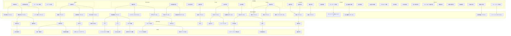

```mermaid
flowchart TB

%% ===== KERNEL LAYER =====
subgraph KERNEL

subgraph Physics
K1[相互作用原理]
K2[エネルギー原理]
K3[保存原理]
K4[対称性原理]
K5[最小作用原理]
K6[エントロピー増大原理]
K7[時間原理]
K8[非線形性原理]
K9[拡散原理]
K10[平衡化原理]
K11[臨界点原理]
K12[フィードバック原理]
end

subgraph Complex
K13[階層原理]
K14[ネットワーク原理]
K15[自己組織化原理]
K16[創発原理]
end

subgraph Evolution
K17[変異原理]
K18[選択原理]
K19[進化原理]
end

subgraph Human
K20[認知原理]
end

subgraph Social
K21[希少性原理]
K22[交換原理]
K23[協力原理]
K24[競争原理]
end

subgraph Information
K25[情報原理]
K26[不確実性原理]
end

subgraph Space
K27[空間原理]
end

subgraph System
K28[制約原理]
K29[資源制約原理]
K30[トレードオフ原理]
K31[スケール原理]
end

end


%% ===== MECHANISM LAYER =====
subgraph MECHANISM

M1[フィードバックメカニズム]
M2[臨界転移メカニズム]
M3[自己組織化メカニズム]
M4[ネットワーク形成メカニズム]

M5[進化メカニズム]
M6[適応メカニズム]
M7[探索メカニズム]

M8[注意メカニズム]
M9[学習メカニズム]
M10[認知バイアスメカニズム]

M11[情報拡散メカニズム]
M12[情報非対称メカニズム]
M13[シグナリングメカニズム]
M14[評判メカニズム]

M15[交換メカニズム]
M16[協力メカニズム]
M17[競争メカニズム]
M18[信頼形成メカニズム]

M19[集積メカニズム]
M20[空間拡散メカニズム]
M21[中心形成メカニズム]

M22[制度形成メカニズム]
M23[制度変化メカニズム]
M24[ルール執行メカニズム]

end


%% ===== PATTERN LAYER =====
subgraph PATTERN

P1[バズ]
P2[炎上]
P3[口コミ拡散]

P4[市場競争]
P5[独占]
P6[寡占]

P7[都市集積]
P8[都市中心形成]
P9[郊外化]

P10[技術進化]
P11[制度慣性]
P12[経路依存]

P13[ブランド形成]
P14[評判社会]

P15[社会協力]
P16[フリーライダー]

end


%% ===== CASE LAYER =====
subgraph CASE

C1[SNS炎上事件]
C2[インフルエンサー拡散]
C3[観光地口コミ拡散]

C4[スマートフォン市場競争]
C5[石油産業寡占]

C6[東京一極集中]
C7[駅前商業集積]
C8[郊外ショッピングモール]

C9[産業革命]
C10[都市形成史]

C11[ブランド成功事例]
C12[観光ブランド形成]

end


%% ===== CONNECTIONS =====

%% Kernel → Mechanism
K12 --> M1
K11 --> M2
K15 --> M3
K14 --> M4

K17 --> M5
K18 --> M5
K19 --> M6
K26 --> M7

K20 --> M8
K20 --> M9
K20 --> M10

K25 --> M11
K26 --> M12
K25 --> M13
K25 --> M14

K22 --> M15
K23 --> M16
K24 --> M17
K23 --> M18

K27 --> M19
K27 --> M20
K27 --> M21

K28 --> M22
K28 --> M23
K28 --> M24


%% Mechanism → Pattern
M11 --> P1
M11 --> P2
M11 --> P3

M17 --> P4
M17 --> P6
M15 --> P5

M19 --> P7
M21 --> P8
M20 --> P9

M5 --> P10
M23 --> P11
M23 --> P12

M14 --> P13
M14 --> P14

M16 --> P15
M16 --> P16


%% Pattern → Case
P2 --> C1
P1 --> C2
P3 --> C3

P4 --> C4
P6 --> C5

P7 --> C6
P7 --> C7
P9 --> C8

P10 --> C9
P11 --> C10

P13 --> C11
P13 --> C12

```