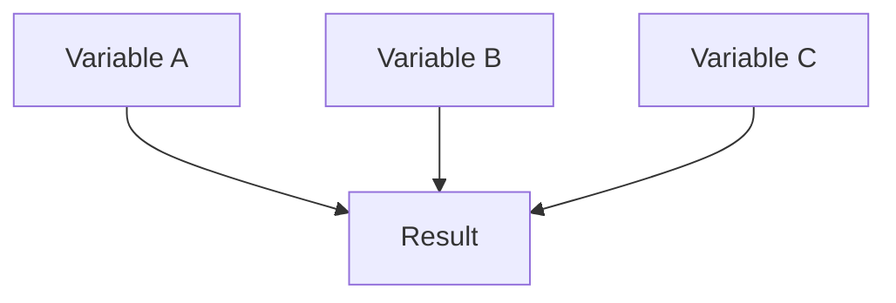
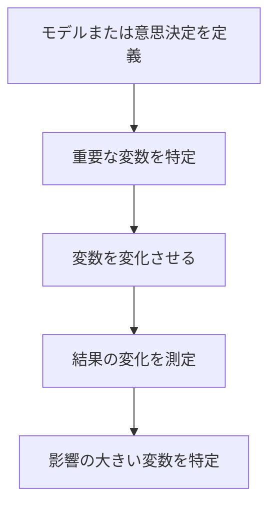

# 概要

Sensitivity Analysis（感度分析）は、モデルや意思決定の結果が  どの変数の変化にどれだけ影響されるかを分析するフレームワークである。
多くの意思決定では、結果は複数の変数に依存する。

結果 = f(複数の変数)

Sensitivity Analysisは、 どの変数が結果を支配しているかを特定する。

---

# Sensitivityの基本構造

各変数を変化させ、結果への影響を比較する。

---

# 手順

---

# 分析のポイント

Sensitivity Analysisでは次を確認する。

## 重要変数

どの変数が結果を最も左右するか

## 安定性

小さな変化で結果が大きく変わらないか

## リスク

結果が特定条件に強く依存していないか

---

# 典型例

例：売上

売上 = 客数 × 客単価

分析

- 客数 +10%    
- 客単価 +10%

どちらが売上に影響するかを見る。

---

例：投資

利益 = 売上 − コスト

変数

- 需要    
- 価格    
- 原価

---

# 他フレームとの関係

| フレーム                         | 役割      |
| ---------------------------- | ------- |
| [[02_zettelkasten/02_process/methods/analysis/費用便益分析]] | 利益比較    |
| [[02_zettelkasten/02_process/methods/analysis/シナリオ分析]]      | 未来の分岐   |
| [[02_zettelkasten/02_process/methods/analysis/感度分析]]  | 重要変数の特定 |
| [[02_zettelkasten/02_process/methods/analysis/ボトルネック分析]]  | 制約の特定   |

---

# 重要性

多くの失敗は重要でない変数に注目することで起きる。
Sensitivity Analysisは何が結果を支配しているかを明確にする。

---

# 関連ノート

- [[02_zettelkasten/02_process/methods/analysis/費用便益分析]]    
- [[02_zettelkasten/02_process/methods/analysis/シナリオ分析]]    
- [[02_zettelkasten/02_process/methods/analysis/意思決定フレームワーク]]    
- [[02_zettelkasten/02_process/methods/analysis/ボトルネック分析]]    
- [[02_zettelkasten/02_process/methods/analysis/00 Analysis Framework hub]]