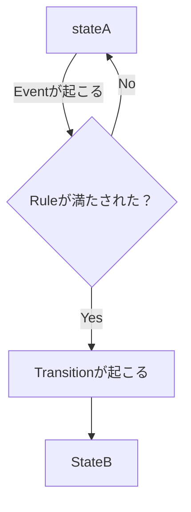

# 概要

State Transition Model は、対象が取りうる状態（state）と、その状態間の遷移（transition）を表すモデル
である。
時間経過に伴う状態変化の構造を明確にするために使う。
主に
- 業務プロセス
- 契約
- システム
- 顧客行動
の分析に有効。
# 基本構造
State Transition Model は次の4要素で構成される

| 要素         | 意味        |
| ---------- | --------- |
| State      | ある時点の状態   |
| Transition | 状態の変化     |
| Event      | 状態変化のトリガー |
| Rule       | 遷移の条件     |

# 基本構造図

# モデルの用途
State Transition Model は、時間構造を持つシステムの理解に使う。  
- 契約  
- 物流  
- 業務フロー  
- 顧客行動  
- システム
# 利点  
- 状態を明確にできる  
- 業務フローを整理できる  
- 不整合を発見できる  
- 自動化設計が可能
# よくある問題
## 状態が定義されていない
- 多くの業務は、状態・遷移条件が曖昧。そのため  責任・手続・権限が混乱する。
# 応用
State Transition Modelは、次の設計の基礎になる。  
- Workflow  
- BPM  
- Event driven system  
- 業務OS  
- 法律構造
# 関連ノート  
- [[Contract Lifecycle]]  
- [[Workflow Modeling]]  
- [[State Machine]]