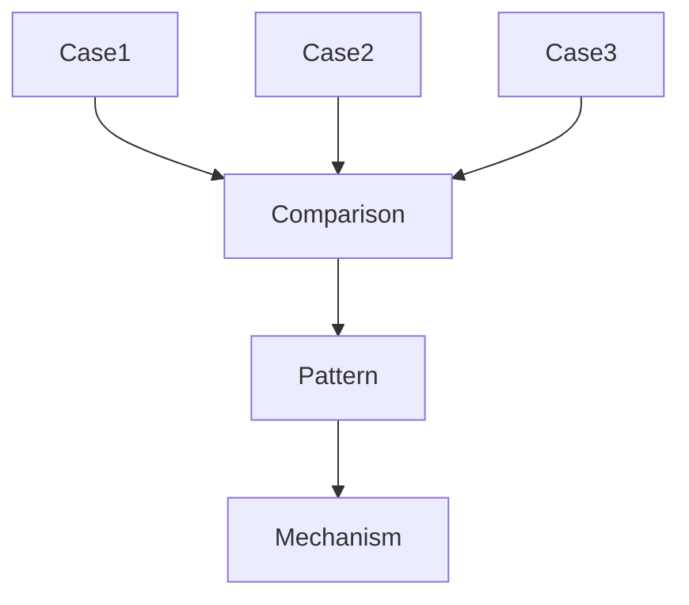

# Case Comparison Method

Case Comparison Method は、複数の Case を比較することで Pattern と Mechanism を抽出する分析手法である。

Vaultにおいて Comparison は

Case
↓
Pattern

を接続する中間装置として機能する。

---

# 目的

Case Comparison の目的は次の3つである。

1 比較による共通構造の発見  
2 Pattern の抽出  
3 Mechanism 仮説の生成  

---

# 基本構造

---

# 運用ルール

## Rule 1 最低3ケース

比較には最低3つの Case を用いる。

理由

2ケース → 偶然の一致  
3ケース → Pattern の可能性

---

## Rule 2 比較軸を明示する

Comparison ノートでは必ず比較軸を設定する。

例

- Actor
- Structure
- Incentive
- Information
- Outcome

---

## Rule 3 観察と解釈を分離する

Case Comparison では

Observation  
Interpretation

を分離する。

Observation

- 事実
- 行動
- 制度

Interpretation

- Pattern
- Mechanism

---

## Rule 4 Pattern は仮置き

Comparison で出る Pattern は仮説とする。

Pattern ノートで確定する。

---

## Rule 5 Mechanism 仮説を出す

Comparison の最終目的は Mechanism の候補を作ることである。

---

# Comparison ノートテンプレート

## Compared Cases

- [[Case1]]
- [[Case2]]
- [[Case3]]

---

# Comparison Dimensions

| 観点 | Case1 | Case2 | Case3 |
|---|---|---|---|
| Actor |  |  |  |
| Structure |  |  |  |
| Incentive |  |  |  |
| Information |  |  |  |
| Outcome |  |  |  |

---

# Emerging Pattern

候補パターン

- Pattern A
- Pattern B

---

# Possible Mechanisms

候補メカニズム

- Mechanism A
- Mechanism B

---

# Open Questions

- 未解決の問題
- 追加 Case