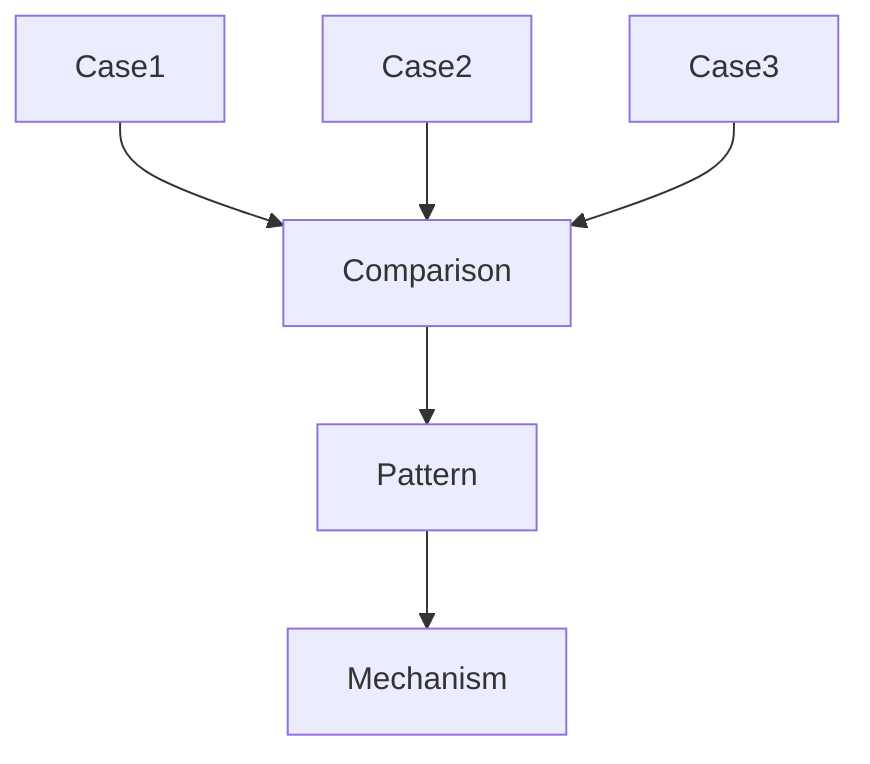

# Case Comparison

Case Comparison は、複数の Case を比較することで
共通 Pattern と Mechanism の候補を発見する分析手法である。

Comparison は Vault において

Case
↓
Pattern

を接続する中間プロセスとして機能する。

---

# 基本構造

---

# Compared Cases

- [[Case1]]
- [[Case2]]
- [[Case3]]

---

# Comparison Dimensions

| 観点 | Case1 | Case2 | Case3 |
|---|---|---|---|
| Actor | | | |
| Structure | | | |
| Incentive | | | |
| Information | | | |
| Trigger | | | |
| Outcome | | | |

---

# Observations

Case 間で観察された共通点・相違点を書く。

---

# Emerging Patterns

比較から見えてくる Pattern 候補

- Pattern A
- Pattern B

---

# Possible Mechanisms

Pattern を説明する Mechanism 候補

- Mechanism A
- Mechanism B

---

# Related Notes

- [[99_oldzettelkasten/04_knowledge_graph/Pattern]]
- [[99_oldzettelkasten/04_knowledge_graph/Mechanism]]

---

# Open Questions

- 追加すべき Case
- 未解決の差異