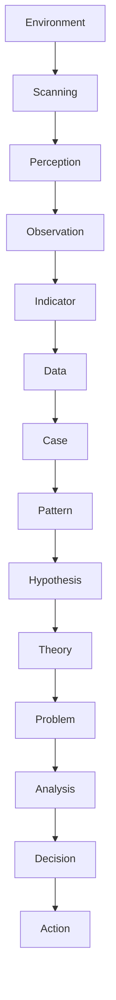

  # Observation Structure  
  
Observation Structure  は、現実の出来事を観察を通じデータ化し、事例をパターンに整理する構造である。  
  
---  
  
# 全体構造  
  

---

# 各層の役割
# 1 Reality
現実世界。
例
- 市場
- 社会
- 組織
- 行動
# 2 Observation
観察。
例
- 人の行動
- 出来事
- 現象
# 3 Indicator（指標）
観察を測定するルール。
例
- 観光地研究なら
- 滞在時間
- 回遊率
- 密度
ここがないとデータが不安定になります。
# 4 Data
測定された数値。
例
- 30分
- 500人
- 売上100万
# 5 Case（事例）
個別ケース。
例
- 京都
- 金沢
- 奈良
# 6 Pattern
共通構造。
例
歴史都市は滞在時間が長い
# 7 Hypothesis（仮説）
なぜそのパターンが生まれるか。
例
歴史資源密度が高い都市は回遊性が高い
# 8 Theory（理論）
複数仮説を統合した説明。
例
都市魅力 = 象徴性 × 資源密度 × 回遊性
# 9 Problem
理論を現実に適用したときの問題。
例
なぜ観光地Aは滞在時間が短いのか

---

# 各構造

| 構造                                                   | 役割    |
| ---------------------------------------------------- | ----- |
| [[観察構造]]                                             | 現象を記録 |
| [[指標構造]]                                             | 測定方法  |
| [[データ構造]]                                            | 数値・記録 |
| [[事例構造]]                                             | 個別ケース |
| [[パターン構造]]                                           | 共通構造  |
| [[02_zettelkasten/02_process/methods/observation/01_observation/仮説構造\|仮説構造]] | 原因説明  |
