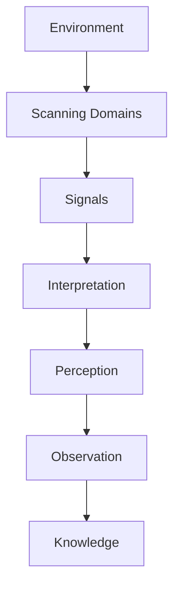

# Scanning Structure

Scanning Structure は、環境変化を探索するための構造である。

Scanning は Observation の前段階であり、どの領域を観察するかを決定する。

---

# 環境領域

- Technology
- Market
- Competition
- Regulation
- Society
- Economy

---

# Signals

- Weak Signals
- Trends
- Disruptions

---

# Flow

# 1 Environment（環境）
観察対象となる世界。
戦略では環境を6領域に分解する。

|領域|内容|
|---|---|
|Technology|技術|
|Market|市場|
|Competition|競争|
|Regulation|規制|
|Society|社会|
|Economy|経済|
これは戦略分析の基本フレームである。
# 2 Scanning Domains（探索領域）
環境のどこを探索するか決める。
## 例
Technology
- 新技術
- AI
- 生産技術
- Market
- 顧客ニーズ
- 市場規模
Competition
- 新規参入
- 競合戦略
# 3 Signals（兆候）
環境変化の兆候。
兆候は3種類ある。

|種類|内容|
|---|---|
|Weak Signal|弱い兆候|
|Trend|トレンド|
|Disruption|大変化|

例
Weak Signal：新しいサービス
Trend：人口高齢化
Disruption：AI革命
# 4 Interpretation（解釈）
兆候の意味を考える。
例
AI普及
→ 自動化
→ 労働市場変化
# 5 Perception（知覚）
解釈された現象が認識される。
ここで初めて気づきが生まれる。
# 6 Observation（観察）
認識された現象を記録、測定、データ化する。
Scanning の時間軸

|時間|内容|
|---|---|
|短期|現在の変化|
|中期|トレンド|
|長期|構造変化|
# Scanning の質問
環境を見るときはこの質問を使う
- 何が変化しているか
- 誰が新しく参入しているか
- 技術はどう変わるか
- 顧客行動はどう変わるか
- 規制はどう変わるか