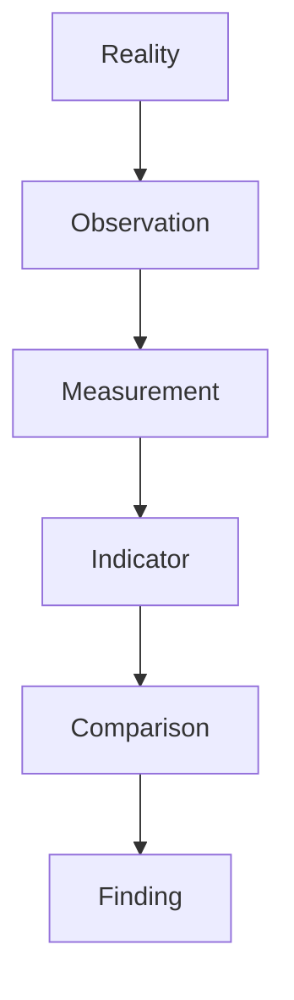
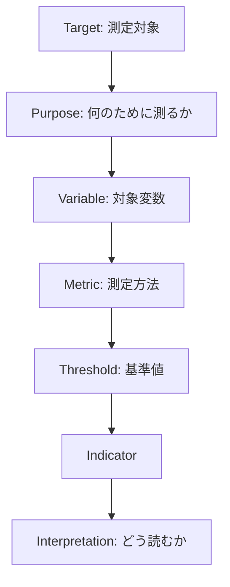

# Indicator Structure

Indicator Structure は、観察対象を意思決定可能な形に変換するための指標設計の構造である。
Measurement が「数値を得ること」だとすれば、Indicator は「その数値を何の意味で使うか」を定義する。

---

# 概要

現実はそのままでは複雑すぎる。
そのため観察対象を、比較・監視・判断に使える形へ圧縮する必要がある。
その圧縮形が Indicator である。

---

# 思考OS内の位置

# 基本構造

# 構成要素
## 1. Target（対象）

何を見たいのか。

例
- 売上    
- 離職    
- 顧客満足    
- 学習進捗    
- 政策成果    

---

## 2. Purpose（目的）

なぜその指標が必要か。

例
- 状態把握    
- 早期警戒    
- 比較    
- 改善効果測定    
- 意思決定支援    

---

## 3. Variable（変数）

対象のどの側面を取るか。

例
- 売上総額    
- リピート率    
- 離脱率    
- 稼働率    
- 通過率    

---

## 4. Metric（測定方法）

どう測るか。

例
- 件数    
- 比率    
- 平均    
- 中央値    
- 増減率    
- 指数化    

---

## 5. Threshold（基準）

どこから異常・良好・注意とみなすか。

例
- 離職率10%以上で注意    
- 売上前年差-5%以上で警戒    
- 稼働率85%以上で逼迫    

---

## 6. Interpretation（解釈）

その値が何を意味するか。

例
- 高い = 良い、とは限らない    
- 低い = 効率的、とは限らない    
- 単独では判断できず、他指標との組み合わせが必要    

---

# 指標の主要類型
## 状態指標

現在の状態を表す。

例
- 現在売上    
- 在庫量    
- 契約件数    

## 変化指標

変化の方向や速度を表す。

例
- 前月比    
- 成長率    
- 増減幅    

## 効率指標

投入と成果の関係を表す。

例
- 一人当たり売上    
- ROAS    
- 時間当たり処理件数    

## 品質指標

成果の中身を表す。

例
- 不良率    
- クレーム率    
- 満足度    

## リスク指標

危険や不安定性を表す。

例
- 事故率    
- 変動率    
- 依存度    
- 集中度    

---

# 良い指標の条件

- 定義が明確    
- 反復測定できる    
- 比較可能    
- 操作可能    
- 歪みにくい    
- 目的と対応している    

---

# 悪い指標の典型
## 1. 代理指標の暴走

測りやすいものだけを測って、本質を取り逃がす。

## 2. 解釈不能

数字はあるが、何を意味するか決めていない。

## 3. 基準不在

閾値や比較対象がなく、良し悪しを判断できない。

## 4. 単独依存

1つの指標だけで全体を判断する。

---

# 典型パターン

## モニタリング型

定点観測して変化を追う。

## アラート型

閾値越えを検知する。

## 比較型

部門間、地域間、期間間で比較する。

## 改善型

施策前後の差を見る。

---

# 例

## 例1：売上管理

- Target: 売上状況    
- Purpose: 事業状態の把握    
- Variable: 月次売上    
- Metric: 金額 / 前年同月比    
- Threshold: 前年比95%未満で注意    
- Interpretation: 一時的要因か構造変化かを要確認
    

## 例2：離職管理

- Target: 人材安定性    
- Purpose: 組織リスクの早期把握    
- Variable: 月次離職率    
- Metric: 離職者数 / 平均在籍者数    
- Threshold: 3か月平均で10%以上    
- Interpretation: 採用問題か配置問題かを切り分ける
    
---

# 関連ノート

[[Measurement]]  
[[comparison structure]]  
[[anomaly detection structure]]  
[[指標構造]]  
[[データ構造]]  
[[Problem Finding Structure]]