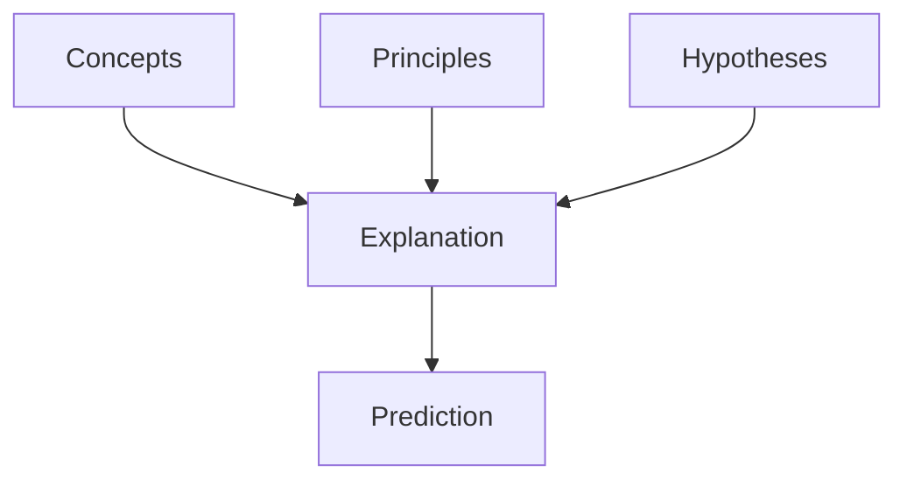

# Theory Structure

Theory Structure は、複数の Hypothesis（仮説）を統合し、現象を体系的に説明する構造である。

Theory は Pattern を説明し、未来の現象を予測するための枠組みとなる。

---

# 位置

Observation Structure の最上位。

Reality
↓
Observation
↓
Indicator
↓
Data
↓
Case
↓
Pattern
↓
Hypothesis
↓
Theory

---

# Theory の基本構造

理論は次の要素で構成される。

## 1 対象

理論が扱う現象。

例
- 市場
- 観光
- 組織
- 社会

---

## 2 概念

理論を構成する基本概念。

例
- 資源
- 密度
- 競争
- インセンティブ

---

## 3 原理

現象を説明する基本法則。

例
- 需要と供給
- 競争原理
- 進化原理

---

## 4 仮説群

理論を構成する仮説。

例
資源密度 → 回遊性 → 滞在時間

---

## 5 予測

理論から導かれる予測。

例
資源密度が高い都市では、滞在時間が長くなる。

---

# Theory の形式

Theory は次の形式で表される。

---

# Theory のタイプ

## 因果理論

A → B

例
価格低下 → 需要増加

---

## 構造理論

複数要因

A + B + C → D

---

## システム理論

相互作用

A ↔ B ↔ C

---

# Theory の品質

良い理論は次の条件を満たす。

- 説明力  
- 予測力  
- 一般性  
- 単純性  

---

# Theory の役割

Theory は、

Pattern
↓
Hypothesis
↓
Theory
↓
Problem

をつなぐ。

理論は現象を説明し、
新しい問題を発見する。

---

# Observation Structure 内の位置

Reality
↓
Observation
↓
Indicator
↓
Data
↓
Case
↓
Pattern
↓
Hypothesis
↓
Theory