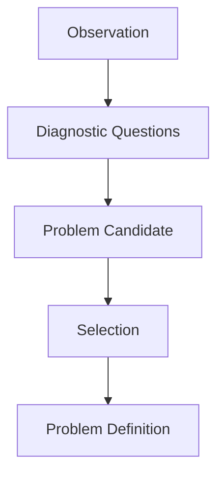
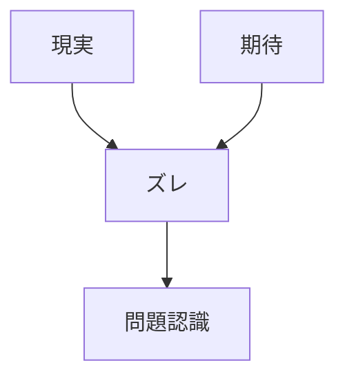
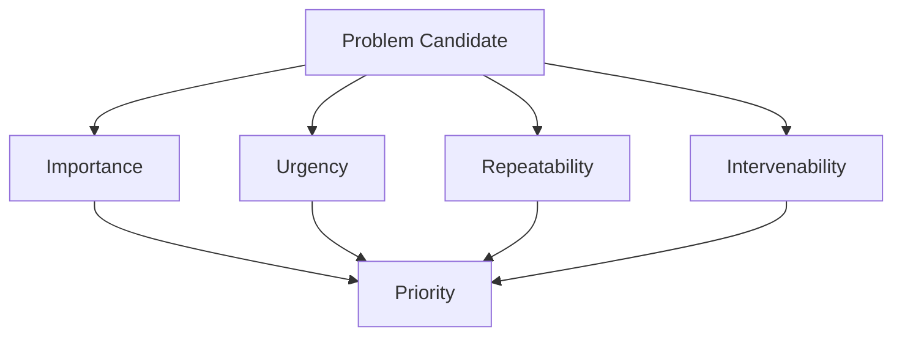
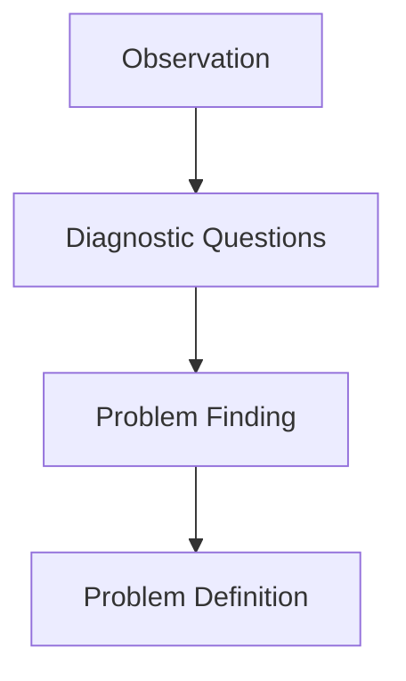

# Problem Finding Structure
Problem Finding は、観察された現実の中から、分析と介入に値する問題を発見する構造である。
Observation と Diagnostic Questions を受けて、後続の Problem Definition に渡すべき問題候補を抽出する。
# 概要
## 定義
Problem Finding とは、観察された現象の中から
- 異常
- 欠落
- 損失
- 機会逸失
- 構造的不整合
を見出し、
それを「扱うべき問題」として認識する過程である。
## 例
- 京都駅で外国人観光客が特定方向に偏って流れている
- バス乗務員が休憩を取れていない
- 商談で顧客が価格の話だけして離脱する
- 組織で責任の所在が曖昧になっている
構造
## 観察対象
- 異常または機会
- 問題候補
- 重要度判断
- 後続処理対象
# フロー

# 位置づけ
## 定義
Problem Finding は、Observation と Problem Definition の中間工程である。
Observation が「何が起きているか」を扱い、Problem Definition が「その問題をどう定義するか」を扱うのに対し、Problem Finding は「そもそも何を問題として取り上げるか」を扱う。
## 構造
1. bservation = 現実の記録
2. Diagnostic Questions = 問いの投入
3. Problem Finding = 問題候補の抽出
4. Problem Definition = 問題の定式化
# 問題の発見基準
## 定義
問題は、単なる不快や違和感ではなく、目的・期待・基準・構造とのズレとして発見される。
## 構造
- 期待とのズレ
- 目的とのズレ
- 基準違反
- 機会損失
- 持続不可能性
## 例
- 本来休めるはずなのに休めていない
- 本来流れるべき導線に流れていない
- 本来売れるはずの顧客に届いていない
- 本来機能すべき制度が空回りしている
## フロー

# 問題候補の類型
## 定義
Problem Finding では、まず現象を問題候補として類型化する。
## 構造
- 異常型
- 欠落型
- 制約型
- 損失型
- 機会型
- 構造不整合型
## 異常型
### 定義
通常状態から外れた現象。
### 例
- 突然離職率が上がった
- 特定地点だけ人流が偏る
## 欠落型
### 定義
本来存在すべき要素が存在しない。
### 例
- 案内導線がない
- 引継ぎルールがない
## 制約型
### 定義
目的達成を阻む制約が強く働いている。
### 例
- 人手不足で休憩が取れない
- 予算不足で改善不能
## 損失型
### 定義
価値・資源・機会が失われている。
### 例
- 顧客が途中離脱する
- 睡眠不足で安全余力が失われる
## 機会型
### 定義
現象の中に未活用の価値がある。
### 例
- 観光客の集中地点に新サービスを設計できる
- 相談の多いテーマを商品化できる
## 構造不整合型
### 定義
制度・役割・インセンティブなどの配置が噛み合っていない。
### 例
- 責任だけあり権限がない
- 現場評価と経営目標が矛盾する
# 問題発見の観点
## 定義
Problem Finding は、複数の観点から問題候補を見ることで精度が上がる。
## 構造
- 目的観点
- 行動観点
- 資源観点
- 制度観点
- 情報観点
- インセンティブ観点
- 時間観点
- 目的観点
## 定義
何の目的に照らして問題なのかを見る。
### 例
- 安全確保という目的から見て問題か
- 回遊促進という目的から見て問題か
## 行動観点
### 定義
誰のどの行動が詰まっているかを見る。
## 資源観点
### 定義
人・時間・金・情報などの不足を見る。
## 制度観点
### 定義
ルールや役割設計の不備を見る。
## 情報観点
### 定義
認知不足・伝達不足・判断材料不足を見る。
## インセンティブ観点
### 定義
人がそう動く理由があるかを見る。
## 時間観点
### 定義
短期異常か、慢性問題かを見る。
# 問題候補の選別
### 定義
発見された問題候補をすべて扱うのではなく、
優先順位を付けて次段に送る必要がある。
## 構造
- 重要性
- 緊急性
- 再現性
- 介入可能性
- 波及性
## 例
- 毎日発生し安全に直結する問題は優先度が高い
- 一度きりで再現性がない問題は保留
- 原因が明らかで介入可能な問題は先に扱う
## フロー

# Problem Finding の出力
## 定義
Problem Finding の出力は、「問題の答え」ではなく 問題として扱うべき対象の一覧である。
## 構造
- 問題名
- 問題類型
- 問題の兆候
- 影響範囲
- 優先度
- 次工程
## 例
- 問題名：外国人観光客の導線偏在
- 類型：構造不整合型
- 兆候：特定方向への集中
- 影響範囲：駅周辺案内・回遊性
- 優先度：中
- 次工程：Problem Definition
##Observation との違い
###定義
Observation は事実を記録する。
Problem Finding は、その事実の中から問題を抽出する。
###  例
- Observation「観光客が京都タワー方向へ集中している」
- Problem Finding「駅周辺の案内導線が偏在し、回遊性が阻害されている可能性がある」
# Problem Definition との違い
## 定義
Problem Finding は 問題候補の発見であり、Problem Definition は 問題の境界・目的・対象・評価軸の定式化である。
## 構造
- Problem Finding = 問題を見つける
- Problem Definition = 問題を定める
# 原則
## 構造
- 違和感だけで終わらせない
- 期待や目的とのズレとして捉える
- 問題候補を複数出す
- すぐ原因と断定しない
- 次段に渡せる形に整える
# Summary
## 定義
Problem Finding は、観察された現実の中から、扱うべき問題を抽出する構造である。
## 構造
- 観察を受ける
- 問いを当てる
- 問題候補を出す
- 優先順位を付ける
- Problem Definition に渡す
## フロー
