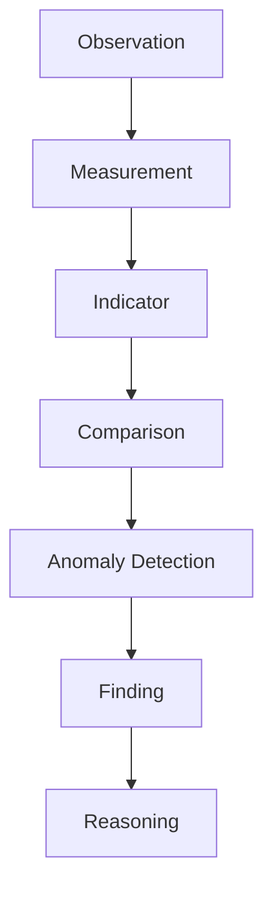
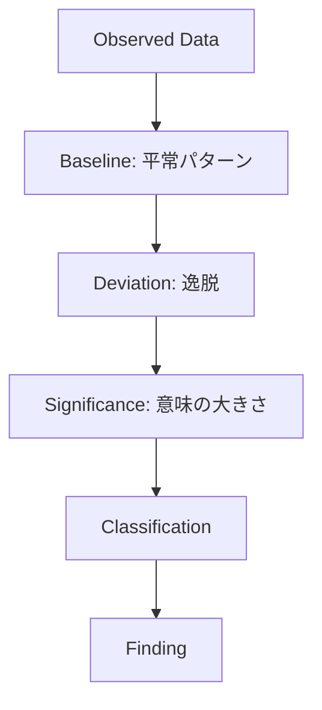
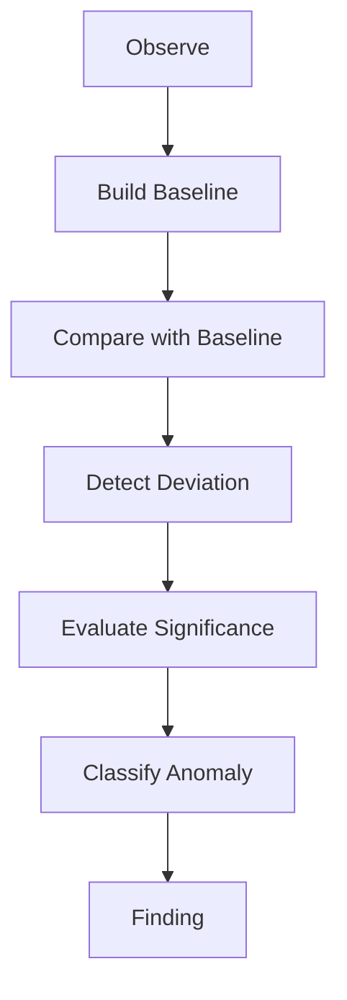

  # Anomaly Detection Structure  
  
Anomaly Detection Structure は、観測値・指標・比較結果の中から、通常パターンから逸脱した重要なズレを検出する構造である。  
  Observation の目的の1つは、平常の中に埋もれた異常を見つけることである。  
  
---

  
# 概要  
  
異常とは単に「珍しいこと」ではない。  
重要なのは、通常パターン・期待値・基準値から見て意味のある逸脱である。  
  
Anomaly Detection は、Finding の起点になる。  
  
---
  
# 思考OS内の位置  
  

# 基本構造

# 構成要素
## 1. Baseline（基準状態）

通常どのような状態か。

例
- 平均値    
- 平常レンジ    
- 季節変動込みの期待値    
- 過去トレンド    
- 標準工程    

---

## 2. Deviation（逸脱）

どれだけ外れているか。

例
- 急増    
- 急減    
- 想定外の停滞    
- 局所的突出    
- パターン崩壊    

---

## 3. Significance（重要性）

その逸脱に意味があるか。

評価軸
- 大きさ    
- 継続性    
- 影響範囲    
- 再現性    
- 文脈上の重大性    

---

## 4. Classification（分類）

異常の性質をどう捉えるか。

例
- ノイズ    
- 一時異常    
- 構造異常    
- 測定異常    
- 兆候    

---

# 異常の主要類型

## 1. 点異常

単発の極端値。

例
- 1日だけ売上ゼロ    
- 突然の事故多発    

## 2. 傾向異常

じわじわ平常からずれていく。

例
- 離職率の継続上昇    
- 成約率の低下傾向    

## 3. 構造異常

全体パターンそのものが変わる。

例
- 主力顧客層の入れ替わり    
- 市場構成比の変化    

## 4. 関係異常

本来連動するはずの変数が連動しない。

例
- 広告費増なのに問い合わせ増えない    
- 人員増なのに処理能力上がらない    

## 5. 文脈異常

数値上は平常でも、状況文脈では不自然。

例
- 繁忙期なのに稼働率が平常並み    
- 新制度導入後も改善が見られない    

---

# 検出手順

# 異常検知の判断基準

- どれだけ外れているか    
- どれくらい続いているか    
- 何に影響するか    
- 他指標でも裏づけられるか    
- 測定ミスで説明できないか    

---

# 異常検知の落とし穴

## 1. ノイズ誤認

単発のブレを重大問題とみなす。

## 2. 異常見逃し

緩やかな劣化を平常変動として放置する。

## 3. 基準設定ミス

ベースライン自体が間違っている。

## 4. 文脈無視

統計上の異常だけ見て実務上の異常を見ない。

## 5. 測定異常との混同

現実の変化ではなく、計測方法の変化である可能性を見落とす。

---

# 例

## 例1：問い合わせ件数

- Baseline: 月100件前後    
- Observed: 62件    
- Deviation: 大幅減少    
- Significance: 3か月連続なら高い    
- Classification: 傾向異常    
- Finding: 集客導線の機能低下の可能性
    

## 例2：事故件数

- Baseline: 月1件    
- Observed: 月4件    
- Deviation: 急増    
- Significance: 高い    
- Classification: 点異常または構造異常    
- Finding: 現場負荷または運行管理プロセスの異常の可能性    

## 例3：売上構成

- Baseline: 法人70 / 個人30    
- Observed: 法人45 / 個人55    
- Deviation: 構成逆転    
- Significance: 高い    
- Classification: 構造異常    
- Finding: 顧客基盤の変質    

---

# Anomaly と Finding の違い

## Anomaly

「平常と違う」という検出段階

## Finding

「何が起きているか」という意味づけ段階

例

- Anomaly: 問い合わせ件数が急減した    
- Finding: 集客導線が機能不全に陥っている可能性がある    

---

# 関連ノート

[[Measurement]]
[[指標構造]]  
[[比較構造]]  
[[シグナルノイズフィルター]]  
[[パターン構造]]  
[[認識構造]]