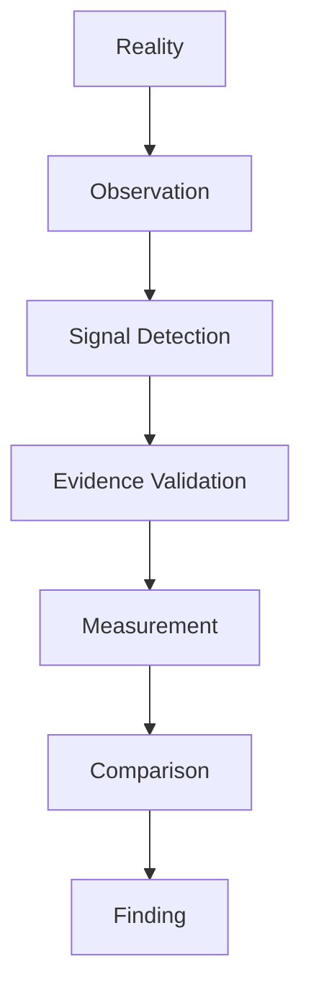
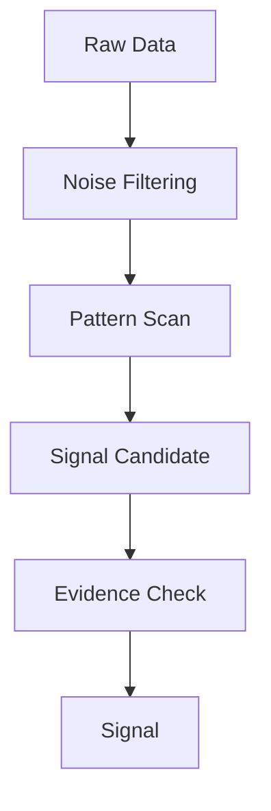
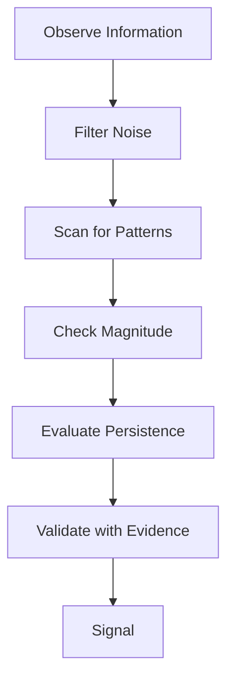

# Signal Detection Structure

Signal Detection Structure は、観察された多数の情報の中から意味を持つ重要情報（Signal）をノイズ（Noise）から分離する構造である。

Observationの段階では、情報は大量に存在するが、その多くは偶然・誤差・雑音である。

Signal Detection は、その中から意味ある変化やパターンを抽出する工程である。

---

# 概要

現実の情報環境では
- SNS
- ニュース
- 統計
- 会話
- 観測データ

などが混在している。しかしその中には
- 一時的ノイズ
- 測定誤差
- 偶然の変動
が多く含まれている。
Signal Detection は、本当に意味のある変化を特定するためのフィルターである。

---

# 思考OS内の位置

# 基本構造

# Signalの定義

Signalとは、将来の変化や構造を示唆する情報である。

特徴
- 偶然では説明できない    
- 他データと整合する    
- 継続性または影響力がある    
- パターンとして認識できる    

---

# Noiseの定義

Noiseとは、意味のない変動または偶然の情報である。

例
- 一時的売上増減    
- 単発事故    
- SNSの一過性話題    
- 測定誤差    

---

# Signal Detectionの主要方法

## 1 Frequency Filter

繰り返し出現するか。

例
- 同種事故の反復    
- 同様の顧客クレーム    

---

## 2 Magnitude Filter

変化の大きさ。

例
- 売上30%減    
- 市場価格急騰    

---

## 3 Persistence Filter

時間継続性。

例
- 3か月連続減少    
- 長期トレンド    

---

## 4 Correlation Filter

他変数との関連。

例
- 広告停止 → 問い合わせ減    
- 金利上昇 → 投資減    

---

## 5 Context Filter

社会・制度・環境の変化。

例
- 法改正    
- 技術革新    
- 政治事件    

---

# Signalの主要類型

## Early Signal

将来変化の兆候。

例
- 小規模だが急増する技術    
- 新しい消費行動    

---

## Structural Signal

構造変化の兆候。

例
- 市場構造変化    
- 産業再編    

---

## Behavioral Signal

人間行動の変化。

例
- 新しい購買習慣    
- 投票行動変化    

---

## Risk Signal

危機の前兆。

例
- 事故頻発    
- 市場バブル    

---

# Signal Detectionプロセス

# Signal Detectionの落とし穴

## 1 False Signal

ノイズをSignalと誤認する。

例
- 一時的流行    

---

## 2 Signal Ignorance

重要なSignalを見逃す。

例
- 小さな初期変化    

---

## 3 Confirmation Bias

自分の仮説を支持するSignalだけ拾う。

---

## 4 Data Overload

情報量過多でSignalが埋もれる。

---

# SignalとFindingの違い

Signal  
重要情報の候補

Finding  
解釈された発見

例

Signal  
「問い合わせが急減」

Finding  
「集客導線が機能不全」

---

# Signal Detectionテンプレート

Observation:  
Possible Noise:  
Signal Candidate:  
Magnitude:  
Persistence:  
Correlation:  
Context:  
Signal Assessment:

---

# 関連ノート

[[シグナルノイズフィルター]]  
[[根拠構造]]  
[[Measurement]]  
[[比較構造]]  
[[認識構造]]