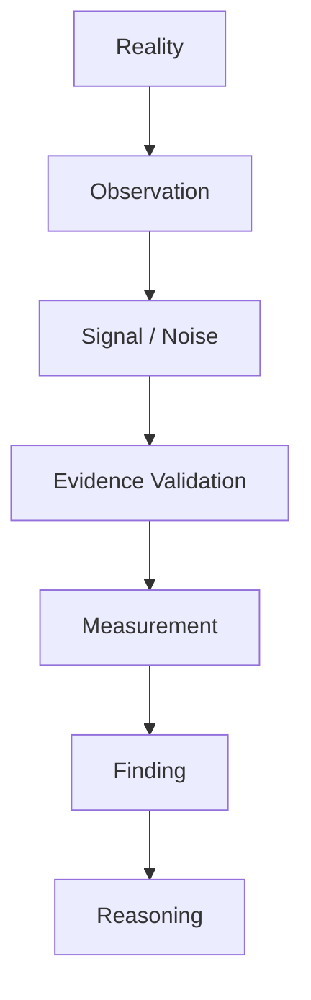
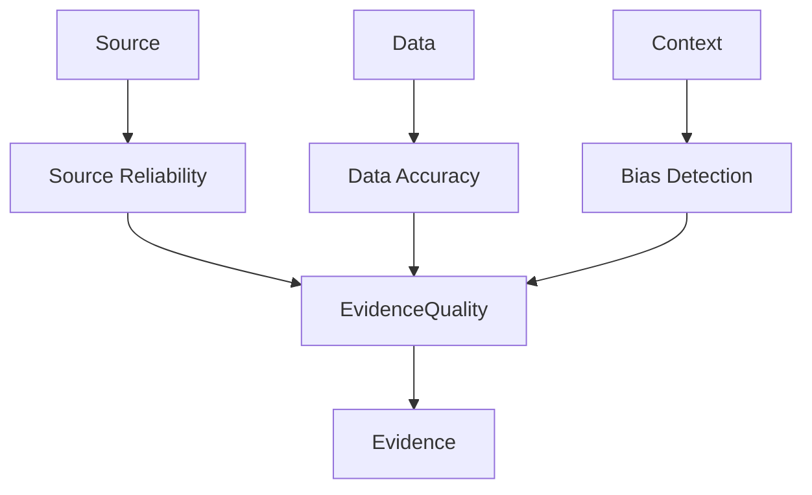
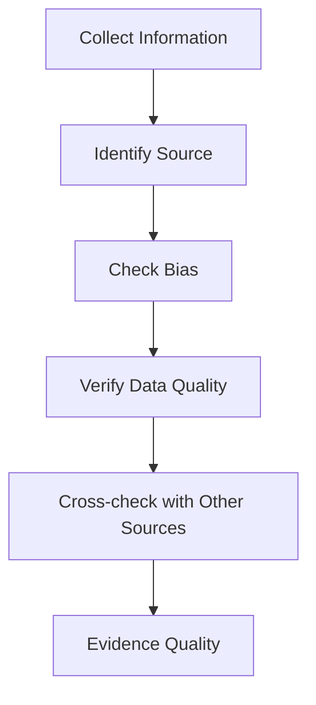
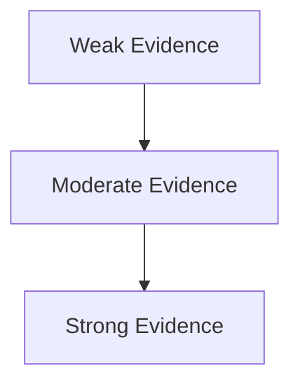

# Evidence Structure

Evidence Structure は、観察された情報・データ・証言・資料がどれだけ信頼できるかを評価する構造である。

Observation が「情報を集めること」だとすれば、Evidence は「その情報をどこまで信用してよいか」を判断する工程である。

---

# 概要

Observationの最大の問題は、誤情報・ノイズ・偏りである。

例
- 誤った統計
- 偏った証言
- 操作されたデータ
- 測定誤差

Evidence 構造はそれらを検証し、信頼可能な情報だけを Reasoning に渡す役割を持つ。

---

# 思考OS内の位置

# 基本構造

# Evidenceの3要素

Evidenceの信頼性は主に3つの要素で決まる。

## 1 Source（情報源）

情報を発した主体。

例
- 一次資料    
- 当事者    
- 研究者    
- メディア    
- SNS    

評価軸
- 専門性    
- 利害関係    
- 過去実績    
- 独立性    

---

## 2 Data（データの品質）

データそのものの正確さ。

評価軸
- 測定方法    
- サンプル数    
- 定義の明確性    
- 再現可能性    

---

## 3 Bias（バイアス）

意図的・無意識の歪み。

例
- 利益誘導    
- 政治的偏向    
- サンプル偏り    
- 観測バイアス    

---

# Evidenceの主要類型

## 1 Direct Evidence

直接観測された証拠。

例
- 計測データ    
- 写真    
- 映像    
- 実験結果    

信頼度  
比較的高い

---

## 2 Testimonial Evidence

証言。

例
- 目撃証言    
- インタビュー    
- 回想    

問題  
記憶歪み

---

## 3 Documentary Evidence

文書資料。

例
- 記録    
- 公文書    
- 契約    
- 報告書    

問題  
編集バイアス

---

## 4 Statistical Evidence

統計データ。

例
- 国勢調査    
- 市場統計    
- 研究データ    

問題  
測定定義

---

## 5 Inferential Evidence

推論による証拠。

例
- 間接証拠    
- 痕跡証拠    
- モデル推定    

問題  
推論依存

---

# Evidence評価プロセス

# Evidenceの評価基準

## 1 信頼性

情報源は信用できるか。

---

## 2 独立性

同じ情報が別ソースから確認できるか。

---

## 3 一貫性

他のデータと矛盾していないか。

---

## 4 再現性

別の測定でも同じ結果になるか。

---

## 5 文脈適合性

状況に合っているか。

---

# Evidenceの階層

例

- Weak：単一証言   
- Moderate：複数証言
- Strong「独立データ + 直接観測」    

---

# Evidenceの落とし穴

## Confirmation Bias

自分の仮説を支持する証拠だけ集める。

---

## Survivorship Bias

残った事例だけ見る。

---

## Selection Bias

サンプルが偏る。

---

## Measurement Error

測定誤差。

---

# EvidenceとFindingの違い

- Evidence「情報の信頼性評価」
- Finding「情報から意味を抽出」

例
- Evidence  「この統計は信頼できる」
- Finding  「市場は縮小している」

---

# 例

## 歴史研究

Observation  
文書記録

Evidence  
文書の年代・著者・編集履歴

Finding  
政策意図の推定

---

## ビジネス

Observation  
売上データ

Evidence  
会計処理・計測方法確認

Finding  
市場需要減少

---

## 社会分析

Observation  
世論調査

Evidence  
サンプル構成確認

Finding  
支持率変化

---

# Evidenceテンプレート
Source:  
Data Type:  
Collection Method:  
Bias Risk:  
Independent Confirmation:  
Reliability Level:

---

# 関連ノート

[[シグナルノイズフィルター]]]  
[[Measurement]]]  
[[指標構造]]  
[[比較構造]]  
[[Problem Finding Structure]]