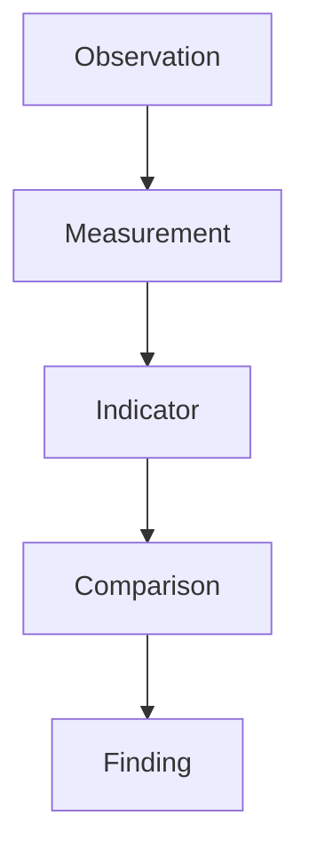
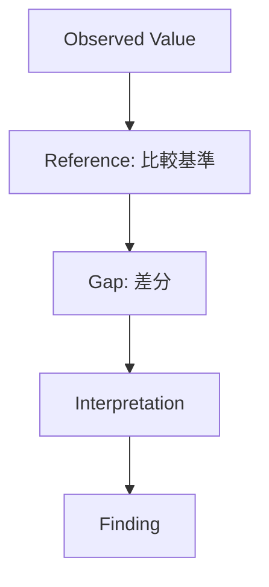
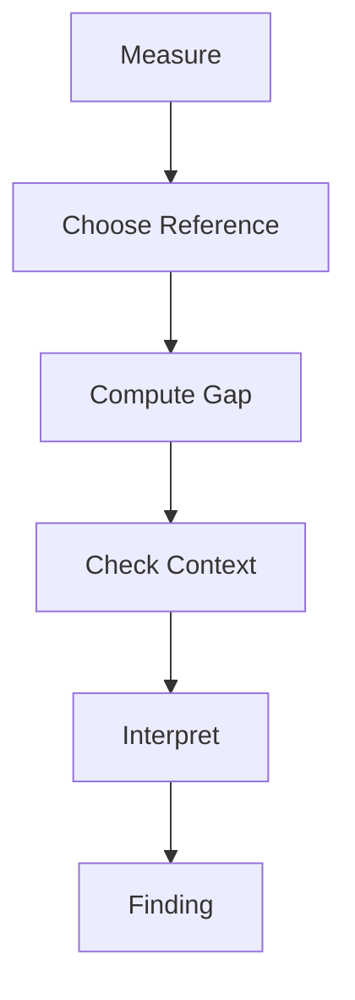

---
note_type: structure
layer: structure
status: stable
maturity: canonical
structure_type: comparison
created: 2026-03-12
updated: 2026-03-12

---

# Comparison Structure

Comparison Structure は、測定値や指標に意味を与えるために、複数の対象・時点・基準を照合する構造である。

数値は単独ではほとんど意味を持たない。
意味は比較によって生まれる。

---

# 概要

「売上1000万円」「離職率8%」という数値だけでは、それが良いのか悪いのか分からない。
比較対象を置いた瞬間に、はじめて判断可能になる。

Comparison は、Observation を Finding に変換する橋渡しである。

---

# 思考OS内の位置

# 基本構造

# 構成要素
## 1. Observed Value（観測値）

今見えている値。

例
- 今月売上    
- 現在の支持率    
- 当月事故件数    

---

## 2. Reference（比較基準）

何と比べるか。

例
- 過去    
- 目標    
- 他社    
- 他部署    
- 業界平均    
- 理論値    
- 平常時    

---

## 3. Gap（差分）

比較してどれだけズレているか。

例
- 差額    
- 差率    
- 偏差    
- 順位差    
- ギャップ方向    

---

## 4. Interpretation（解釈）

差分が何を意味するか。

例
- 季節要因か    
- 構造変化か    
- 一時要因か    
- 測定誤差か    

---

# 比較の主要類型
## 1. 時間比較

過去との比較。

例
- 前日比    
- 前月比    
- 前年同月比    
- トレンド比較    

用途

- 変化把握    
- 成長確認    
- 劣化検知    

---

## 2. 目標比較

目標値や計画値との比較。

例
- KPI達成率    
- 予算差異    
- 着地予測との差    

用途

- 実行管理    
- 進捗確認    
- 警戒判断

---

## 3. 横比較

他者や他部門との比較。

例
- 他店舗比較    
- 他地域比較    
- 競合比較    

用途
- 相対評価    
- ベストプラクティス抽出    
- 偏在把握    

---

## 4. 基準比較

理論値・標準値・規範との比較。

例
- 法定基準    
- 安全基準    
- 平常レンジ    
- モデル想定値    

用途
- 適合性判断    
- 異常検知    
- 品質管理    

---

## 5. 構成比較

全体の中の内訳比較。

例
- 売上構成比    
- 年齢構成    
- 収益源別比率    

用途
- ボトルネック把握    
- 偏り発見    
- 依存構造の把握    

---

# 良い比較の条件

- 同じ定義で比較している    
- 母数が揃っている    
- 時間軸が揃っている    
- 条件差を理解している    
- 比較目的が明確    

---

# 比較の落とし穴

## 1. 母数不一致

絶対数だけ比べて率を見ない。

## 2. 条件差無視

店舗規模や地域差を無視して比較する。

## 3. 季節性無視

前月比だけで判断し、前年同月比を見ない。

## 4. 指標定義不一致

部署ごとにカウント方法が違う。

## 5. 比較対象の誤選択

本来比較すべき相手でなく、都合の良い相手と比べる。

---

# 典型フロー

# 例
## 例1：売上

- Observed Value: 今月売上 900万円    
- Reference: 前年同月 1100万円    
- Gap: -200万円、-18.2%    
- Interpretation: 季節要因だけでは説明困難    
- Finding: 需要減少または集客不全の可能性
    

## 例2：事故件数

- Observed Value: 当月事故 4件    
- Reference: 月平均 1件    
- Gap: +3件    
- Interpretation: 偶発ではなく異常域の可能性    
- Finding: 現場ルール、教育、疲労管理の再点検が必要    

---

# 関連ノート

[[Measurement]]]  
[[指標構造]]  
[[anomaly detection structure]]  
[[パターン構造]]  
[[認識構造]]