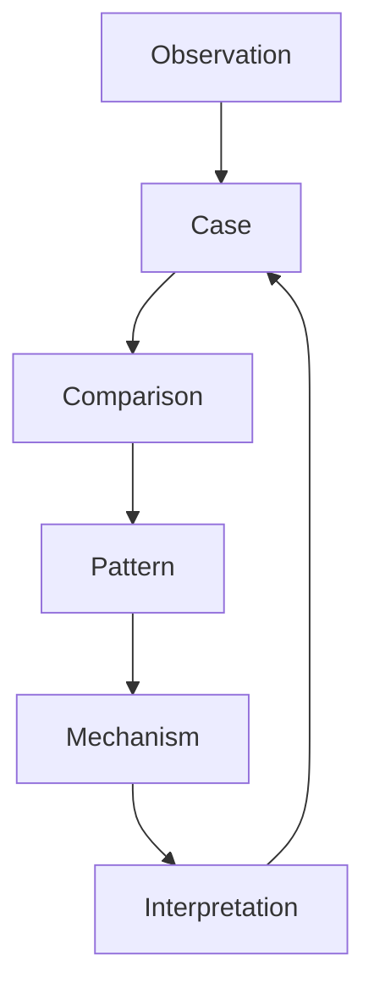
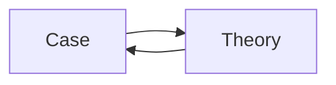

# Research Loop

Research Loop は、Case の観察から Pattern と Mechanism を抽出し、
再び Case の理解を更新する知識生成サイクルである。

Vaultにおいて Research Loop は

Case
↓
Comparison
↓
Pattern
↓
Mechanism
↓
Case

という循環を形成する。

---

# 基本構造

---

# 各ステップ

## 1 Observation

現実の出来事や資料を観察する。

例

- 歴史事件
- 社会現象
- 組織行動

Observation は Case の素材となる。

---

## 2 Case

観察された出来事を Case ノートとして整理する。

Case ノートには以下を記録する。

- Actor
- Event Timeline
- Key Facts
- Sources

Case は研究のデータである。

---

## 3 Comparison

複数の Case を比較する。

Comparison の目的

- 共通点の発見
- 相違点の発見

Comparison によって Pattern が浮かび上がる。

---

## 4 Pattern

複数 Case に共通する構造を Pattern として記述する。

例

- 指導者舌禍
- 革命連鎖
- 寡占形成

Pattern は Mechanism の手がかりになる。

---

## 5 Mechanism

Pattern の背後にある仕組みを説明する。

例

- エリート対立
- 情報拡散
- ネットワーク効果

Mechanism は Pattern の原因を説明する。

---

## 6 Interpretation

Mechanism を使って Case を再解釈する。

例

デイリーテレグラフ事件

失言事件  
ではなく

権力責任構造の問題

として理解する。

---

# Research Loop の原則

Research Loop は

Case → 理論 → Case

という往復運動である。

ここで

Theory = Pattern + Mechanism

である。

---

# Research Loop の目的

Research Loop の目的は

知識整理ではなく

知識生成

である。

---

# Vaultでの位置

Research Loop は次のフォルダ群を横断する。

- case
- analysis/comparison
- pattern
- mechanism
- structure