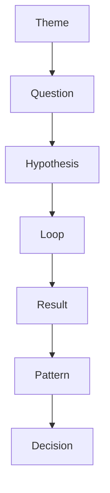

# Research Program

## 1. 目的
複数のResearch Loopを統合し、体系的に知識を構築する。

---

## 2. 起動条件

- 同一テーマで複数の仮説がある
- 長期的に検証したい
- 知識を体系化したい
- ビジネス・戦略に関わる

---

## 3. 構造

Research Program = Theme + Questions + Hypotheses + Loops

---

## 4. 構成要素

### ■ Theme（テーマ）
研究の対象領域

例：
- タクシー労働と疲労
- 観光圏の成立条件
- 地方衰退の構造

---

### ■ Questions（問い群）

テーマを分解したもの

例：
- 労働時間と疲労の関係は？
- 休憩頻度は影響するか？
- 運転密度は影響するか？

---

### ■ Hypotheses（仮説群）

各問いに対応

例：
- 注意資源の消耗が疲労を生む
- 中断が回復を促す

---

### ■ Loops（検証）

各仮説ごとにResearch Loopを回す

---

## 5. フロー

Theme
→ Question分解
→ Hypothesis生成
→ Loop実行
→ Result統合
→ Pattern化

---

## 6. 出力

- Pattern（再現性あり）
- Mechanism（因果構造）
- Rule（適用条件）
- Decision input

---

## 7. Patternとの関係

Research Programの最終成果：

→ Pattern Hubへ昇格

---

## 8. Decisionとの関係

- ResearchはDecisionの精度を上げる
- DecisionはResearchの優先順位を決める

---

## 9. 優先順位設計

どの仮説から検証するか：

1. 影響が大きい
2. 不確実性が高い
3. 実験しやすい

---

## 10. 注意点

- 全部やらない（焦点を絞る）
- 小さく回す
- Loop単位で評価する
- 完璧より速度

---

## 11. テンプレート

### Theme
-

### Questions
-

### Hypotheses
-

### Loops
-

### Results
-

### Pattern化
-

---

# ■ 実行構造

---
# ■ 実例

## テーマ
タクシー労働と疲労
### Questions
- 労働時間と疲労の関係
- 休憩の影響
- 時間帯の影響
### Hypotheses
- 注意資源消耗説
- サーカディアンリズム説
### Loop
- 勤務ログ × 疲労感記録
### Result
- 4時間以降で急激に疲労増
### Pattern
- 注意資源は連続運転で非線形に減少

---

# 重要な違い

|概念|スケール|
|---|---|
|Thinking|単発|
|Research Loop|仮説単位|
|Research Program|テーマ単位|

---

# ■ よくあるミス

## ❌ Research Programを作るだけで終わる

→ Loopが回らない

## ❌ 仮説が曖昧

→ 検証不能

## ❌ データにこだわりすぎる

→ 進まない

---

# ■ Vaultでの位置

Thinking Engine  
→ Hypothesis  
→ Research Program  
→ Research Loop  
→ Pattern Hub  
→ Decision