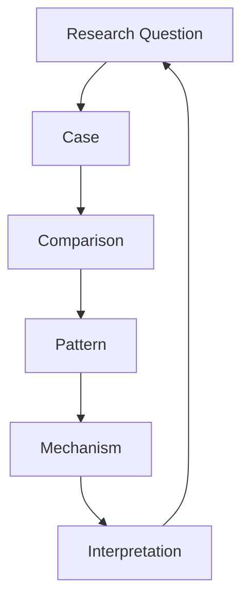
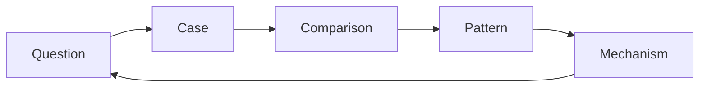

# Research Question

Research Question は、Case の観察から Pattern と Mechanism を探るための
研究指向の問いである。

Research Question は単なる情報取得ではなく

理解の深化  
構造の発見  
Mechanismの説明  

を目的とする。

---

# Research Question の位置

Vaultにおいて Research Question は Research Loop の起点となる。

---

# Research Question の特徴

Research Question は次の性質を持つ。

1 Mechanism を問う  
2 Pattern を探す  
3 Structure を明らかにする  

---

# 問いの種類

Research Question には主に3種類ある。

---

## Mechanism Question

現象の原因を問う。

例

なぜ指導者の発言は政治危機になるのか  
なぜ企業独占は形成されるのか  

---

## Pattern Question

複数 Case に共通するパターンを問う。

例

革命はどのような条件で起きるのか  
政治スキャンダルはどのような構造で発生するのか  

---

## Structure Question

制度や構造の影響を問う。

例

制度は個人行動をどのように制約するのか  
政治体制は外交危機をどう変えるのか  

---

# Research Question テンプレート

## Question

研究問い

---

## Motivation

この問いが重要な理由

---

## Related Cases

- [[Case1]]
- [[Case2]]
- [[Case3]]

---

## Possible Patterns

仮説パターン

---

## Possible Mechanisms

仮説メカニズム

---

## Open Problems

未解決問題

---

# Research Question の運用

Research Question は次のループで運用する。

---

# Research Question の更新

研究が進むと問いは変化する。

例

初期

なぜデイリーテレグラフ事件は起きたのか

発展

なぜ指導者の発言は政治危機になるのか

最終

メディア環境は政治責任構造をどう変えるのか

---

# Research Question の命名

Research Question ノートは

RQ - テーマ

と命名する。

例

RQ - 指導者発言と政治危機  
RQ - 革命発生条件  
RQ - 独占企業形成  

---

# 注意

Research Question は

答えを書かない。

書くのは

問い  
仮説  
関連 Case  

である。