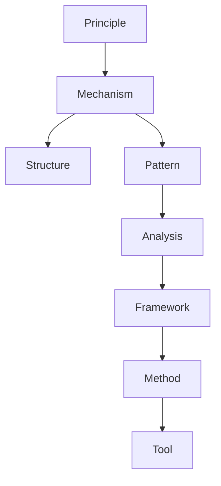

# Unified Knowledge Classification Engine

## 1. 目的
本ルールは、Vault内のすべての知識を以下の型に分類するための統一基準である。

- Principle（原理）
- Mechanism（法則・作動）
- Rule / Structure（律・構造）
- Pattern（パターン）
- Method（方法）
- Tool（道具）
- Framework（枠組み）
- Analysis（分析）

---

## 2. 全体構造

```text
Reality
 ↓
Principle（なぜ）
 ↓
Mechanism（どう動く）
 ↓
Structure / Rule（どう制約される）
 ↓
Pattern（繰り返し現れる型）
 ↓
Analysis（どう読む）
 ↓
Framework（どう整理する）
 ↓
Method（どう扱う）
 ↓
Tool（何で実行する）
```

---

## 3. 各分類の定義と判定基準
### 3.1 Principle（原理）
#### 定義
- 普遍的な説明枠組み。「なぜそうなるか」
#### 判定
- 上位概念
- 多分野に適用可能
- 他の法則を説明する
#### 例
- 最小作用の原理
- 希少性原理
- フィードバック原理
### 3.2 Mechanism（法則・作動）
#### 定義
- 再現可能な因果過程。「どう動くか」
#### 判定
- 入力→変化→出力
- 条件依存で再現
#### 例
- 需要の法則
- 情報拡散
- 学習
### 3.3 Rule / Structure（律・構造）
#### 定義
- 形式的制約または関係形。「どう制約されるか」
#### 判定
- 不変条件
- 制約
- 形
#### 例
- 保存則
- 予算制約
- ネットワーク
- 階層
### 3.4 Pattern（パターン）
#### 定義
- 繰り返し現れる典型形。「よく起こる型」
#### 判定
- 具体例から抽出される
- 再利用可能
- Mechanismの表層表現
#### 例
- 炎上
- バブル
- サイロ化
- ロックイン
### 3.5 Analysis（分析）
#### 定義
- 対象を分解・解釈する視点。「どう読むか」
#### 判定
- 観察・理解のための視点
- 分解・比較・評価を行う
#### 例
- 因果分析
- 構造分析
- ネットワーク分析
- フィールドワーク分析
## 3.6 Framework（枠組み）
#### 定義
- 複数の要素を整理するための構造。「どう整理するか」
#### 判定
- 複数概念の集合
- 分類や整理に使う
#### 例
- 3C分析
- SWOT分析
- 五力分析
### 3.7 Method（方法）
#### 定義
- 目的達成のための手順。「どうやるか」
#### 判定
- 手順として再現可能
- 実行可能なプロセス
#### 例
- 仮説検証
- 実験
- インタビュー
- フィールドワーク
### 3.8 Tool（道具）
#### 定義
- Methodを実行するための手段
#### 判定
- 実体（ソフト・ハード）
- Methodの補助
#### 例
- Excel
- GIS
- Notion
- Python
##  4. 最上位判定フロー
新規概念を見たら次の順で判定する：
- Q1 なぜを説明するか？ → Principle
- Q2 因果的に動くか？ → Mechanism
- Q3 制約・構造か？ → Rule / Structure
- Q4 繰り返しパターンか？ → Pattern
- Q5 見方・読み方か？ → Analysis
- Q6 整理枠か？ → Framework
- Q7 手順か？ → Method
- Q8 実行手段か？ → Tool
## 5. 典型的な対応関係



## 6. 同一概念の多層配置
同じ概念は複数層に現れる。
#### 例：フィードバック
- Principle：フィードバック原理
- Mechanism：正・負フィードバック
- Structure：フィードバックループ
- Pattern：自己強化スパイラル
## 7. Kernelとの関係
Kernelはメタ概念であり、全レイヤーを横断する。
### 関係
- Principle → 抽象化元
- Mechanism → 実装形
- Structure → 形
- Pattern → 観測形
## 8. YAMLテンプレ
Principle
```YAML
type: principle
layer: academic
```

Mechanism
```YAML
type: mechanism
layer: academic
```

Rule / Structure
```YAML
type: rule
layer: academic
```
Pattern
```YAML
type: pattern
layer: meta
```
Analysis
```YAML
type: analysis
layer: meta
```

Framework
```YAML
type: framework
layer: meta
```
Method
```YAML
type: method
layer: meta
```

Tool
```YAML
type: tool
layer: meta
```

## 9. 優先順位
迷った場合：
1. Rule
2. Mechanism
3. Principle
4. Pattern
5. Analysis
6. Framework
7. Method
8. Tool
# 9. 最終定義
- Principle = なぜ
- Mechanism = どう動く
- Rule = 何に縛られる
- Pattern = どう現れる
- Analysis = どう読む
- Framework = どう整理する
- Method = どうやる
- Tool = 何を使ってやる