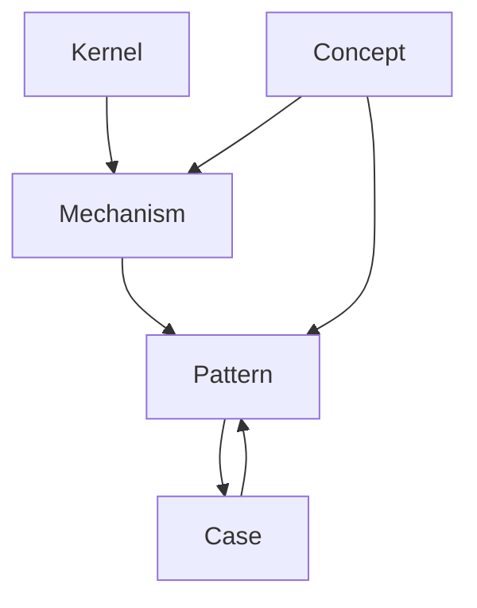
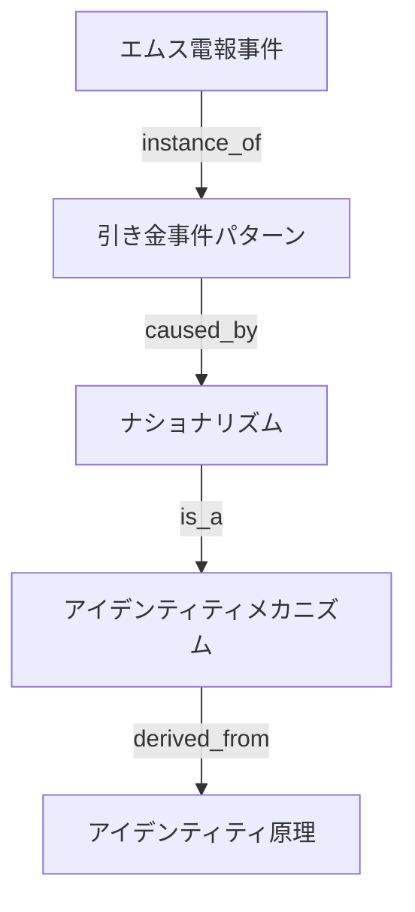

# Vault Knowledge Graph Architecture

このVaultは単なるノート集合ではない。

Knowledge Graph（知識グラフ）として設計されている。

すべてのノートは 、Relation Ontologyに基づく関係で接続される。

---

# 基本階層

Vaultの知識は次の階層で構成される。

```
kernel
↓
mechanism
↓
pattern
↓
case
```

意味

|層|役割|
|---|---|
|kernel|世界原理|
|mechanism|作動原理|
|pattern|観測パターン|
|case|具体事例|

---

# Graph Layer

Vaultは5つの知識レイヤーを持つ。

```
Kernel Layer
Mechanism Layer
Pattern Layer
Concept Layer
Case Layer
```

---

# Layer Structure



---

# Relation Flow

ノード間の主な関係

| relation     | 意味   |
| ------------ | ---- |
| is_a         | 上位概念 |
| part_of      | 構成   |
| instance_of  | 具体例  |
| derived_from | 派生   |
|causes|原因|
|explains|説明|
|analogous_to|類似|

---

# Knowledge Expansion

知識の拡張は以下の流れで行う。

```
Observation
↓
Case
↓
Pattern
↓
Mechanism
↓
Kernel
```

---

# Promotion Rules

Vaultではノードが昇格する。

## Case → Pattern

複数のCaseに共通構造がある場合、Patternとして抽象化する。

例

```
企業価格戦争
航空価格戦争
通信価格戦争
↓
価格戦争パターン
```

---

## Pattern → Mechanism

パターンの原因構造が特定された場合、Mechanismに昇格する。

例

```
同調行動パターン
↓
社会的証明メカニズム
```

---

## Mechanism → Kernel

複数分野で成立する場合、Kernelとなる。

例

```
競争メカニズム
↓
競争原理
```

---

# Graph Traversal

Vaultの推論は以下の経路で行う。

## Pattern Search

```
Question
↓
Pattern
↓
Mechanism
↓
Kernel
```

---

## Case Reasoning

```
Question
↓
Case
↓
Pattern
↓
Mechanism
```

---

## Concept Mapping

```
Question
↓
Concept
↓
Pattern
↓
Case
```

---

# Knowledge Graph Types

Vaultには3種類のグラフが存在する。

## 1 Concept Graph

概念ネットワーク

```
Concept ↔ Concept
```

---

## 2 Mechanism Graph

因果構造

```
Mechanism → Mechanism
```

---

## 3 Case Graph

事例ネットワーク

```
Case → Pattern → Mechanism
```

---

# Graph Example



---

# Knowledge Engine

Vaultは以下のように動作する。

```
Question
↓
Relevant Concept
↓
Pattern Search
↓
Mechanism Identification
↓
Kernel Reference
↓
Answer
```

---

# Graph Maintenance

知識グラフは以下の操作で更新される。

## Add Case

新しい事例を追加。

---

## Extract Pattern

共通構造を抽出。

---

## Identify Mechanism

原因構造を特定。

---

## Update Kernel

普遍原理を更新。

---

# Design Philosophy

このVaultは、ノートの集まりではない。思考エンジンである。
知識は、
```
事例
↓
構造
↓
原理
```

へと圧縮される。

Vaultの目的は、世界の構造を抽出することである。