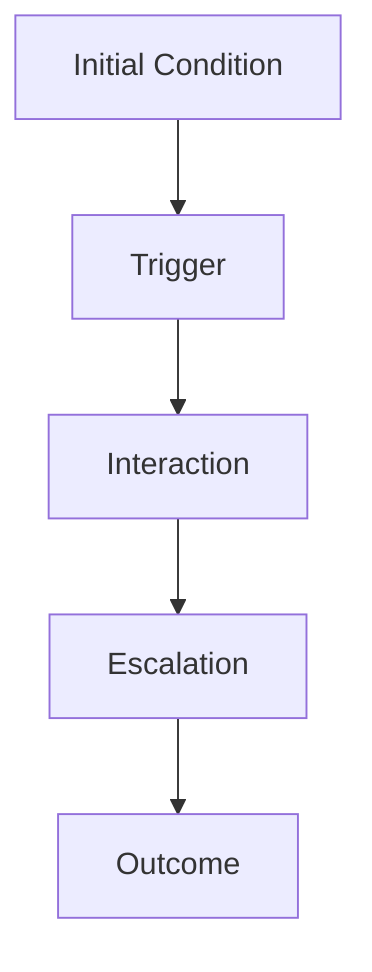
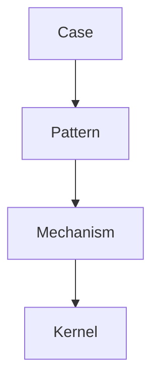

# Case Writing Rule

Case Writing Rule は、Knowledge Graph において  
**具体事例（case）をどのように記述するかの標準ルール**である。

case は Knowledge Graph の **観測層（observation layer）**であり、

```
case
 ↓
pattern
 ↓
mechanism
 ↓
kernel
```

という抽象化の出発点になる。

そのため case ノートは  
単なる出来事の記録ではなく、

- pattern 抽出  
- mechanism 推論  
- cross domain 比較  

に使える形で書く必要がある。

---

# Case の定義

Case とは、

**現実世界で実際に起きた具体的事例**

であり、次の特徴を持つ。

- 時間  
- actor  
- interaction  
- outcome  

が存在する。

---

# Case の役割

Case ノートは次の役割を持つ。

### 1 観測

現実の出来事を記録する。

---

### 2 Pattern 抽出

繰り返し現れる構造を見つける。

---

### 3 Mechanism 推論

なぜ起きたかを考える。

---

### 4 Comparison

他の case と比較する。

---

### 5 Knowledge Graph 接地

抽象概念を現実に接地する。

---

# Case ノートの基本構造

Case ノートは次の構造を持つ。

```
概要
背景
actor
event
interaction
outcome
pattern
mechanism
comparison
```

---

# Case ノートテンプレート

```markdown
---
note_type: case
layer: observation
status: draft
case_type:
domain:
date:
location:
tags:
---

# {{Case Name}}

## 概要
この case は {{出来事}} に関する事例である。

---

## 背景
発生前の状況。

- 社会状況
- 組織状況
- 関係者

---

## Actor

主要 actor。

- actor A
- actor B
- actor C

---

## Event

主要な出来事。

1  
2  
3  

---

## Interaction

actor 間の相互作用。

- 行動
- 反応
- 対立
- 協力

---

## Outcome

結果。

- 短期結果
- 長期結果

---

## Pattern

この case が示す pattern。

- [[pattern1]]
- [[pattern2]]

---

## Mechanism

働いた可能性のある mechanism。

- [[mechanism1]]
- [[mechanism2]]

---

## Comparison

似た case。

- [[case1]]
- [[case2]]
```

---

# Case 記述の原則

Case を書くときは次を守る。

---

## 原則1  
**事実と解釈を分ける**

例

事実  
```
企業が広告を公開
```

解釈  
```
規範逸脱と認識された
```

---

## 原則2  
**時間順に書く**

case は時間構造を持つ。

---

## 原則3  
**actor を明確にする**

誰が何をしたか。

---

## 原則4  
**interaction を書く**

case の核心は相互作用である。

---

## 原則5  
**結果だけで終わらない**

原因と過程を書く。

---

# Case の時間構造

多くの case は次の形になる。



---

# Case と Pattern の関係

Case は pattern の材料になる。

```
case1
case2
case3
 ↓
pattern
```

---

# Case と Mechanism の関係

Case は mechanism を推測する材料になる。

```
case
 ↓
mechanism hypothesis
```

---

# 良い Case ノートの条件

良い case ノートは次を満たす。

- actor が明確  
- interaction が明確  
- 時系列が明確  
- pattern と接続できる  
- mechanism と接続できる  

---

# 悪い Case ノート

次は避ける。

### 1 単なるニュース要約

構造がない。

---

### 2 結果しか書いていない

原因が不明。

---

### 3 actor が不明

誰が何をしたか分からない。

---

### 4 pattern 接続がない

抽象化できない。

---

# Case ノートの図



---

# Case の粒度

Case の粒度は次の3段階。

### micro case
単一事件

---

### meso case
事件群

---

### macro case
歴史事件

---

# Case ノートを書くタイミング

次の場合に書く。

- interesting event  
- pattern を疑うとき  
- mechanism を考えたいとき  

---

# LLM にとっての意味

Case ノートが整っていると

LLM は

- pattern 抽出  
- mechanism 推論  
- cross domain analogy  

を行いやすくなる。

---

# 関連ノート

- [[Representative Case Rule]]
- [[Case Comparison Method]]
- [[99_oldzettelkasten/04_knowledge_graph/Pattern]]
- [[99_oldzettelkasten/04_knowledge_graph/Mechanism]]
- [[99_oldzettelkasten/04_knowledge_graph/Knowledge Graph]]