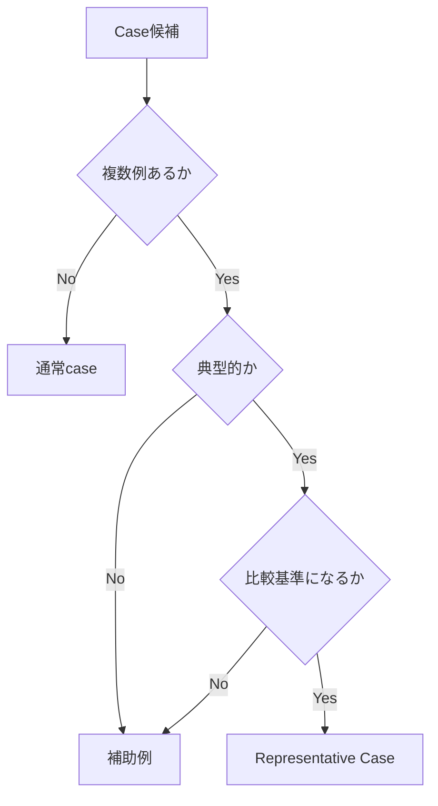
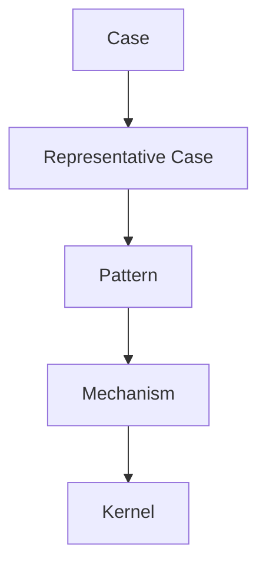

# Representative Case Rule

Representative Case Rule は、Knowledge Graph において  
**どの case を「代表事例（Representative Case）」として扱うかを決めるルール**である。

Knowledge Graph では多くの case が存在するが、  
すべてを同じ重要度で扱うと次の問題が起きる。

- 概念説明が不安定になる  
- pattern の理解が曖昧になる  
- LLM が毎回違う例を出す  
- reasoning path が揺れる  

Representative Case はそれを防ぐための **標準例**である。

---

# 定義

Representative Case とは、

**ある pattern / concept / mechanism を説明する際に  
最も典型的で繰り返し参照される具体事例**

である。

---

# Representative Case の役割

Representative Case は次の役割を持つ。

### 1 定義の具体化

抽象概念を具体例で理解可能にする。

```
concept → representative case
```

---

### 2 Pattern の典型形

pattern の進行を具体で示す。

```
pattern → representative case
```

---

### 3 Mechanism の可視化

因果メカニズムが実際にどう働くかを見せる。

```
mechanism → representative case
```

---

### 4 Comparison 基準

他 case を比較するときの基準になる。

```
case A
case B
case C
   ↓
representative case
```

---

### 5 Teaching Anchor

教育・説明の際に安定して使える。

---

# Representative Case の条件

良い Representative Case は次を満たす。

### 1 典型性

その pattern / concept をよく表している。

---

### 2 再現性

同様の構造が他にも存在する。

---

### 3 説明力

複数のノードと接続できる。

例

```
case
↓
pattern
↓
mechanism
↓
kernel
```

---

### 4 比較可能性

他 case と比較しやすい。

---

### 5 ノイズが少ない

特殊事情が多すぎない。

---

# Representative Case と Anchor Case の違い

|項目|Representative Case|Anchor Case|
|---|---|---|
|目的|典型例|基準点|
|使用頻度|高い|非常に高い|
|範囲|pattern単位|concept単位|

Representative Case の中から  
特に重要なものが **Anchor Case** になる。

---

# Representative Case 選定手順



---

# Representative Case の配置

Knowledge Graph では通常

```
case/
```

フォルダに置き、  
pattern ノートから参照する。

例

```
pattern/炎上パターン
↓
case/〇〇炎上事件
```

---

# Representative Case の書き方（要点）

Representative Case ノートには次を書く。

- 概要  
- 発生条件  
- actor  
- interaction  
- 結果  
- 対応する pattern  
- 対応する mechanism  

---

# Representative Case と Pattern の関係

```
case
 ↓
representative case
 ↓
pattern
 ↓
mechanism
 ↓
kernel
```

Representative Case は

**case → pattern の橋**

である。

---

# Representative Case の例（抽象）

例

Pattern  
```
規範逸脱炎上
```

Representative Case  
```
ある企業の差別広告炎上
```

---

# Representative Case を増やすときの注意

以下は避ける。

### 1 特殊事例

典型性がない。

---

### 2 一回しか出ない事件

pattern にならない。

---

### 3 結果だけ有名

構造が分からない。

---

# Representative Case の図



---

# LLM にとっての意味

Representative Case があると、

LLM は

- 抽象説明を具体化できる  
- pattern を理解しやすい  
- reasoning が安定する  

---

# 関連ノート

- [[Case Writing Rule]]
- [[Case Comparison Method]]
- [[99_oldzettelkasten/04_knowledge_graph/Pattern]]
- [[Anchor Case]]
- [[99_oldzettelkasten/04_knowledge_graph/Knowledge Graph]]