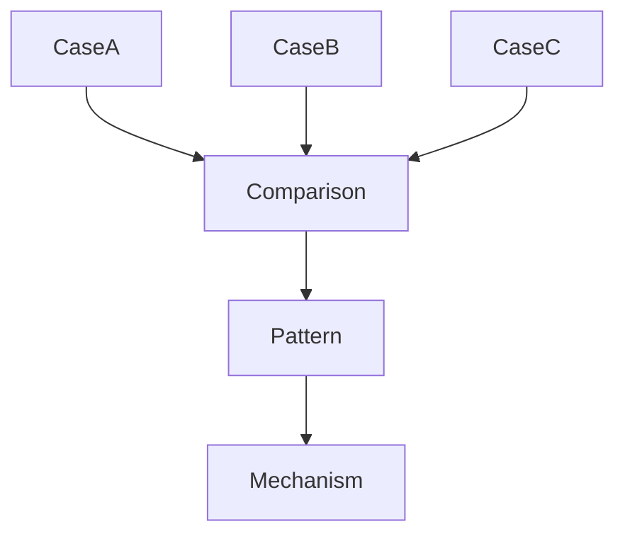
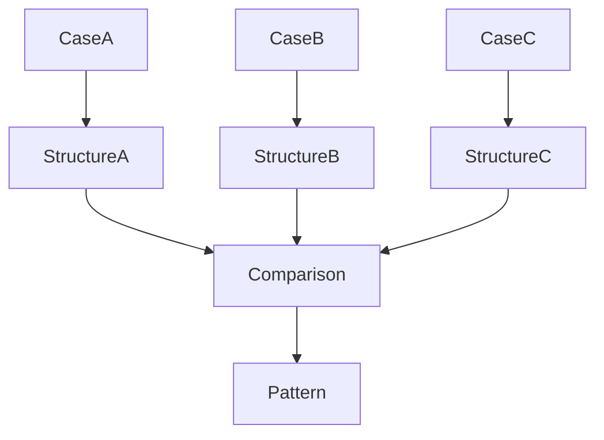

# Case Comparison Method

Case Comparison Method は  
**複数の case を比較して共通構造（pattern）を発見する方法**である。

Knowledge Graph において

```
case → pattern
```

の抽象化は  
**Case Comparison によって行われる。**

---

# Case Comparison の目的

Case Comparison の目的

1 Pattern 発見  
2 Mechanism 推論  
3 Bridge Concept 発見  

---

# Knowledge Graph における位置



Case Comparison は

```
case layer
↓
pattern layer
```

の橋渡しである。

---

# Case Comparison の基本手順

## Step1  
比較する case を選ぶ

最低

```
3 case
```

が望ましい。

---

## Step2  
Case Structure を整理する

各 case について

|要素|説明|
|---|---|
|condition|初期条件|
|trigger|発生要因|
|actor|主体|
|interaction|相互作用|
|outcome|結果|

---

## Step3  
共通要素を探す

複数 case に現れる構造を抽出する。

---

## Step4  
進行構造を作る

```
condition
↓
trigger
↓
interaction
↓
outcome
```

---

## Step5  
Pattern を定義する

共通構造を

```
pattern
```

として記述する。

---

# Case Comparison 図



---

# Case Comparison の比較軸

Case は次の軸で比較する。

|軸|説明|
|---|---|
|condition|背景|
|trigger|発生原因|
|actor|主体|
|interaction|相互作用|
|outcome|結果|

---

# Case Comparison 表

|要素|Case A|Case B|Case C|
|---|---|---|---|
|condition| | | |
|trigger| | | |
|actor| | | |
|interaction| | | |
|outcome| | | |

---

# Case Comparison 例（抽象）

Case

```
企業炎上
政治スキャンダル
芸能人炎上
```

比較

|要素|企業炎上|政治炎上|芸能炎上|
|---|---|---|---|
|trigger|規範逸脱|規範逸脱|規範逸脱|
|actor|SNS群衆|メディア|SNS群衆|
|interaction|拡散|報道|拡散|
|outcome|評判制裁|政治制裁|評判制裁|

抽出 pattern

```
評判制裁パターン
```

---

# Case Comparison の種類

## Similar Case Comparison

似た case の比較

目的

```
pattern 発見
```

---

## Contrast Case Comparison

対照 case の比較

目的

```
mechanism 発見
```

---

## Cross Domain Case Comparison

異分野 case の比較

目的

```
Bridge Concept 発見
```

---

# Cross Domain Case Comparison 例

```
市場バブル
政治ポピュリズム
SNS炎上
```

共通構造

```
群衆心理
↓
急激拡大
↓
崩壊
```

---

# Case Comparison の注意

### Case 数不足

1〜2 case では  
pattern は不安定。

---

### 特殊 case

例外が pattern を歪める。

---

### outcome 比較のみ

過程が消える。

---

# Case Comparison と Pattern Extraction

Case Comparison は

```
Pattern Extraction Method
```

の中心プロセスである。

---

# Case Comparison と Knowledge Graph

Knowledge Graph では

```
case layer
↓
pattern layer
↓
mechanism layer
```

の最初の抽象化が  
Case Comparison である。

---

# LLM にとっての意味

Case Comparison があると  
LLM は

- pattern discovery  
- analogy reasoning  
- structure abstraction  

を行いやすくなる。

---

# 関連ノート

- [[Representative Case Rule]]
- [[Case Writing Rule]]
- [[Pattern Extraction Method]]
- [[99_oldzettelkasten/04_knowledge_graph/Pattern]]
- [[99_oldzettelkasten/04_knowledge_graph/Bridge Concept]]