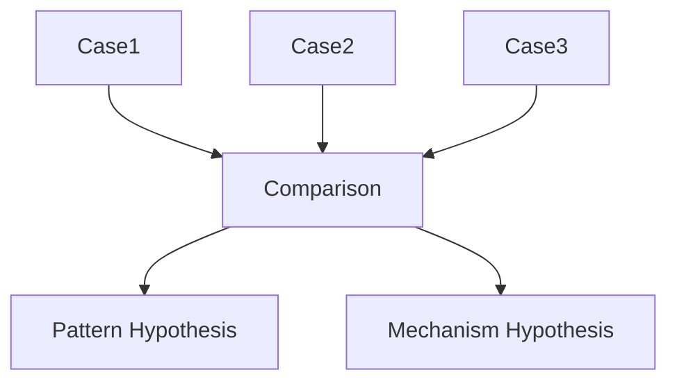
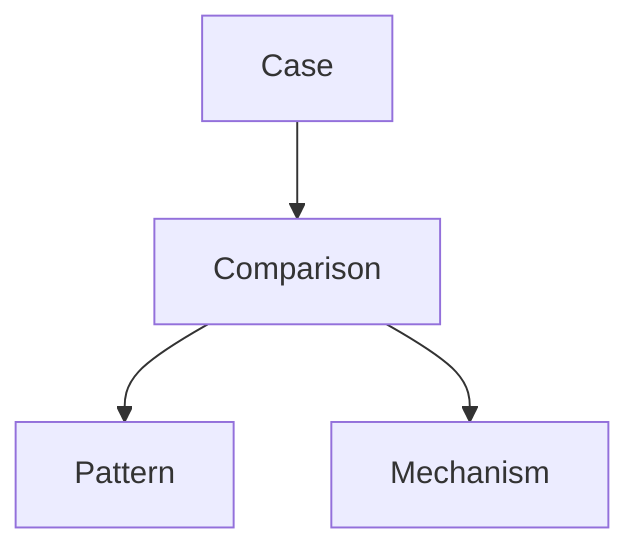

# Case Comparison Method

Case Comparison Method は、Knowledge Graph において  
**複数の case を比較して pattern や mechanism を抽出する方法**である。

単一 case だけでは

- pattern は見えにくい  
- mechanism は推測にとどまる  

しかし複数 case を比較すると、

- 共通構造  
- 相違条件  
- 因果要因  

が見えてくる。

---

# Case Comparison の役割

Case Comparison は次の目的で使う。

### 1 Pattern 抽出

複数の case から共通構造を見つける。

```
case1
case2
case3
 ↓
pattern
```

---

### 2 Mechanism 推論

違いの原因を探す。

```
case A
case B
 ↓
mechanism difference
```

---

### 3 Boundary 確認

似た pattern の境界を確認する。

---

### 4 Cross Domain Insight

異なる領域の共通構造を見つける。

---

# Case Comparison の基本構造

比較は次の要素で行う。

```
context
actor
trigger
interaction
outcome
```

---

# Comparison テーブル

case 比較は次の形式が便利。

|項目|case1|case2|case3|
|---|---|---|---|
|context| | | |
|trigger| | | |
|actor| | | |
|interaction| | | |
|outcome| | | |

---

# Case Comparison 手順

### Step1  
比較する case を選ぶ。

---

### Step2  
比較軸を決める。

例

- trigger  
- actor  
- interaction  
- outcome  

---

### Step3  
共通点を探す。

---

### Step4  
相違点を探す。

---

### Step5  
pattern / mechanism を仮説として立てる。

---

# Comparison の図



---

# Case Comparison の種類

比較には3種類ある。

---

## Similar Case Comparison

似た case を比較する。

目的

pattern 抽出

---

## Contrast Case Comparison

対照的 case を比較する。

目的

mechanism 推論

---

## Cross Domain Comparison

異なる領域の case を比較する。

目的

bridge concept 発見

---

# Similar Case Example（抽象）

```
炎上事件A
炎上事件B
炎上事件C
```

比較すると

```
規範逸脱
 ↓
炎上
 ↓
社会制裁
```

pattern が見える。

---

# Contrast Case Example（抽象）

```
炎上した企業
炎上しなかった企業
```

違いを見ると

```
対応速度
謝罪内容
```

mechanism が見える。

---

# Cross Domain Comparison

例

```
企業炎上
政治スキャンダル
SNSキャンセル
```

共通構造

```
規範逸脱
 ↓
集団反応
 ↓
評判制裁
```

---

# Comparison の注意

Case Comparison は次に注意する。

---

### 1 比較軸を揃える

軸が違うと意味がない。

---

### 2 case 数を増やす

3 case 以上が理想。

---

### 3 特殊事例を除く

ノイズになる。

---

### 4 outcome だけ比較しない

過程が重要。

---

# Comparison から Pattern を作る

Case Comparison の結果、

```
共通構造
```

が見えたら pattern ノートを作る。

---

# Comparison から Mechanism を作る

Contrast Comparison で

```
違いの原因
```

が見えたら mechanism を作る。

---

# Case Comparison と Knowledge Graph

Case Comparison は

```
case layer
```

から

```
pattern layer
mechanism layer
```

へ上がる方法である。

---

# Case Comparison の図



---

# LLM にとっての意味

Case Comparison があると

LLM は

- pattern 抽出  
- mechanism 推論  
- cross domain analogy  

を行いやすくなる。

---

# 関連ノート

- [[Case Writing Rule]]
- [[Representative Case Rule]]
- [[99_oldzettelkasten/04_knowledge_graph/Pattern]]
- [[99_oldzettelkasten/04_knowledge_graph/Mechanism]]
- [[99_oldzettelkasten/04_knowledge_graph/Bridge Concept]]
- [[99_oldzettelkasten/04_knowledge_graph/Knowledge Graph]]