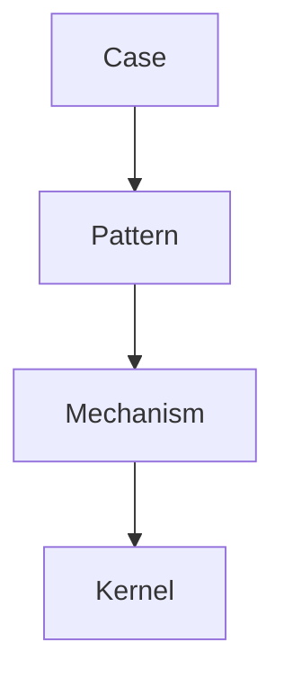
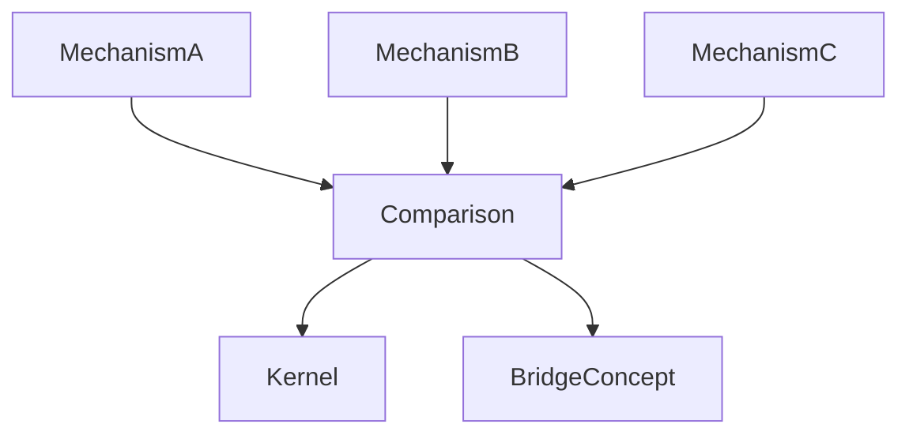
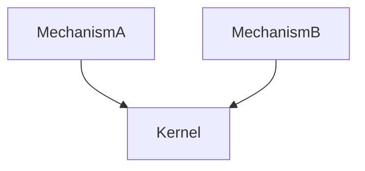

# Mechanism Comparison

Mechanism Comparison は  
**複数の mechanism を比較して共通原理や差異を明らかにする方法**である。

Mechanism は pattern の背後にある因果構造であるため、  
mechanism を比較することで

- 上位 kernel の発見  
- mechanism の分類  
- cross domain 理解  

が可能になる。

---

# Mechanism Comparison の位置

Knowledge Graph の階層



Mechanism Comparison は

```
Mechanism ↔ Mechanism
```

の比較分析である。

---

# Mechanism Comparison の目的

Mechanism Comparison の主な目的

1 共通 Kernel の発見  
2 Mechanism の分類  
3 Bridge Concept の発見  

---

# Mechanism Comparison の基本構造



---

# Mechanism Comparison 手順

### Step1  
比較する mechanism を選ぶ

---

### Step2  
比較軸を決める

---

### Step3  
共通構造を抽出する

---

### Step4  
差異を特定する

---

### Step5  
Kernel や Bridge Concept を推定する

---

# Mechanism Comparison の比較軸

|軸|説明|
|---|---|
|actor|主体|
|trigger|発生条件|
|action|行動|
|interaction|相互作用|
|feedback|フィードバック|

---

# Mechanism Comparison 表

|要素|Mechanism A|Mechanism B|
|---|---|---|
|trigger| | |
|actor| | |
|interaction| | |
|feedback| | |

---

# Mechanism Comparison 例

Mechanism A

```
同調メカニズム
```

Mechanism B

```
模倣メカニズム
```

比較

|要素|同調|模倣|
|---|---|---|
|trigger|社会圧力|成功観察|
|actor|集団|個人|
|行動|合わせる|真似る|

共通 Kernel

```
社会性原理
```

---

# Mechanism Comparison 図



---

# Mechanism Comparison の種類

## Similar Mechanism Comparison

似た mechanism の比較

目的

```
分類
```

---

## Contrast Mechanism Comparison

対照 mechanism の比較

目的

```
構造理解
```

---

## Cross Domain Mechanism Comparison

異分野の mechanism 比較

目的

```
普遍原理発見
```

---

# Cross Domain Mechanism Comparison 例

```
市場競争
政治競争
進化競争
```

共通 kernel

```
選択原理
```

---

# Mechanism Comparison の注意

### 抽象度を揃える

micro と macro mechanism を混ぜない。

---

### pattern と混同しない

pattern

```
進行構造
```

mechanism

```
因果構造
```

---

### kernel を急いで決めない

比較結果から慎重に抽出する。

---

# Mechanism Comparison と Knowledge Graph

Mechanism Comparison は

```
mechanism layer
```

の分析手法である。

```
case → pattern → mechanism → kernel
```

の上位構造理解を助ける。

---

# LLM にとっての意味

Mechanism Comparison があると

LLM は

- mechanism の分類  
- kernel 推定  
- cross domain 推論  

を行いやすくなる。

---

# 関連ノート

- [[99_oldzettelkasten/04_knowledge_graph/Mechanism]]
- [[Mechanism Identification]]
- [[99_oldzettelkasten/04_knowledge_graph/Pattern]]
- [[Kernel]]
- [[99_oldzettelkasten/04_knowledge_graph/Knowledge Graph Structure]]