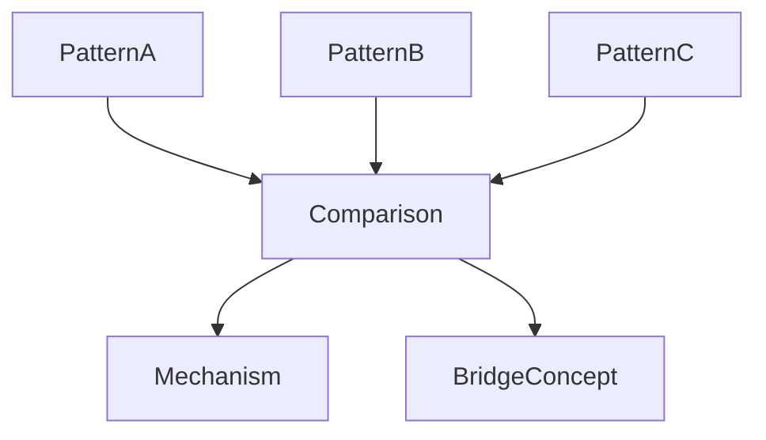
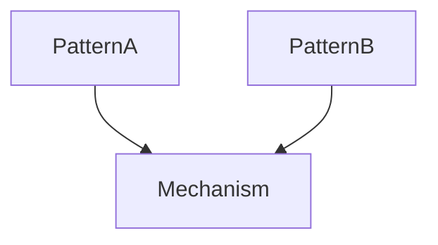
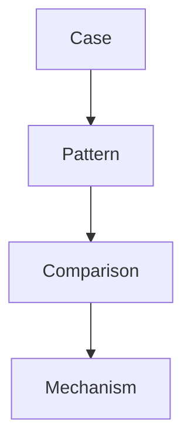

# Pattern Comparison

Pattern Comparison は、Knowledge Graph において  
**複数の pattern を比較して構造差や共通 mechanism を発見する方法**である。

Pattern Extraction が

```
case → pattern
```

の抽象化だとすると、

Pattern Comparison は

```
pattern ↔ pattern
```

の比較分析である。

この方法を使うと

- pattern の境界を明確にできる  
- mechanism を特定できる  
- Bridge Concept を発見できる  

---

# Pattern Comparison の目的

Pattern Comparison の主な目的は次の3つ。

---

## 1 Pattern Boundary の確認

似た pattern の違いを明確にする。

---

## 2 Mechanism の発見

複数 pattern の背後にある  
共通 mechanism を見つける。

---

## 3 Bridge Concept の発見

異なる domain の pattern を接続する。

---

# Pattern Comparison の基本構造



---

# Pattern Comparison 手順

### Step1  
比較する pattern を選ぶ。

---

### Step2  
比較軸を決める。

---

### Step3  
共通点を探す。

---

### Step4  
相違点を探す。

---

### Step5  
mechanism や Bridge Concept を抽出する。

---

# Pattern Comparison の比較軸

Pattern は次の軸で比較する。

|軸|説明|
|---|---|
|trigger|発生原因|
|actor|主体|
|interaction|相互作用|
|escalation|拡大過程|
|outcome|結果|

---

# Pattern Comparison 表

|要素|Pattern A|Pattern B|
|---|---|---|
|trigger| | |
|actor| | |
|interaction| | |
|outcome| | |

---

# Pattern Comparison の例（抽象）

例

Pattern A

```
炎上
```

Pattern B

```
政治スキャンダル
```

比較

|要素|炎上|スキャンダル|
|---|---|---|
|trigger|規範逸脱|規範逸脱|
|actor|SNS群衆|メディア|
|interaction|拡散|報道|
|outcome|評判制裁|政治制裁|

共通 mechanism

```
評判メカニズム
```

---

# Pattern Comparison 図



---

# Pattern Comparison の種類

---

## Similar Pattern Comparison

似た pattern を比較する。

目的

```
境界確認
```

---

## Contrast Pattern Comparison

対照的 pattern を比較する。

目的

```
mechanism 発見
```

---

## Cross Domain Pattern Comparison

異なる domain の pattern を比較する。

目的

```
Bridge Concept 発見
```

---

# Cross Domain Pattern Comparison 例

```
政治権力争い
組織内権力争い
コミュニティ対立
```

共通概念

```
権力
```

Bridge Concept

```
権力
```

---

# Pattern Comparison の注意

---

### 1 抽象度を揃える

macro pattern と micro pattern を  
直接比較しない。

---

### 2 pattern と mechanism を混同しない

pattern

```
進行構造
```

mechanism

```
因果構造
```

---

### 3 outcome だけ比較しない

過程が重要。

---

# Pattern Comparison と Knowledge Graph

Pattern Comparison は

```
pattern layer
```

の分析方法である。

```
case → pattern → mechanism
```

の中間を扱う。

---

# Pattern Comparison の図



---

# LLM にとっての意味

Pattern Comparison があると  
LLM は

- pattern 境界を理解  
- mechanism を発見  
- cross domain analogy  

を行いやすくなる。

---

# 関連ノート

- [[99_oldzettelkasten/04_knowledge_graph/Pattern]]
- [[99_oldzettelkasten/04_knowledge_graph/Pattern Hub]]
- [[Pattern Extraction Method]]
- [[99_oldzettelkasten/04_knowledge_graph/Bridge Concept]]
- [[99_oldzettelkasten/04_knowledge_graph/Mechanism]]
- [[99_oldzettelkasten/04_knowledge_graph/Knowledge Graph]]