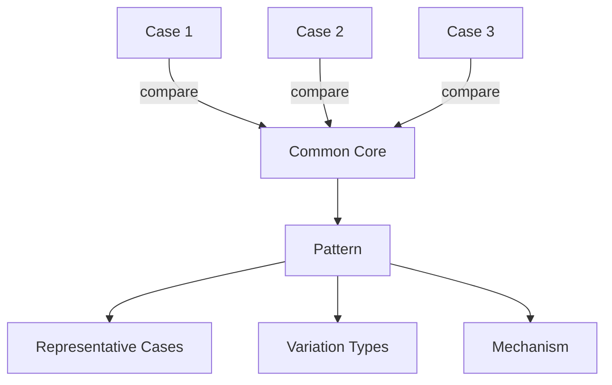
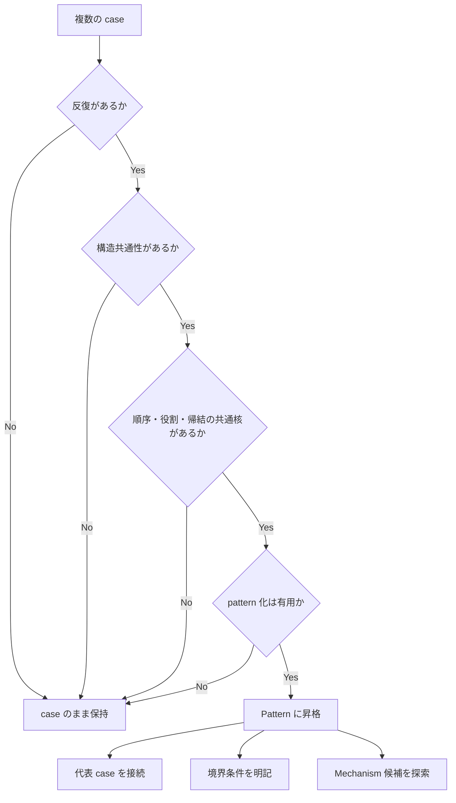

# Case to Pattern Promotion

Case to Pattern Promotion は、  
複数の具体事例から反復する共通形を抽出し、  
**case を pattern へ昇格させるための判断規則**である。

Knowledge Graph では、case は現実との接地面であり、  
pattern は再発する型の認識装置である。  
この二つがつながらないと、Vault は

- 事例の倉庫にはなるが
- 一般化が弱く
- 再発予測ができず
- domain 横断も起きにくい

という状態に陥る。

Case to Pattern Promotion は、  
「この事例は単独事件として置くべきか、  
それとも繰り返す型として pattern に上げるべきか」  
を判断するための規則である。

---

# 定義

Case to Pattern Promotion とは、  
複数の case に共通して現れる構造・順序・役割分担・帰結を整理し、  
それらを **反復可能な現象の型** として pattern ノードに昇格させる操作である。

その目的は次の通りである。

1. case の山から共通形を抽出する  
2. 一回きりの出来事と反復型を区別する  
3. prediction と comparison を可能にする  
4. domain を超える再利用性を高める  
5. mechanism 抽出の足場を作る  
6. LLM が類例探索しやすい構造を作る  

---

# なぜ必要か

Vault は運用していると、  
最初は case がどんどん増える。  
しかし pattern 昇格が起きないと、次のような問題が生じる。

## 1. case の散乱
似た事例がバラバラに置かれ、関連性が見えない。

## 2. 毎回ゼロから解釈
同じ種類の失敗や炎上でも、毎回一件ずつ手で考えることになる。

## 3. 再発予測不能
「また起きる型」として認識されないため、予防や設計に使えない。

## 4. mechanism 抽出不能
pattern がないと、背後 mechanism に上がりにくい。

## 5. Graph の具体偏重
case は増えるが abstract layer が痩せる。

Case to Pattern Promotion は、  
Knowledge Graph を「出来事の記録帳」から  
**再発構造の地図** へ変えるために必要である。

---

# 全体構造

```mermaid
graph TD

    A[Case to Pattern Promotion] --> B[Promotion Trigger]
    A --> C[Promotion Criteria]
    A --> D[Promotion Procedure]
    A --> E[Promotion Output]
    A --> F[Promotion Risks]
    A --> G[Post Promotion Maintenance]

    B --> B1[Repeated Similar Cases]
    B --> B2[Shared Sequence]
    B --> B3[Shared Roles]
    B --> B4[Shared Outcome]

    C --> C1[Repetition]
    C --> C2[Structural Similarity]
    C --> C3[Difference Tolerance]
    C --> C4[Abstraction Usefulness]
    C --> C5[Cross Context Portability]

    D --> D1[Collect Cases]
    D --> D2[Compare Cases]
    D --> D3[Extract Common Core]
    D --> D4[Name Pattern]
    D --> D5[Link Pattern to Cases]
    D --> D6[Link Pattern to Mechanism]

    E --> E1[Pattern Note]
    E --> E2[Representative Cases]
    E --> E3[Boundary Conditions]
    E --> E4[Variation Types]

    F --> F1[Premature Abstraction]
    F --> F2[Overfitting to One Case]
    F --> F3[Naming Bias]
    F --> F4[Ignoring Counterexamples]

    G --> G1[Update Pattern by New Cases]
    G --> G2[Split Pattern if Too Broad]
    G --> G3[Promote to Mechanism]
```

---

# Promotion の本質

Promotion の本質は、  
「似た例が複数あったからまとめる」ことではない。  
重要なのは、  
**何が共通し、何が違ってもなお同じ型とみなせるか**  
を判断することである。

つまり pattern は単なる平均ではない。  
pattern とは、

- 反復する順序
- 反復する役割配置
- 反復する緊張関係
- 反復する崩れ方
- 反復する帰結

を持つ「型」である。

---

# pattern に昇格すべき case とは何か

以下の条件があるとき、case は pattern 昇格候補になる。

## 1. 類似 case が複数ある
最低2件でも候補にはなるが、3件以上あると強い。

## 2. 共通する順序がある
出来事の並びに反復性がある。

例:
- 逸脱
- 可視化
- 非難集中
- 境界確認
- 排除

## 3. 共通する役割がある
登場主体が違っても、役割配置が似る。

例:
- 逸脱者
- 規範維持者
- 煽動者
- 観衆
- 仲裁者

## 4. 共通する outcome がある
結末や帰結が一定方向へ寄る。

## 5. その抽象化が今後使える
pattern 化したときに、
- 比較
- 予測
- 設計
- domain 横断
に役立つ。

---

# Promotion Trigger

Promotion を始めるきっかけは次のようなものである。

---

## 1. Repeated Similar Cases

似た case が複数蓄積したとき。

例:
- 複数の炎上事例
- 複数の責任回避事例
- 複数の制度疲労事例

---

## 2. Shared Sequence

発生順序が似ているとき。

例:
- 期待形成
- 誤解
- 失望
- 攻撃集中
- 信頼崩壊

---

## 3. Shared Roles

登場人物は違うが役割配置が似ているとき。

例:
- 支配者 / 被支配者
- 正統化主体 / 反対主体
- 逸脱者 / 制裁者 / 観衆

---

## 4. Shared Outcome

帰結が繰り返し似るとき。

例:
- 排除
- 責任不明化
- 制度形骸化
- 信頼低下

---

# Promotion Criteria

pattern に上げる前に確認すべき基準がある。

---

## 1. Repetition

本当に複数回現れているか。

確認すること:
- 少なくとも複数事例に現れるか
- 一件限りの特殊事情ではないか
- 別文脈でも見られるか

---

## 2. Structural Similarity

表面的要素ではなく、構造が似ているか。

たとえば:
- 人物名が違う
- 時代が違う
- media が違う

それでも
- 役割配置
- 力関係
- 進行順
- 破綻箇所
が似ていれば、pattern 候補になる。

---

## 3. Difference Tolerance

何が違っても同じ pattern として扱えるかを確認する。

これは非常に重要である。

pattern は完全一致ではない。  
違いがあっても同じ型として扱える必要がある。

例:
- 炎上の規模は違う
- 主体は個人か企業か違う
- 媒体は SNS かリアル集団か違う

しかし
- 規範逸脱の可視化
- 集団的制裁
- 境界確認
が共通なら、同型とみなせる。

---

## 4. Abstraction Usefulness

pattern 化することで、何が良くなるか。

pattern に上げる価値があるのは、次のような場合。

- 新しい case を分類しやすくなる
- 他分野へ応用できる
- 背後 mechanism が見えやすくなる
- 予防や介入設計に使える

価値が薄いなら、無理に pattern 化しない。

---

## 5. Cross Context Portability

別 context にも移せるか。

例:
- fandom 炎上
- 宗教的異端排除
- 組織内スケープゴート形成

これらが同じ型なら、pattern の価値は高い。

---

# Promotion 手順

Promotion は次の順で行うと安定する。

---

## Step 1. Collect Cases

候補 case を集める。

条件:
- 似ていると感じる case
- outcome が近い case
- 順序が近い case
- role 配置が近い case

---

## Step 2. Compare Cases

比較軸で並べる。

比較軸の例:
- 発端
- 主体
- role 配置
- 進行順
- 強制 / 説得 / 可視化
- outcome
- 再発条件

---

## Step 3. Extract Common Core

共通核を取り出す。

ここで抽出するのは、
- 表面的な素材
ではなく
- 反復する骨格
である。

---

## Step 4. Name Pattern

pattern 名を付ける。

命名のコツ:
- 抽象すぎない
- 一事例固有すぎない
- 作動や帰結が見える
- 他 case にも適用しやすい

悪い例:
- A社炎上型
- なんか攻撃されるやつ

良い例:
- 規範逸脱可視化パターン
- 責任拡散パターン
- 正統性崩壊パターン

---

## Step 5. Link Pattern to Cases

新 pattern から各 case へ `observed_in` / `instance_of` 関係でつなぐ。

基本:
- Case → Pattern は `instance_of`
- Pattern → Case は `observed_in` 的に本文で示す

---

## Step 6. Link Pattern to Mechanism

pattern の背後に mechanism があるなら接続する。

例:
- 責任回避パターン
→ 責任分散メカニズム
- 規範逸脱可視化パターン
→ 集団規範防衛メカニズム

---

# Promotion の図

---

# pattern ノートに書くべき内容

promotion 後の pattern ノートには最低限、次を書く。

## 1. 定義
この pattern は何か。

## 2. 発生条件
どんな条件で起きやすいか。

## 3. 典型的進行
どういう順序で進むか。

## 4. 主要 role
どんな役割が現れやすいか。

## 5. 典型的 outcome
どう終わりやすいか。

## 6. variation
どこが違っても同じ pattern とみなせるか。

## 7. representative case
代表 case は何か。

## 8. related mechanism
背後 mechanism は何か。

---

# 昇格してはいけないケース

次のようなものは、まだ pattern に上げない方がよい。

---

## 1. 一件限りで特殊性が強い
共通性より特殊事情が大きい。

## 2. 共通点が表層だけ
人物属性や時代背景だけ似ていて、構造が違う。

## 3. 名前だけ先走る
面白い名前は付けられるが、実体がない。

## 4. 比較対象が足りない
最低限の variation を見ていない。

## 5. pattern にしても使い道がない
単にまとめただけで、比較・予測・設計に役立たない。

---

# よくある Promotion の失敗

## 1. Premature Abstraction
まだ2件程度で、しかも表面的類似だけなのに pattern 化する。

## 2. Overfitting to One Case
実質的に1件の説明を pattern 名にしただけになる。

## 3. Naming Bias
名前が強すぎて、他 case が見えなくなる。

例:
- 「〇〇型炎上」など固有名寄りすぎる名称

## 4. Ignoring Counterexamples
反例や違う系統を無視して pattern を固定する。

## 5. Mechanism と混同
pattern は「繰り返す型」であり、
mechanism は「それを生む作動過程」である。

---

# pattern と mechanism の違い

これは Promotion で特に重要。

## Pattern
- 繰り返し現れる現象の型
- 順序・役割・帰結の反復
- 観察寄り

## Mechanism
- その型を生む作動過程
- 因果寄り
- 説明寄り

例:
- 責任回避パターン = Pattern
- 責任分散メカニズム = Mechanism

pattern 化の次に、必要なら mechanism 化を考える。

---

# pattern の境界条件

良い pattern には、  
「何を含み、何を含まないか」が必要である。

書くべきこと:
- この pattern の必須条件
- 任意条件
- 似ているが別 pattern のもの
- 適用しないケース

これがないと pattern が膨張する。

---

# Promotion 判断のための質問

新しい case 群を見たとき、次の問いで判定する。

## 1. これは複数回現れているか
## 2. 共通する順序があるか
## 3. 共通する role 配置があるか
## 4. 結果が似ているか
## 5. 表層差を超える構造共通性があるか
## 6. pattern 化すると比較や予測に役立つか
## 7. 反例を見てもなお共通核が残るか

---

# Promotion 判定フロー

---

# LLM にとっての意味

Case to Pattern Promotion があると、LLM は

- 新しい case を既存 pattern に分類しやすくなり
- 類例探索が速くなり
- 単発の印象論でなく反復構造として説明しやすくなり
- 背後 mechanism への抽象化がしやすくなる

逆に promotion がないと、  
LLM は毎回 case ごとにゼロから連想しやすい。

つまり Promotion は、  
LLM に「この Vault における再発型の辞書」を与える。

---

# この Vault における実装方針

この Vault では、case が3件以上似たら、  
最低一度は pattern 昇格を検討する。

推奨運用:
- case を並べた比較メモを作る
- 共通核を抽出する
- 仮 pattern 名をつける
- 反例が出たら境界条件を修正する
- pattern が安定したら mechanism を探る

重要:
- 一気に mechanism へ飛ばない
- まず pattern を作る
- その後に背後 explanation を整える

---

# 他ノートとの接続

## 上位
- [[99_oldzettelkasten/04_knowledge_graph/Knowledge Graph]]

## 近接
- [[99_oldzettelkasten/04_knowledge_graph/Graph Maintenance]]
- [[99_oldzettelkasten/04_knowledge_graph/Reasoning Path]]
- [[99_oldzettelkasten/04_knowledge_graph/Traversal]]
- [[99_oldzettelkasten/04_knowledge_graph/Bridge Concept]]
- [[Anchor Case]]

## 下位候補
- [[02_zettelkasten/04_meta/case_intelligence/03_pattern_extraction/Pattern Boundary Rule]]
- [[Representative Case Rule]]
- [[Pattern Naming Rule]]
- [[Pattern to Mechanism Promotion]]

---

# まとめ

Case to Pattern Promotion は、  
複数の具体事例から**反復する共通形**を抽出し、  
case を pattern へ昇格させるための判断規則である。

これにより、

- case の散乱を防ぎ
- 比較と予測を可能にし
- mechanism 抽出の足場を作り
- domain 横断を強め
- LLM の類例推論を安定化できる

case が地面の石だとすれば、  
pattern はそこに現れる地層の線である。
