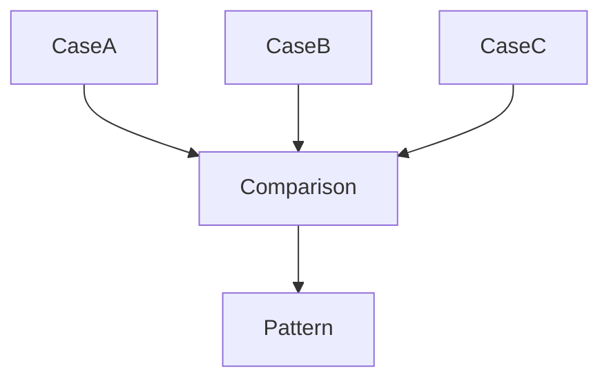
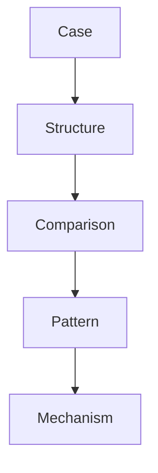
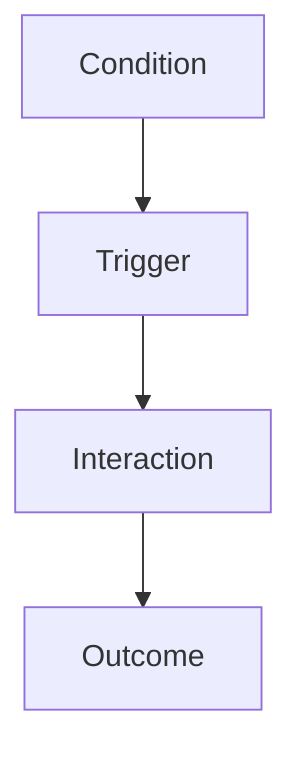
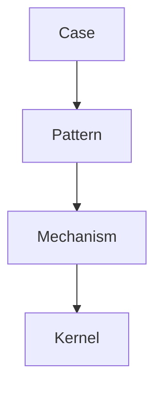

# Pattern Extraction Method

Pattern Extraction Method は、Knowledge Graph において  
**複数の case から共通する進行構造（pattern）を抽出する方法**である。

Pattern は直接観察できるものではなく、  
**case の比較から発見される構造**である。

そのため Pattern Extraction は

- case analysis
- case comparison
- abstraction

のプロセスを含む。

---

# Pattern Extraction の目的

Pattern Extraction は次を目的とする。

- case の共通構造を発見する  
- 知識を抽象化する  
- mechanism 推論の基盤を作る  

---

# Pattern Extraction の基本構造



---

# Pattern Extraction 手順

### Step1  
case を収集する。

最低

```
3 case
```

以上が望ましい。

---

### Step2  
case の構造を整理する。

各 case について

- condition
- trigger
- actor
- interaction
- outcome

を書く。

---

### Step3  
case comparison を行う。

共通点を探す。

---

### Step4  
進行構造を抽象化する。

```
共通 sequence
```

を抽出する。

---

### Step5  
pattern ノートを作る。

---

# Pattern Extraction の図



---

# Pattern Extraction の例（抽象）

例

```
企業炎上
政治スキャンダル
SNSキャンセル
```

共通構造

```
規範逸脱
 ↓
情報拡散
 ↓
集団反応
 ↓
評判制裁
```

Pattern

```
評判制裁パターン
```

---

# Pattern Extraction の分析軸

Pattern Extraction は次の軸で分析する。

|軸|説明|
|---|---|
|condition|初期状態|
|trigger|発生原因|
|actor|主体|
|interaction|相互作用|
|outcome|結果|

---

# Pattern Extraction フレーム

```
condition
 ↓
trigger
 ↓
interaction
 ↓
outcome
```

---

# Pattern Extraction 図



---

# Pattern Extraction の注意

---

### 1 case が少ない

pattern が不安定になる。

---

### 2 特殊事例

共通構造が歪む。

---

### 3 outcome だけ抽象

進行構造が消える。

---

### 4 mechanism と混同

因果説明と構造を区別する。

---

# Pattern Extraction と Mechanism

Pattern は mechanism の表れ。

```
pattern
 ↓
mechanism
```

Mechanism は  
pattern の原因を説明する。

---

# Pattern Extraction と Knowledge Graph

Pattern Extraction は

```
case layer
 ↓
pattern layer
```

への抽象化である。

---

# Pattern Extraction の図



---

# LLM にとっての意味

Pattern Extraction があると  
LLM は

- case の共通構造を見つける  
- 新しい pattern を発見する  
- reasoning を一般化する  

---

# 関連ノート

- [[99_oldzettelkasten/04_knowledge_graph/Pattern]]
- [[99_oldzettelkasten/04_knowledge_graph/Pattern Hub]]
- [[Pattern Comparison]]
- [[Case Comparison Method]]
- [[99_oldzettelkasten/04_knowledge_graph/Mechanism]]