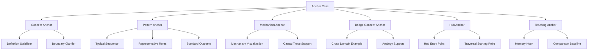
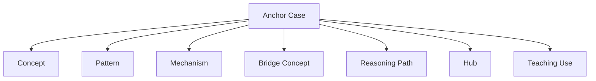
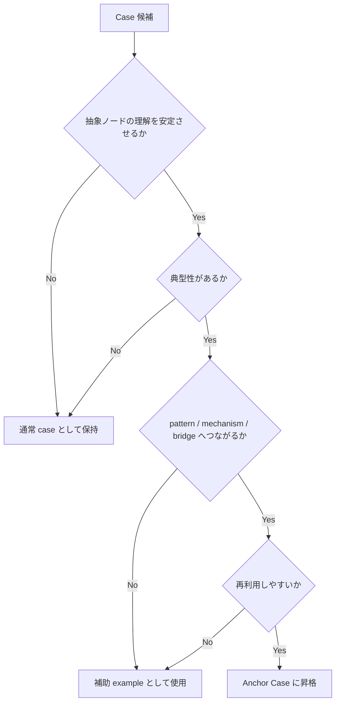

# Anchor Case

Anchor Case は、Knowledge Graph において  
**抽象概念・pattern・mechanism・bridge concept を現実に接地させる代表的事例**である。

Knowledge Graph を整備していくと、  
どうしても次の方向に傾きやすい。

- concept が増える
- pattern が増える
- mechanism が増える
- bridge concept が増える

これは必要な発展だが、同時に危険もある。  
抽象が育つほど、知識はしばしば

- 何となく分かった気になる
- 具体的にどの事例なのか曖昧になる
- 似た概念同士の差が見えにくくなる
- LLM が空中戦を始めやすくなる

Anchor Case はそれを防ぐ。  
つまり Anchor Case は、抽象知に対する  
**現実の杭** である。

---

# 定義

Anchor Case とは、  
ある concept / pattern / mechanism / bridge concept の理解・説明・比較・教育において、  
**代表例として繰り返し参照される具体事例ノード**である。

単なる case との違いは、  
Anchor Case が次のような役割を持つ点にある。

1. 抽象概念の意味を安定させる  
2. pattern の典型形を見せる  
3. mechanism の作動を具体化する  
4. bridge concept の横断性を支える  
5. hub や reasoning path の入口になる  
6. LLM の説明を空中化させない  

---

# なぜ必要か

抽象知には具体の支えが必要である。  
Anchor Case がないと、Knowledge Graph は次のように崩れやすい。

## 1. 抽象漂流
概念は整っているが、何のことか分からない。

## 2. 差分不明
似た pattern がどう違うか、具体例で比べられない。

## 3. 教材化不能
人にも LLM にも「例えば？」に弱くなる。

## 4. 説明不安定
毎回違う例を思い出し、説明が揺れる。

## 5. bridge 不成立
Bridge Concept が複数 domain にまたがるとき、各 domain の具体例がないため横断性が弱くなる。

## 6. mechanism 空洞化
「どう動くか」は書いてあるが、どの現実で見えるのかが曖昧になる。

Anchor Case は、抽象と具体の往復を可能にする  
**下降路と上昇路の接点** である。

---

# 全体構造

---

# Anchor Case の本質

Anchor Case の本質は、  
「有名な事例」であることではない。  
重要なのは、  
**その abstract node を理解するうえで、繰り返し使ってよいほど典型的・説明的・比較可能であること**  
である。

つまり Anchor Case は、

- ただの具体例
- 思いつきの例
- 面白い逸話

ではない。

Anchor Case は、  
**抽象知の基準点** である。

---

# Anchor Case の役割

## 1. Definition Stabilizer

concept の定義を具体で安定させる。

例:
- [[植民地化]]
- [[韓国併合]]

このとき Anchor Case は、  
「何をもって植民地化と呼ぶか」の輪郭を具体に落とす。

---

## 2. Boundary Clarifier

似た概念との差を具体例で示す。

例:
- [[正統性]]
- [[強制]]
- それぞれを代表する事例

これにより、抽象差分が見えやすくなる。

---

## 3. Typical Sequence Holder

pattern の典型進行を持つ。

例:
- 規範逸脱可視化パターン
- その代表事例としての特定炎上 case

pattern を学ぶとき、Anchor Case は  
「この順で進みやすい」という時間構造を見せる。

---

## 4. Mechanism Visualization

mechanism の作動を見える形にする。

例:
- [[責任分散メカニズム]]
- 多段委任構造の具体事例

mechanism は抽象的なので、Anchor Case があると格段に理解しやすい。

---

## 5. Cross Domain Support

Bridge Concept の横断性を支える。

例:
- [[権力]] を anchor する
  - 国家支配の事例
  - 組織支配の事例
  - fandom 規範支配の事例

これにより、Bridge Concept が本当に橋として機能する。

---

## 6. Memory Hook

学習や再利用のための記憶フックになる。

抽象だけでは覚えにくいが、  
Anchor Case があると想起しやすい。

---

# Anchor Case の種類

Anchor Case は用途によって型が分かれる。

---

## 1. Concept Anchor

概念の意味を安定させるための case。

例:
- [[主権]]
- [[韓国併合]]
- [[信頼]]
- 代表的な協力崩壊事例

使い道:
- 定義
- contrasts_with
- example

---

## 2. Pattern Anchor

pattern の典型進行を示す case。

例:
- [[02_zettelkasten/01_knowledge/world_model/pattern/organization/pattern/behavior/責任回避パターン]]
- 代表的責任回避案件

使い道:
- pattern 説明
- case 比較
- pattern 境界条件確認

---

## 3. Mechanism Anchor

mechanism がどう働くかを見せる case。

例:
- [[02_zettelkasten/01_knowledge/world_model/model/social/information/シグナリング]]
- 就活学歴競争の具体事例
- ブランド高価格化の具体事例

使い道:
- 因果説明
- application
- domain 横断

---

## 4. Bridge Concept Anchor

bridge concept を各領域で支える case 群。

例:
- [[正統性]]
  - 君主制事例
  - 企業リーダー事例
  - fandom 中心人物事例

使い道:
- domain 横断
- analogy
- hub 間移動

---

## 5. Hub Anchor

Hub の入口として置く case。

例:
- Human Model Hub における代表観察事例
- Social Pattern Hub における代表炎上事例

使い道:
- 初学者導線
- traversal 開始点

---

## 6. Teaching Anchor

教育や説明で繰り返し使う case。

特徴:
- 分かりやすい
- 過剰に特殊でない
- 複数概念へ展開できる

---

# Anchor Case の条件

良い Anchor Case には次の条件がある。

---

## 1. 典型性

その concept / pattern / mechanism を代表しうる。

問い:
- その事例を出せば、相手は抽象をイメージしやすくなるか
- 特殊事情が強すぎないか

---

## 2. 説明力

その事例を通じて、重要な relation を辿れるか。

例:
- case → pattern
- case → mechanism
- case → bridge concept

---

## 3. 再利用性

一度だけでなく、何度も参照できるか。

---

## 4. 境界明確化力

似た概念との差を示すのに使えるか。

---

## 5. 比較可能性

他の case と並べて比較しやすいか。

---

## 6. 適度な具体性

細部が多すぎて本筋が埋もれないこと。  
逆に薄すぎて抽象の支えにならないこと。

---

# Anchor Case の図

---

# Anchor Case の作り方

Anchor Case は偶然見つかることもあるが、  
基本的には選定するものである。

---

## Step 1. 抽象ノードを決める

まず、何の anchor が必要か決める。

対象:
- concept
- pattern
- mechanism
- bridge concept

---

## Step 2. 候補 case を集める

その抽象ノードに関わる case を複数集める。

---

## Step 3. 比較する

比較軸:
- 典型性
- 分かりやすさ
- 重要 relation の多さ
- 他 case との比較のしやすさ
- 横断性

---

## Step 4. 代表 case を選ぶ

最も anchor として安定する case を選ぶ。

必要なら1つではなく、  
「主 anchor + 補助 anchor」の形でもよい。

---

## Step 5. anchor として明記する

abstract node の本文や hub に、  
この case が representative / anchor であることを書く。

---

## Step 6. reasoning path に埋め込む

重要な問いに対して、その anchor case を経由する path を作る。

---

# Anchor Case の記述内容

Anchor Case ノートまたは abstract node 側には、最低限次を明示するとよい。

## 1. 何の anchor か
- concept anchor
- pattern anchor
- mechanism anchor
- bridge anchor

## 2. なぜ代表例なのか
- 典型性
- 説明力
- 比較可能性

## 3. どの abstract node につながるか
- 関連 concept
- 関連 pattern
- 関連 mechanism
- 関連 bridge concept

## 4. 何を示すのに向くか
- 定義
- 因果
- 類比
- 対比
- teaching

## 5. どこが限界か
- 特殊事情
- 時代依存
- domain 依存

---

# 代表的な Anchor Case の使い方

## 1. concept の説明

例:
- [[植民地化]]
→ [[韓国併合]] を anchor にする

効果:
- 定義が具体化する
- 単なる用語論争で終わらない

---

## 2. pattern の説明

例:
- [[02_zettelkasten/01_knowledge/world_model/pattern/organization/pattern/behavior/責任回避パターン]]
→ 典型案件を anchor にする

効果:
- pattern の進行順が見える
- role が具体化する

---

## 3. mechanism の説明

例:
- [[02_zettelkasten/01_knowledge/world_model/model/social/information/シグナリング]]
→ 学歴競争を anchor にする

効果:
- 抽象 mechanism が理解しやすい
- 別 domain へ飛ばしやすい

---

## 4. bridge concept の説明

例:
- [[正統性]]
→ 君主制・企業・fandom それぞれ1件ずつ anchor を置く

効果:
- 本当に bridge であることが分かる
- domain 横断が可能になる

---

# 1つの anchor で足りない場合

ある概念には、1件だけでは足りないことがある。

その場合は次の形が有効。

---

## 主 anchor + 補助 anchor

- 主 anchor: 最も典型的
- 補助 anchor: 境界や variation を示す

例:
- [[正統性]]
  - 主: 国家支配事例
  - 補助: 企業リーダー事例
  - 補助: fandom 中心人物事例

---

## 複数 domain anchor

bridge concept では、domain ごとに1件ずつ持つ方がよいことが多い。

---

# Anchor Case と Representative Case の違い

両者は近いが同一ではない。

## Representative Case
その pattern 群の代表例

## Anchor Case
その抽象ノード全体の理解を固定する基準点

多くの場合、Representative Case は Anchor Case になりうるが、  
Anchor Case の方がより「基準点」としての役割が強い。

---

# Anchor Case と Example の違い

## Example
説明のために一時的に出す例

## Anchor Case
継続的に再利用する代表例

つまり Anchor Case は、  
**長期的に使う標準例** である。

---

# 良い Anchor Case の条件

## 1. 抽象を支えられる
## 2. 過度に特殊でない
## 3. 比較の基準になる
## 4. reasoning path に埋め込みやすい
## 5. hub の入口になれる
## 6. 他ノードへの edge が豊富

---

# 悪い Anchor Case のパターン

## 1. 特殊すぎる
例外事例すぎて一般理解を歪める。

## 2. 有名すぎてノイズが多い
余計な連想が多く、概念理解を濁らせる。

## 3. relation が少ない
具体例としてあるだけで、pattern や mechanism に上がれない。

## 4. domain 固定すぎる
bridge concept の anchor なのに、一領域でしか機能しない。

## 5. 使い捨て
一回しか参照されず、標準例になっていない。

---

# Anchor Case 判定のための質問

## 1. この case は何の代表例か
## 2. この case を出すと抽象概念が理解しやすくなるか
## 3. 他 case と比較するとき基準になれるか
## 4. pattern や mechanism に上がりやすいか
## 5. hub や reasoning path の入口として使えるか
## 6. 特殊事情が強すぎないか
## 7. 繰り返し使っても歪みが少ないか

---

# Anchor Case 判定フロー

---

# LLM にとっての意味

Anchor Case が整っていると、LLM は

- 抽象概念を説明するときに安定した代表例を使いやすくなり
- pattern や mechanism を具体に落としやすくなり
- domain 横断時にも具体的な着地点を持ちやすくなり
- 空中戦や曖昧な一般論を減らしやすくなる

つまり Anchor Case は、  
LLM にとっての **具体的な接地座標** である。

---

# この Vault における実装方針

この Vault では、特に次のものに Anchor Case をつけると強い。

## 優先対象
- 重要 concept
- 繰り返し使う pattern
- 抽象的な mechanism
- 強い bridge concept
- 大型 hub の入口ノード

## 推奨運用
- 各重要 abstract node に最低1 anchor
- bridge concept には可能なら複数 domain anchor
- hub に「代表 case」セクションを設ける
- reasoning path で anchor を繰り返し使う
- 特殊すぎる case は補助例にとどめる

---

# 他ノートとの接続

## 上位
- [[99_oldzettelkasten/04_knowledge_graph/Knowledge Graph]]

## 近接
- [[99_oldzettelkasten/04_knowledge_graph/Bridge Concept]]
- [[99_oldzettelkasten/04_knowledge_graph/Reasoning Path]]
- [[02_zettelkasten/04_meta/case_intelligence/03_pattern_extraction/Case to Pattern Promotion]]
- [[99_oldzettelkasten/04_knowledge_graph/Hub Design Rule]]
- [[99_oldzettelkasten/04_knowledge_graph/Traversal]]

## 下位候補
- [[Representative Case Rule]]
- [[02_zettelkasten/04_meta/case_intelligence/03_pattern_extraction/Pattern Boundary Rule]]
- [[Teaching Example Rule]]
- [[Anchor Set Design]]
- [[Concept Anchor]]
- [[Pattern Anchor]]

---

# まとめ

Anchor Case は、Knowledge Graph において  
**抽象概念・pattern・mechanism・bridge concept を現実に接地させる代表事例**である。

これにより、

- 抽象漂流を防ぎ
- 概念差分を見えやすくし
- pattern や mechanism を具体化し
- hub や reasoning path の入口を安定させ
- LLM の説明を接地させる

ことができる。

抽象が空に伸びる木だとすれば、  
Anchor Case はその木を地面につなぐ根である。