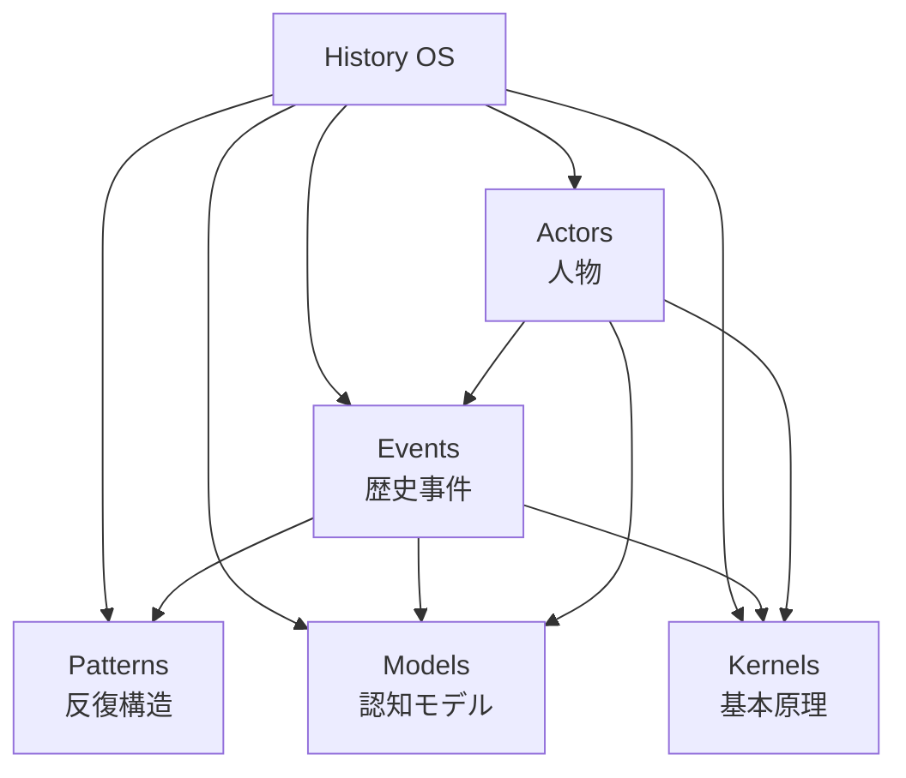
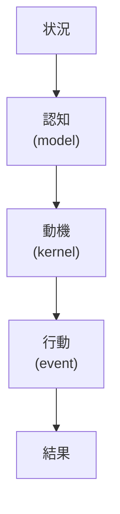
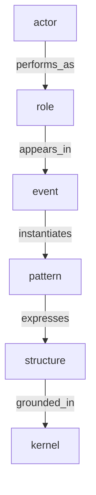

# History Hub

このHubは、歴史分析Vaultの入口であり、

- actors（人物）
- events（事件）
- patterns（反復構造）
- models（認知モデル）
- kernels（基本原理）

を接続する。

歴史事件は次の構造で分析する。

1. Situation
2. Cognition
3. Motivation
4. Action
5. Outcome

対応関係

```
Cognition → model
Motivation → kernel
Action → event
Outcome → historical consequence
```

---

# 全体構造



---

# Actors（人物）

主要な歴史人物

- [[ビスマルク]]
- [[ナポレオン3世]]
- [[ヴィルヘルム1世]]

人物ノートでは

- 置かれた状況
- 認知
- 動機
- 行動パターン

を記述する。

---

# Events（歴史事件）

歴史事件のcaseノート

- [[エムス電報事件]]
- [[サライェヴォ事件]]
- [[七月危機]]
- [[韓国併合]]

各事件は以下の構造で記述される。

1. 背景  
2. 相互作用  
3. 行動モデル  
4. 主体分析  
5. 抽象構造  

---

# Patterns（反復構造）

歴史に繰り返し現れる構造

- [[威信競争]]
- [[世論動員]]
- [[外交エスカレーション]]
- [[情報編集]]
- [[外敵利用による国家統合]]

---

# Models（認知モデル）

主体が状況をどう解釈するか

- [[世論政治]]
- [[国家安全保障モデル]]
- [[国家統合モデル]]
- [[リアルポリティーク]]

---

# Kernels（基本原理）

人間・集団の行動原理

- [[02_zettelkasten/01_knowledge/world_model/model/human/human/感情駆動原理]]
- [[02_zettelkasten/01_knowledge/world_model/meta/model/human/human/社会性原理]]
- [[02_zettelkasten/01_knowledge/world_model/meta/pattern/state/structure/権力構造]]
- [[02_zettelkasten/01_knowledge/world_model/meta/model/human/congnition/限定合理性]]
- [[02_zettelkasten/model/human/human/予測処理原理]]

---

# 歴史分析の基本連鎖



---

# 典型的な分析フロー

1. 人物
2. 事件
3. パターン
4. モデル
5. 原理

例

```
[[ビスマルク]]
↓
[[エムス電報事件]]
↓
[[威信競争]]
↓
[[リアルポリティーク]]
↓
[[権力構造]]
```

---

# 関連ノート

- [[歴史分析構造]]
- [[history_event_template]]
- [[history_event_writing_rule]]
# 11 重要ルール

Caseでは

- 解釈より事実
- event / actor / role を優先

Pattern・Structure・Kernelは後から修正可能である。

Caseは **観察データの保存ノード** として扱う。



主体（actor）が
ある役割（role）で
ある出来事（event）に参加し
そこにあるパターン（pattern）が現れ
その背後に構造（structure）があり
さらに根底（kernel）がある。