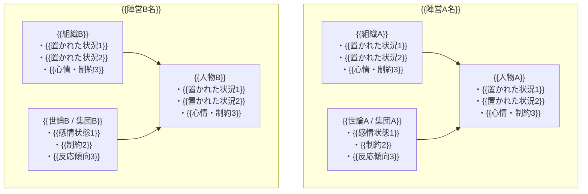
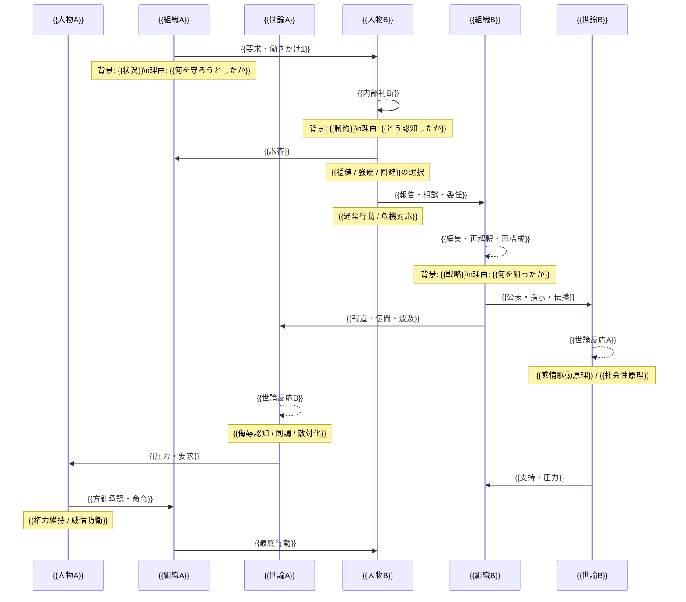
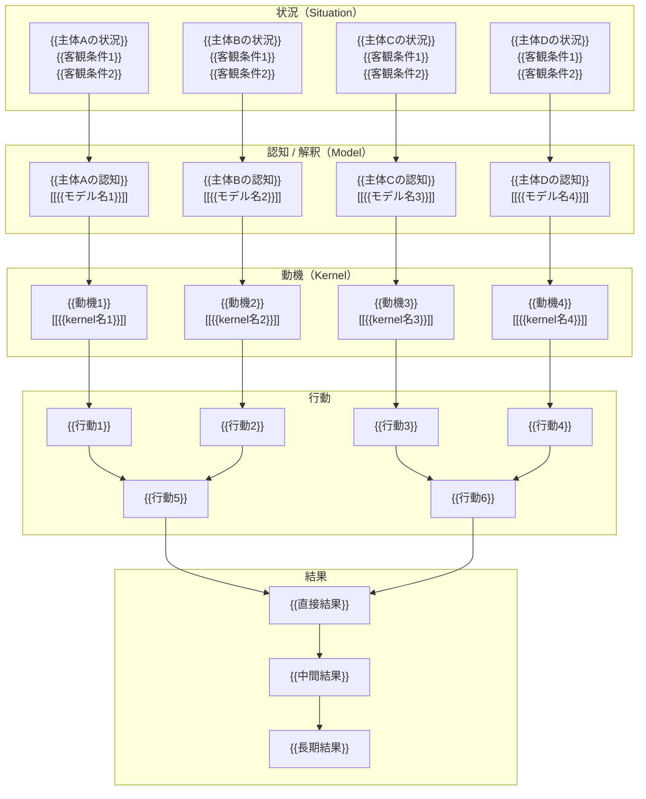
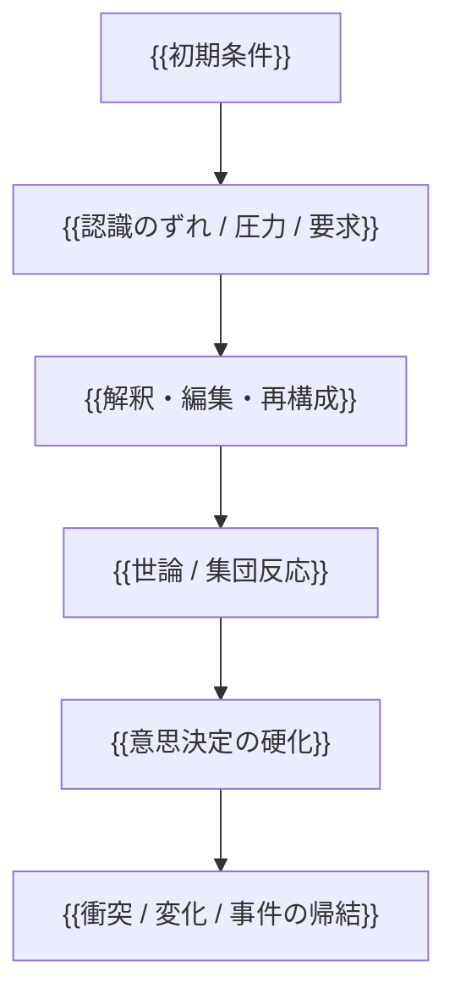

# 概略図
---
note_type: case
layer: event
title: {{事件名}}
period: {{年・時期}}
region: {{地域}}
actors:
  - {{主要人物A}}
  - {{主要人物B}}
  - {{主要集団C}}
tags:
  - 歴史
  - 事件
  - {{タグ1}}
  - {{タグ2}}
status: draft
written: ChatGPT
---

# {{事件名}}

{{事件名}}とは、{{時代・地域}}において生じた{{事件の種類}}であり、  
{{何が起きたか}}を通じて、最終的に{{帰結}}へ至った事件である。

この事件の本質は、単なる出来事の列挙ではなく、

- 各主体がどのような**状況**に置かれていたか
- その状況をどう**認知・解釈**したか
- どのような**動機**によって行動したか
- それらの相互作用がどう**結果**へ連鎖したか

にある。

---

# 1. 背景・心情・置かれた状況

---

# 2. 時系列の相互作用構造

---

# 3. 行動モデル図  
## 状況 → 認知 → 動機 → 行動 → 結果

---

# 4. 主体ごとの整理  
## 置かれた状況 → 認知 → 動機 → 行動

---

## {{主体1}}

### 置かれた状況
- {{客観条件1}}
- {{客観条件2}}
- {{制約3}}

### 認知
- {{何をどう解釈したか}}
- {{何を脅威 / 機会と見たか}}
- 対応する model:
  - [[{{モデル名1}}]]
  - [[{{モデル名2}}]]

### 動機
- {{何を守りたかったか}}
- {{何を達成したかったか}}
- 対応する kernel:
  - [[{{kernel名1}}]]
  - [[{{kernel名2}}]]

### 行動
- {{行動1}}
- {{行動2}}

---

## {{主体2}}

### 置かれた状況
- {{客観条件1}}
- {{客観条件2}}
- {{制約3}}

### 認知
- {{何をどう解釈したか}}
- {{何を脅威 / 機会と見たか}}
- 対応する model:
  - [[{{モデル名1}}]]
  - [[{{モデル名2}}]]

### 動機
- {{何を守りたかったか}}
- {{何を達成したかったか}}
- 対応する kernel:
  - [[{{kernel名1}}]]
  - [[{{kernel名2}}]]

### 行動
- {{行動1}}
- {{行動2}}

---

## {{主体3}}

### 置かれた状況
- {{客観条件1}}
- {{客観条件2}}
- {{制約3}}

### 認知
- {{何をどう解釈したか}}
- {{何を脅威 / 機会と見たか}}
- 対応する model:
  - [[{{モデル名1}}]]
  - [[{{モデル名2}}]]

### 動機
- {{何を守りたかったか}}
- {{何を達成したかったか}}
- 対応する kernel:
  - [[{{kernel名1}}]]
  - [[{{kernel名2}}]]

### 行動
- {{行動1}}
- {{行動2}}

---

# 5. 抽象構造

## 基本連鎖

---

## この事件の主要 pattern
- [[{{pattern名1}}]]
- [[{{pattern名2}}]]
- [[{{pattern名3}}]]
- [[{{pattern名4}}]]

---

# 6. この事件から引ける model

- [[{{model名1}}]]
- [[{{model名2}}]]
- [[{{model名3}}]]
- [[{{model名4}}]]

---

# 7. この事件から引ける kernel

- [[{{kernel名1}}]]
- [[{{kernel名2}}]]
- [[{{kernel名3}}]]
- [[{{kernel名4}}]]

---

# 8. 一言で言うと

{{事件名}}とは、  
**{{一文要約}}**  
である。

---

# 9. 参照先候補

## pattern
- [[{{pattern名1}}]]
- [[{{pattern名2}}]]

## model
- [[{{model名1}}]]
- [[{{model名2}}]]

## kernel
- [[{{kernel名1}}]]
- [[{{kernel名2}}]]

# 概要
出来事の要約

# Situation
歴史状況

# Event
出来事

# Actor
関与主体

# Role
主体の役割

# Pattern
行動パターン

# Structure
背後構造

# Kernel
根本原理