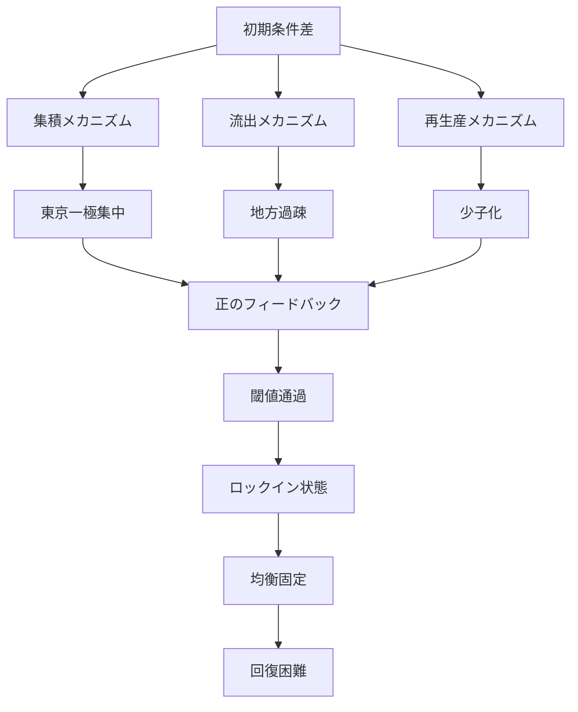

```mermaid
flowchart TD

A[初期条件差] --> B[集積メカニズム]
A --> C[流出メカニズム]
A --> D[再生産メカニズム]

B --> E[東京一極集中]
C --> F[地方過疎]
D --> G[少子化]

E --> H[正のフィードバック]
F --> H
G --> H

H --> I[閾値通過]
I --> J[ロックイン状態]

J --> K[均衡固定]
K --> L[回復困難]
```
