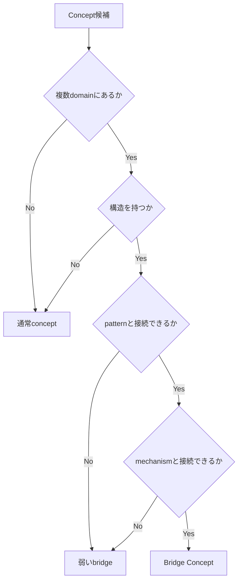
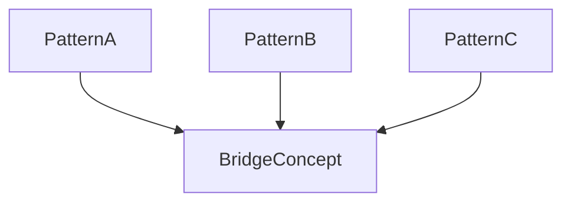
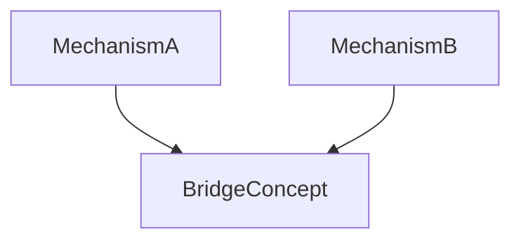
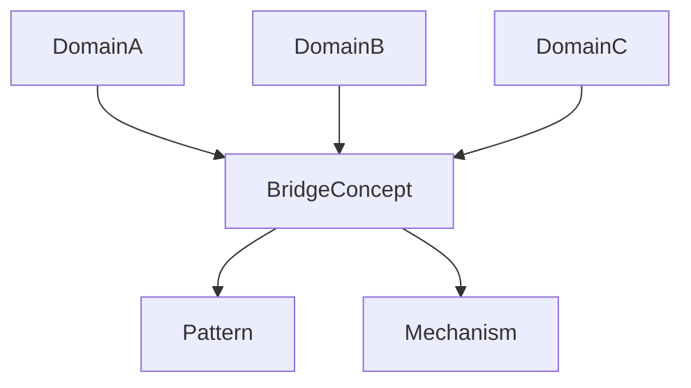
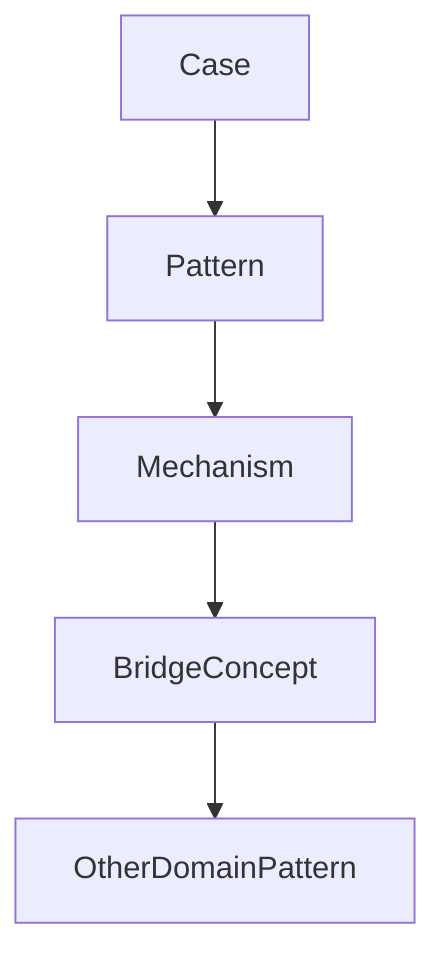

# Bridge Concept Rule

Bridge Concept Rule は、Knowledge Graph において  
**どの概念を Bridge Concept として扱うかを決めるルール**である。

Bridge Concept は便利だが、  
むやみに増やすと次の問題が起きる。

- 抽象が増えすぎる  
- 概念の意味が曖昧になる  
- domain 特殊性が消える  
- 誤った類比が増える  

Bridge Concept Rule はこれを防ぐ。

---

# Bridge Concept の定義（再確認）

Bridge Concept とは、

**複数 domain に現れる構造を接続する概念**

である。

---

# Bridge Concept の条件

Bridge Concept として採用するには  
次の条件を満たす必要がある。

---

## 条件1  
**複数 domain に存在する**

最低でも

```
2 domain
```

以上に現れること。

例

```
権力
```

```
政治
企業
コミュニティ
```

---

## 条件2  
**構造を持つ**

単なる言葉ではなく  
pattern や mechanism と接続できる。

---

## 条件3  
**抽象概念である**

具体的事件ではない。

---

## 条件4  
**pattern を説明できる**

Bridge Concept は  
複数 pattern の共通構造になる。

---

## 条件5  
**mechanism を接続できる**

因果構造を横断する。

---

# Bridge Concept 判定フロー



---

# Bridge Concept の粒度

Bridge Concept は  
抽象度によって3段階ある。

---

## Level1  
Domain Bridge

2つの domain を接続。

例

```
信号
```

```
動物行動
市場
```

---

## Level2  
Multi Domain Bridge

複数 domain を接続。

例

```
権力
```

```
政治
企業
社会
```

---

## Level3  
Universal Bridge

非常に多くの domain を接続。

例

```
協力
競争
信頼
```

---

# Bridge Concept と Pattern の関係

Bridge Concept は  
複数 pattern を束ねる。



---

# Bridge Concept と Mechanism

Bridge Concept は  
mechanism を横断する。



---

# Bridge Concept の書き方

Bridge Concept ノートには次を書く。

- 定義  
- 関係 domain  
- 関係 pattern  
- 関係 mechanism  
- representative case  

---

# Bridge Concept の例

例（抽象）

---

## 権力

domain

```
政治
企業
コミュニティ
```

pattern

```
権力集中
権力争い
```

mechanism

```
資源制御
情報制御
```

---

## 信頼

domain

```
社会
市場
コミュニティ
```

pattern

```
協力
裏切り
```

mechanism

```
評判
シグナリング
```

---

# Bridge Concept の図



---

# Bridge Concept の注意

Bridge Concept を作るとき  
次に注意する。

---

### 1 抽象過剰

意味が曖昧になる。

---

### 2 domain 固有概念

特定領域にしかない概念は  
bridge ではない。

---

### 3 類比錯覚

似ているだけで  
同じ構造とは限らない。

---

# Bridge Concept の役割

Knowledge Graph において  
Bridge Concept は

```
横方向の接続
```

を作る。

---

# Bridge Concept と Knowledge Graph



---

# LLM にとっての意味

Bridge Concept があると

LLM は

- cross domain analogy  
- 新しい仮説  
- pattern 転用  

を行いやすくなる。

---

# 関連ノート

- [[Bridge Concept]]
- [[Bridge Detection Method]]
- [[Cross Domain Mapping]]
- [[Pattern]]
- [[Mechanism]]
- [[Knowledge Graph]]