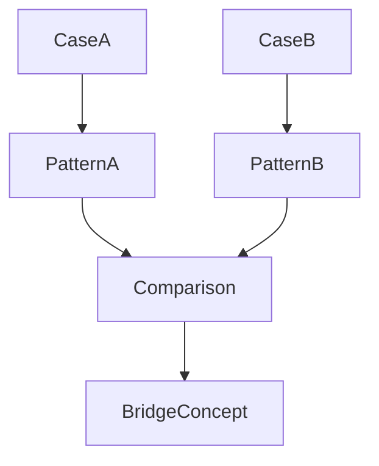
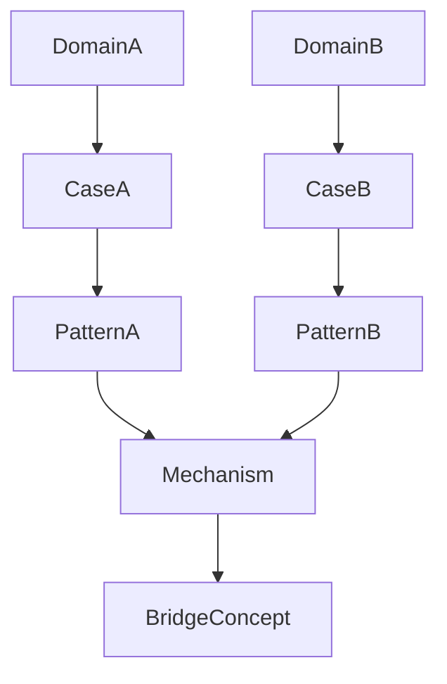
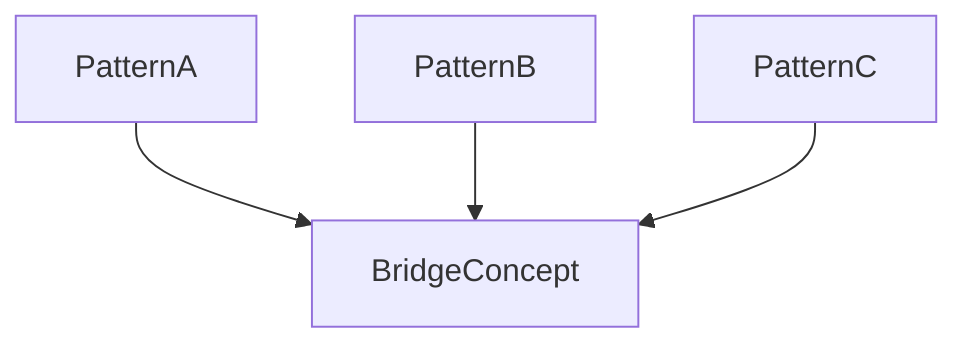

# Bridge Detection Method

Bridge Detection Method は、Knowledge Graph において  
**異なる domain の知識を接続する Bridge Concept を発見する方法**である。

Bridge Concept は Knowledge Graph の横方向の構造を作るが、  
自然に見つかるとは限らない。

多くの場合、Bridge Concept は

- case 比較
- pattern 比較
- mechanism 比較

から発見される。

---

# Bridge Detection の目的

Bridge Detection は次を目的とする。

- cross domain insight を得る  
- 知識の再利用性を高める  
- pattern の一般化  
- mechanism の普遍化  

---

# Bridge Detection の基本構造

Bridge Concept は次の流れで発見される。



---

# Bridge Detection の主要手法

Bridge Concept の発見には  
次の4手法がある。

---

## 1 Case Comparison

異なる domain の case を比較する。

例

```
企業炎上
政治スキャンダル
SNSキャンセル
```

共通構造

```
規範逸脱
 ↓
集団反応
 ↓
評判制裁
```

Bridge Concept

```
評判
```

---

## 2 Pattern Comparison

似た pattern を比較する。

例

```
権力争い
組織内派閥争い
コミュニティ内対立
```

共通概念

```
権力
```

---

## 3 Mechanism Comparison

同じ因果メカニズムが  
異なる領域に存在する。

例

```
動物行動
市場
就職
```

共通 mechanism

```
シグナリング
```

Bridge Concept

```
信号
```

---

## 4 Analogy Detection

類似構造を探す。

例

```
進化
市場競争
```

共通概念

```
選択
```

---

# Bridge Detection 手順

### Step1  
複数 domain の case を集める。

---

### Step2  
pattern を抽出する。

---

### Step3  
共通構造を比較する。

---

### Step4  
共通概念を抽象化する。

---

### Step5  
Bridge Concept として登録する。

---

# Bridge Detection の図



---

# Bridge Detection のヒント

Bridge Concept は次の場所で見つかる。

---

### 異なる domain に同じ構造がある

例

```
国家
企業
コミュニティ
```

---

### 同じ問題が現れる

例

```
信頼問題
```

---

### 同じ因果関係がある

例

```
評判 → 協力
```

---

# Bridge Detection の注意

Bridge Detection は次に注意する。

---

### 1 表面類似

似ているだけで  
同じ構造とは限らない。

---

### 2 抽象過剰

Bridge Concept が曖昧になる。

---

### 3 domain 特殊性

領域ごとの差を無視しない。

---

# Bridge Detection の例

例（抽象）

```
動物行動
市場
就職
```

共通構造

```
信号
```

Bridge Concept

```
シグナリング
```

---

# Bridge Detection と Knowledge Graph

Bridge Detection は

```
pattern layer
mechanism layer
```

を横断して  
Bridge Concept を作る。

---

# Bridge Detection の図



---

# LLM にとっての意味

Bridge Detection があると  
LLM は

- cross domain analogy  
- 新しい仮説  
- pattern 転用  

を発見しやすくなる。

---

# 関連ノート

- [[Bridge Concept]]
- [[Bridge Concept Rule]]
- [[Cross Domain Mapping]]
- [[Pattern Comparison 1]]
- [[02_zettelkasten/04_knowledge_graph/Mechanism Comparison]]
- [[Knowledge Graph]]