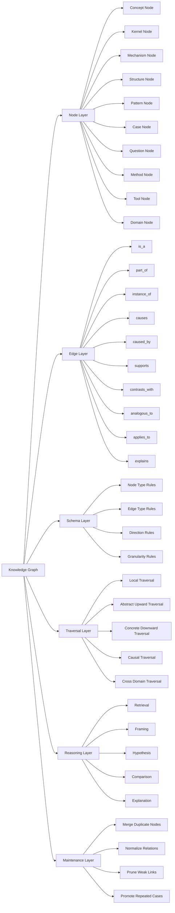
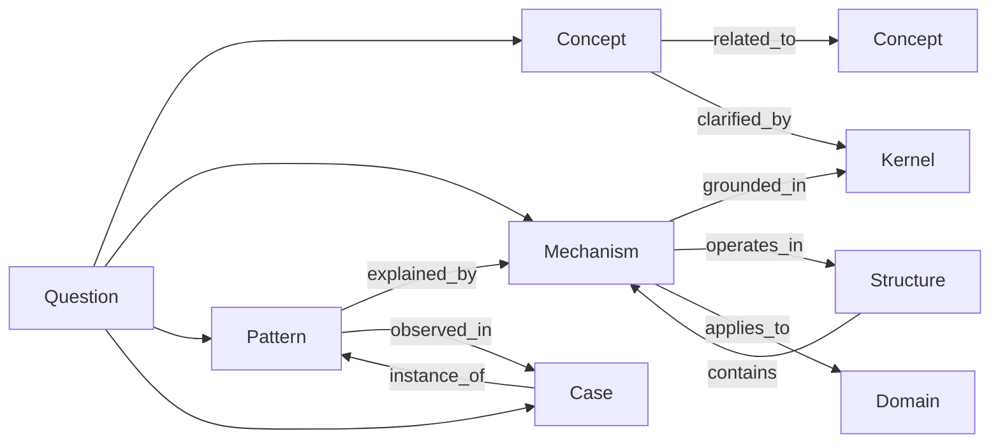

  
# Knowledge Graph  
  
Knowledge Graph は、ノート群・概念群・事例群・問い群のあいだにある**関係そのもの**を明示し、    
LLM や人間が「何が何とどうつながっているか」を辿れるようにするための構造である。  
  
単なるリンク集ではなく、以下を担う。  
  
- 概念間の意味関係の保持  
- 抽象と具体の往復  
- 因果・構造・所属・類似の区別  
- 問いから関連ノート群への探索  
- case から pattern / mechanism / kernel への昇格  
- reasoning のための探索経路の提供  
  
---  
  
# 定義  
  
Knowledge Graph とは、    
**Node（対象）** と **Edge（関係）** を用いて、知識体系をネットワークとして表現する構造である。  
  
ここで重要なのは、    
「ノートがあること」ではなく、    
**ノート同士の関係が型付きで保持されていること**である。  
  
つまり Knowledge Graph は、  
  
- ノートの倉庫  
- タグの束  
- 単純な双方向リンク集  
  
ではなく、  
  
- どのノートが  
- どの種類の関係で  
- どの方向に  
- どの粒度で  
- どの推論に使えるか  
  
を表現する知識地図である。  
  
---  
  
# この構造が必要な理由  
  
Zettelkasten を大きくすると、問題は「ノート不足」ではなく**接続不足**になる。  
  
典型的には次のような破綻が起こる。  
  
1. ノートはあるが関連が見えない    
2. case が pattern に接続されない    
3. concept が domain ごとに孤立する    
4. 同じ内容が別名で重複する    
5. LLM が近いが違うノートを拾って誤推論する    
6. 逆に重要な橋渡しノートが埋もれる    
  
Knowledge Graph はこれを防ぎ、    
Vault 全体を**検索可能な構造体**へ変える。  
  
---  
  
# 全体構造  
  

---

# 基本発想

Knowledge Graph の中核は、  **知識を点ではなく経路として扱う**ことである。

たとえば「韓国併合」は単独で理解するのでなく、

- 韓国併合    
- 帝国主義    
- 非対称権力構造    
- 正統化言説    
- 植民地化パターン    
- 国家形成    
- 国際秩序    
- 支配の制度化    

という経路で辿られる。

このとき価値があるのは個別ノートの記述量だけでなく、  
**どの順で辿れるか**である。

---

# Node の種類

## 1. Concept Node

最も一般的な意味単位。  
まだ十分に構造化されていないが、重要な概念。

例:

- 正統性    
- 動員    
- 抑圧    
- アイデンティティ    
- 協調    
- 制約    

役割:

- 語彙の入口    
- 他ノードへの橋    
- 概念の曖昧さを管理する    

---

## 2. Kernel Node

より深い原理・恒常性・世界理解の土台。

例:

- 資源制約    
- 限定合理性    
- 権力偏在    
- 情報非対称    
- 制度は行動を方向づける    

役割:

- 多数の現象の背後にある根本原理    
- pattern や mechanism の基礎
    

---

## 3. Mechanism Node

何がどう作用して結果を生むかの作動単位。

例:

- シグナリング    
- フリーライダー化    
- 同調形成    
- 注意資源の偏り    
- インセンティブ歪み    

役割:

- 因果の説明    
- 動態の記述    
- reasoning の中心    

---

## 4. Structure Node

要素の配置・接続・階層・循環の形。

例:

- 主従構造    
- 中心周辺構造    
- 寡占構造    
- フィードバックループ    
- 委任連鎖    

役割:

- 静的な骨格の把握    
- どこにボトルネックがあるかの可視化    

---

## 5. Pattern Node

反復して現れる典型形。

例:

- 炎上パターン    
- 責任回避パターン    
- 外部敵形成パターン    
- 制度疲労パターン

役割:

- case を束ねる    
- 予測のたたき台になる    

---

## 6. Case Node

具体的事例・歴史事象・観察記録。

例:

- 韓国併合    
- ドイツ革命    
- 具体的な炎上事例    
- ある企業の失敗案件    

役割:

- 現実の接地面    
- 抽象化の素材    
- pattern / mechanism への入力
    

---

## 7. Question Node

問いそのものをノード化したもの。

例:

- なぜ人は不合理な選択を続けるのか    
- なぜ制度は自己目的化するのか    
- なぜ同じ失敗が反復するのか    

役割:

- 探索の起点    
- reasoning の入口    
- 関連ノート群の束ね直し    

---

## 8. Method Node

分析・観察・設計の方法。

例:

- causal chain analysis    
- five whys    
- power mapping    
- comparative analysis    

役割:

- 問いと知識をつなぐ操作手順    

---

## 9. Tool Node

実務上のテンプレート・フレーム・チェックリスト・プロンプトなど。

例:

- case 分析テンプレート    
- 観察シート    
- 比較表    
- 問題分解フォーマット    

役割:

- Graph を実務に接続する    

---

## 10. Domain Node

知識の適用領域・分野。

例:

- history    
- law    
- business    
- tourism    
- psychology    

役割:

- 横断知を分野に落とす    
- 検索や整理の起点にする    

---

# Edge の種類

Knowledge Graph では、リンクはすべて同じではない。  
**関係の型**を分けることが重要である。

---

## 1. is_a

分類関係。  
「A は B の一種である」

例:

- 植民地化 is_a 支配形態    
- 同調 is_a 社会的影響    

用途:

- 概念整理    
- 上位概念への遡及    

---

## 2. part_of

部分関係。  
「A は B の一部である」

例:

- 動員装置 part_of 総力戦体制    
- 問題定義 part_of problem solving    

用途:

- 全体構造の把握    
- 要素分解    

---

## 3. instance_of

具体例関係。  
「A は B の事例である」

例:

- 韓国併合 instance_of 植民地化パターン    
- ある炎上事件 instance_of 規範違反可視化パターン    

用途:

- case から pattern への接続    
- 抽象化の足場    

---

## 4. causes

原因関係。  
「A が B を引き起こす」

例:

- 情報非対称 causes 逆選択    
- 注意資源不足 causes 判断短絡    

用途:

- 因果推論    
- 問題解決    
- 仮説生成    

---

## 5. caused_by

被原因関係。  
「A は B によって生じる」

例:

- 制度疲労 caused_by 過剰複雑化    
- 不信拡大 caused_by 裏切り経験    

用途:

- 原因探索    
- 逆向き推論    

---

## 6. supports

支援・根拠関係。  
「A は B を支える」

例:

- 統計データ supports 仮説    
- 事例群 supports パターン認定    

用途:

- エビデンス接続    
- 議論補強    

---

## 7. contrasts_with

対比関係。  
「A は B と対照的である」

例:

- 正統性 contrasts_with 強制    
- 市場調整 contrasts_with 計画統制    

用途:

- 概念の輪郭化    
- 誤同一視の防止    

---

## 8. analogous_to

類比関係。  
「A は B に似た構造を持つ」

例:

- 企業官僚制 analogous_to 国家官僚制    
- fandom 炎上 analogous_to 宗教的異端審問    

用途:

- 分野横断    
- 発想拡張    

---

## 9. applies_to

適用関係。  
「A は B 領域で使える」

例:

- principal-agent problem applies_to 組織運営    
- シグナリング applies_to 就活市場    

用途:

- 実用化    
- domain への橋渡し    

---

## 10. explains

説明関係。  
「A は B を説明する」

例:

- 限定合理性 explains 不十分な意思決定    
- アイデンティティ防衛 explains 認知的不協和の回避    

用途:

- reasoning 文生成    
- 説明構造の構築    

---

# ノード間の典型接続

---

# 推論における役割

Knowledge Graph は reasoning engine の下請けではない。  
むしろ reasoning の**前提インフラ**である。

## 1. Retrieval

問いに対し、単語一致ではなく**関係近傍**で関連ノートを拾う。

例:

- 「韓国併合は植民地化か」    
    - 韓国併合        
    - 植民地化        
    - 帝国主義        
    - 非対称支配        
    - 正統化言説        
    - 国家主権侵食        
    - 同化政策        

というように近傍探索できる。

---

## 2. Framing

何の問題として見るべきかを与える。

例:

- 倫理問題    
- 権力問題    
- 制度問題    
- アイデンティティ問題    
- 市場シグナル問題    

Graph があると、問いを別フレームで再配置できる。

---

## 3. Hypothesis

未接続のノード間に仮説的エッジを引ける。

例:

- ある組織の意思決定遅延    
- 既存ノード: サイロ化 / 責任分散 / 情報非対称 / 承認多段化    

ここから

- 承認多段化 causes 意思決定遅延    
- 責任分散 supports 先送り行動    

などの仮説を出せる。

---

## 4. Comparison

異なる case の共通構造を見つける。

例:

- ドイツ革命    
- ソ連崩壊    
- ベンチャー企業の崩壊    

一見違っても、

- 正統性低下    
- 強制力の揺らぎ    
- エリート分裂    
- 代替秩序の浮上    

という pattern で比較できる。

---

## 5. Explanation

説明文を「関係に沿って」生成できる。

悪い説明:

- A は複雑です    
- 背景があります    
- 様々な要因があります    

良い説明:

- A は B による圧力の下で C が作動し、その結果 D が制度化された    

Knowledge Graph は後者を可能にする。

---

# 探索方向

Knowledge Graph では、探索方向が重要である。

## 1. 上向き探索（抽象化）

case → pattern → mechanism → kernel

用途:

- この出来事は何の一例か    
- 背後で何が働いたか    
- より普遍的には何か    

---

## 2. 下向き探索（具体化）

kernel → mechanism → pattern → case

用途:

- この原理はどこで現れるか    
- 抽象概念を具体例で理解したい    
- 教材や事例が欲しい    

---

## 3. 横断探索（類比）

domain A → analogous_to → domain B

用途:

- 歴史を現代組織で読む    
- 心理を営業で使う    
- 法構造を制度設計へ応用する    

---

## 4. 因果探索

result → caused_by → cause → caused_by ...

用途:

- 根本原因分析    
- 問題解決
- five whys の補強    

---

## 5. 構造探索

phenomenon → operates_in → structure

用途:

- 現象がどの配置で起きやすいかを見る    
- 個人原因論への過剰還元を防ぐ    

---

# Graph における重要単位

Knowledge Graph では、特に次のノードが重要になる。

## 1. Hub Node

多くのノードを束ねる中心ノード。

例:

- 人間モデル Hub    
- 社会構造 Hub    
- Problem Solving Hub    
- Knowledge Graph Hub    

条件:

- 単なる目次ではなく    
- 何がどうつながるかを示すこと    

---

## 2. Bridge Node

異分野を接続する橋。

例:

- シグナリング    
- 正統性    
- 制約    
- 委任    
- アイデンティティ    

こうしたノードは、

- psychology    
- business    
- history    
- law  
を跨ぐ。

---

## 3. Bottleneck Node

多くの推論が集中するが未整備なノード。

例:

- 権力    
- 制度    
- 合理性    
- 価値    
- 正義    

ここが曖昧だと Graph 全体が濁る。

---

## 4. Anchor Case

抽象概念の足場になる代表事例。

例:

- 韓国併合    
- ドイツ革命    
- 具体的炎上事例    
- 就活市場    

これがあると抽象が浮かない。

---

# Knowledge Graph の作り方

## Step 1: Node を置く

まず重要概念・事例・方法をノード化する。

原則:

- 1ノート1中心概念    
- 曖昧なら concept として置く    
- 具体事例は case に置く    
- 作動説明できるなら mechanism 化する    

---

## Step 2: Edge を型付きで張る

単に `[[リンク]]` するのでなく、  
本文かプロパティで関係型を明記する。

例:

- 韓国併合 instance_of 植民地化パターン    
- 植民地化パターン explained_by 非対称権力構造    
- 非対称権力構造 grounded_in 権力偏在原理    

---

## Step 3: Hub で束ねる

ノードが増えたら hub を作る。

Hub の役割:

- 代表ノード一覧    
- 関係の見取り図    
- 読む順序    
- 重要経路    

---

## Step 4: 重複を正規化する

例:

- 支配    
- domination    
- 統制    
- 管理    

が混在していたら、  
代表語を決めて他を寄せる。

---

## Step 5: 繰り返し出る case を昇格させる

具体例が3回以上別 case に現れるなら、  
pattern または mechanism への昇格を検討する。

---

# 良い Graph の条件

## 1. 関係型が明確

単なる「関連する」では弱い。  
is_a / instance_of / causes などに分ける。

## 2. 抽象と具体が往復可能

上に上がれるだけでなく、下に降りられること。

## 3. 分野横断ができる

同じ mechanism が複数 domain に現れることが見える。

## 4. 誤接続が少ない

似ているが違う概念が混線していない。

## 5. 推論経路が辿れる

「なぜその結論になったか」が path として説明できる。

---

# 悪い Graph の典型

## 1. タグの言い換えに終わる

単に #history #power #society と付いているだけ。

## 2. 全リンクが同じ重み

原因も所属も類似も同列に扱っている。

## 3. case だらけで抽象がない

具体例の山になり、一般化できない。

## 4. 抽象だらけで事例がない

言葉は立派だが現実に接続しない。

## 5. hub が目次でしかない

一覧はあるが関係が示されていない。

---

# Obsidian / Vault 運用上の実装方針

## 1. ノート単位でグラフ化する

1ノート1中心概念を守る。  
複数概念を詰め込むと Graph が曖昧になる。

## 2. リンク本文で関係型を書く

たとえば本文中で次のように書く。

- [[韓国併合]] は [[植民地化パターン]] の **instance_of**    
- [[02_zettelkasten/01_knowledge/world_model/meta/model/social/information/情報非対称]] は [[02_zettelkasten/01_knowledge/world_model/model/social/incentive/逆選択]] を **causes**    
- [[02_zettelkasten/01_knowledge/world_model/meta/model/human/congnition/限定合理性]] は [[不完全意思決定]] を **explains**
    

## 3. Hub で中距離リンクを束ねる

全文検索だけに頼らず、hub で読み筋を作る。

## 4. property は最小限

Graph を支える主役は本文中の関係記述。  
property は補助。

## 5. 関係語を統一する

relation 語彙を固定する。

推奨語彙:

- is_a    
- part_of    
- instance_of    
- causes    
- caused_by    
- supports    
- contrasts_with    
- analogous_to    
- applies_to    
- explains    

---

# LLM にとっての意味

Knowledge Graph がない場合、LLM は

- 単語近傍    
- 頻出共起    
- 一般知識    
- 表層的類似    

に頼りやすい。

Knowledge Graph がある場合、LLM は

- どの概念が上位か    
- どの case が何の例か    
- どの mechanism が背後にあるか    
- 何を経由して推論すべきか    

を辿りやすくなる。

つまり Graph は、  
LLM に「情報」ではなく**思考経路**を与える。

---

# この Vault における位置づけ

Knowledge Graph は単独フォルダというより、Vault 全体を横断する**メタ構造**である。  
ただし運用上は次の位置づけがよい。

- `zettelkasten/structure/knowledge/Knowledge Graph.md    
- または    
- `thinking_engine/reasoning/Knowledge Graph.md`
    

役割としては、

- observation が入力を取り込み    
- concept / case / pattern / mechanism / kernel が内容を保持し    
- knowledge graph がそれらを接続し    
- reasoning が接続を辿って推論し    
- decision / solution_design が出力する    

という流れになる。

---

# 上位・下位関係

## 上位

- [[Thinking Engine]]    
- [[Reasoning Structure]]    
- [[Knowledge Structure]]    

## 近接

- [[Concept]]
- [[Case]]    
- [[Pattern]]    
- [[Mechanism]]    
- [[Kernel]]    
- [[Structure]]    
- [[Question]]    
- [[Hub Note]]    

## 下位

- [[02_zettelkasten/04_meta/knowledge_graph/Node Type]]    
- [[02_zettelkasten/04_meta/knowledge_graph/Edge Type]]    
- [[Traversal]]    
- [[Graph Maintenance]]    
- [[Bridge Concept]]    
- [[02_zettelkasten/04_knowledge_graph/Anchor Case]]    

---

# 典型ユースケース

## 1. 問いから探索する

「なぜ組織は責任回避するのか」  
→ 責任回避  
→ 委任連鎖  
→ principal-agent problem  
→ 情報非対称  
→ インセンティブ歪み

## 2. 事例を抽象化する

「ドイツ革命」  
→ 正統性崩壊  
→ エリート分裂  
→ 命令系統の揺らぎ  
→ 体制転換パターン

## 3. 別分野へ応用する

「同調」  
→ 社会心理  
→ 消費行動  
→ 組織文化  
→ SNS 炎上

## 4. 誤認をほどく

「合理性」と「最適性」は同じか  
→ 概念対比  
→ 限定合理性  
→ satisficing  
→ 情報制約

---

# 最小実装ルール

Knowledge Graph を回し始めるだけなら、最低限これでよい。

1. ノート種別を分ける
    
    - concept / case / pattern / mechanism / kernel
        
2. 関係語を固定する
    
    - is_a / instance_of / causes / explains / part_of
        
3. hub を作る
    
    - 分野ごとに1つ        
    - 重要概念ごとに1つ
        
4. case から必ず1つ上に上げる
    
    - その事例は何の例かを書く
        
5. mechanism か structure を必ず経由する
    
    - いきなり感想で終わらせない
        

---

# まとめ

Knowledge Graph とは、  
Vault 内の知識を**関係つきネットワーク**として運用するための中核構造である。

それは、

- ノートをつなぎ    
- 抽象と具体を往復させ    
- 因果と構造を区別し    
- 分野横断を可能にし    
- LLM に推論経路を与える    

ためのものである。

Zettelkasten が「知識の蓄積」だとすれば、  
Knowledge Graph は「知識の可動化」である。
