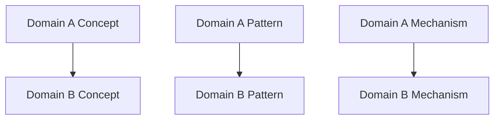
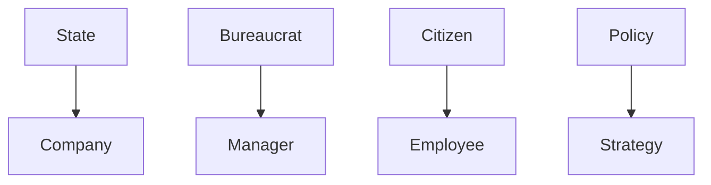
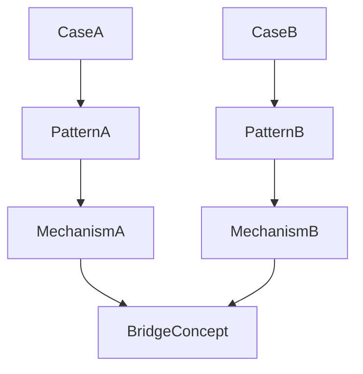

# Cross Domain Mapping

Cross Domain Mapping は、Knowledge Graph において  
**異なる domain の構造を対応づける方法**である。

Bridge Concept が **橋（bridge）** だとすると、  
Cross Domain Mapping は **対応表（mapping）** である。

この方法を使うと

- 知識の再利用  
- 新しい仮説の発見  
- pattern の一般化  

が可能になる。

---

# 定義

Cross Domain Mapping とは

**ある domain の構造を  
別の domain の構造に対応づける操作**

である。

---

# Cross Domain Mapping の役割

---

## 1 構造理解

複雑な現象を  
別の分野の構造で理解できる。

---

## 2 仮説生成

未知の領域の  
仮説を作ることができる。

---

## 3 Pattern 転用

ある domain の pattern を  
別 domain に応用できる。

---

## 4 Mechanism 発見

同じ因果が  
複数領域に存在することを発見する。

---

# Cross Domain Mapping の基本構造

Cross Domain Mapping は  
次の対応関係を作る。

```
domain A structure
↓
domain B structure
```

---

# Mapping 図



---

# Mapping の対象

Mapping は次を対応させる。

|要素|説明|
|---|---|
|concept|概念|
|pattern|進行構造|
|mechanism|因果構造|
|actor|主体|
|resource|資源|

---

# Mapping 手順

### Step1  
domain A の構造を整理する。

---

### Step2  
domain B の構造を整理する。

---

### Step3  
対応関係を探す。

---

### Step4  
Bridge Concept を見つける。

---

### Step5  
Mapping ノートを作る。

---

# Mapping 例（抽象）

例

### Domain A  
政治

### Domain B  
企業

|政治|企業|
|---|---|
|国家|企業|
|官僚|管理職|
|国民|社員|
|政策|戦略|

---

# Mapping 図



---

# Pattern Mapping

pattern も mapping できる。

例

```
政治権力争い
```

```
組織内派閥争い
```

共通 pattern

```
権力争い
```

---

# Mechanism Mapping

mechanism も mapping できる。

例

```
市場競争
進化
```

共通 mechanism

```
選択
```

---

# Cross Domain Mapping の注意

---

### 1 表面類似

似ているだけで  
同じ構造とは限らない。

---

### 2 domain 特殊性

領域固有の要素を無視しない。

---

### 3 過度な一般化

抽象化しすぎると意味がなくなる。

---

# Mapping の粒度

Mapping は3段階ある。

---

## Concept Mapping

概念対応

---

## Pattern Mapping

進行構造対応

---

## Mechanism Mapping

因果対応

---

# Cross Domain Mapping の図



---

# Cross Domain Mapping と Knowledge Graph

Knowledge Graph の中では

```
domain
↓
pattern
↓
mechanism
```

を横断して mapping を作る。

---

# LLM にとっての意味

Cross Domain Mapping があると  
LLM は

- analogy reasoning  
- 新しい仮説  
- pattern 転用  

を行いやすくなる。

---

# 関連ノート

- [[Bridge Concept]]
- [[Bridge Detection Method]]
- [[Pattern Comparison 1]]
- [[02_zettelkasten/04_knowledge_graph/Mechanism Comparison]]
- [[Knowledge Graph]]