# Graph Maintenance

Graph Maintenance は、Knowledge Graph を  
**壊れにくく、辿りやすく、推論可能な状態に保つための保守構造**である。

Knowledge Graph は、一度作れば終わりではない。  
ノートが増えるほど、関係は自然に劣化する。

- 重複ノードが増える
- 関係語が揺れる
- case が孤立する
- hub が肥大化する
- 似ているが違う概念が混線する
- 古い仮説が残り続ける

Graph Maintenance は、こうした劣化を抑え、  
Vault 全体を**思考に耐える構造**として維持する。

---

# 定義

Graph Maintenance とは、  
Knowledge Graph の node・edge・hub・schema・path を点検し、  
**構造の整合性・探索性・再利用性を保つための運用構造**である。

目的は単なる掃除ではない。  
主な目的は次の通りである。

1. 重複ノードを整理する  
2. relation 語彙を正規化する  
3. 孤立ノードを減らす  
4. 弱いリンクと強いリンクを区別する  
5. pattern や mechanism への昇格を判断する  
6. hub と index の肥大化を防ぐ  
7. LLM が安定して辿れる graph を保つ  

---

# なぜ必要か

Knowledge Graph は、作成時よりも運用中に崩れる。

典型的な崩れ方は次の通りである。

## 1. 重複
- 正統性
- 正統化
- 正当性
- legitimacy

のように、近いノードが乱立する。

## 2. 関係語の揺れ
- causes
- leads_to
- results_in
- creates

が混在し、因果探索が不安定になる。

## 3. 孤立
case は増えるが、pattern や mechanism に接続されない。

## 4. 肥大化
Hub が巨大化し、個別ノートの役割を食い潰す。

## 5. 古い仮説の残骸
仮説段階の弱リンクが、そのまま強い知識のように残る。

## 6. 抽象偏重または具体偏重
概念ばかり増えて現実に接地しない、あるいは事例ばかり増えて抽象化できない。

Graph Maintenance は、これらを防ぐための定常運用である。

---

# 全体構造

```mermaid
graph TD

    A[Graph Maintenance] --> B[Node Maintenance]
    A --> C[Edge Maintenance]
    A --> D[Hub Maintenance]
    A --> E[Schema Maintenance]
    A --> F[Traversal Maintenance]
    A --> G[Promotion Maintenance]
    A --> H[Archive Maintenance]

    B --> B1[Duplicate Merge]
    B --> B2[Rename / Normalize]
    B --> B3[Split Overloaded Node]
    B --> B4[Repair Isolated Node]

    C --> C1[Relation Normalize]
    C --> C2[Strength Review]
    C --> C3[Broken Direction Fix]
    C --> C4[Dead Link Prune]

    D --> D1[Hub Slimming]
    D --> D2[Index Separation]
    D --> D3[Route Clarification]

    E --> E1[Node Type Review]
    E --> E2[Edge Type Review]
    E --> E3[Property Consistency]

    F --> F1[Reasoning Path Check]
    F --> F2[Traversal Bottleneck Check]
    F --> F3[Cross Domain Route Review]

    G --> G1[Case to Pattern Promotion]
    G --> G2[Pattern to Mechanism Promotion]
    G --> G3[Concept to Kernel Promotion]

    H --> H1[Deprecated Note Archive]
    H --> H2[Weak Hypothesis Archive]
    H --> H3[Superseded Version Archive]
```

---

# 保守対象

Graph Maintenance の対象は大きく7つある。

## 1. Node
ノードそのものの重複・曖昧さ・過積載を点検する。

## 2. Edge
関係の型・方向・強さ・妥当性を点検する。

## 3. Hub
束ねノートの導線・肥大化・重複を点検する。

## 4. Schema
Node Type / Edge Type / Rule の一貫性を点検する。

## 5. Traversal
辿り方が実際に機能しているかを点検する。

## 6. Promotion
反復知を上位抽象へ昇格させる判断を行う。

## 7. Archive
古くなった仮説や置換済みノートを隔離する。

---

# 1. Node Maintenance

Node Maintenance は、  
各ノードの粒度・名前・役割・重複状態を保守する。

---

## 1-1. Duplicate Merge

意味がほぼ同じノードを統合する。

例:
- 正統性
- 正当性
- legitimacy

対処:
- 代表ノードを1つ決める
- 他ノードは統合・転送・リンク整理する
- 表記揺れは alias 的に扱う

判断基準:
- 中心概念が同じか
- edge の接続先が大きく重なるか
- 今後分ける理由があるか

---

## 1-2. Rename / Normalize

名前が曖昧・長すぎる・揺れているノードを正規化する。

悪い例:
- いろいろな正統性の問題について
- 正統性って大事だよね
- legitimation process maybe

良い例:
- 正統性
- 正統化メカニズム
- 正統性危機パターン

基準:
- 何の node type か見えやすい
- 他ノードと混線しにくい
- 再利用しやすい

---

## 1-3. Split Overloaded Node

一つのノートに複数役割が混在していたら分割する。

典型例:
- concept + mechanism + case が同居している
- hub + 本文解説 + index が混ざっている
- pattern 集と rule が同じノートにある

分割原則:
- 一ノート一中心役割
- role が違うなら分ける
- hub は hub、case は case として独立させる

---

## 1-4. Repair Isolated Node

孤立ノードを修復する。

孤立の典型:
- case があるが pattern に上がっていない
- concept があるが対比も例もない
- mechanism があるが kernel や structure に接続されていない

修復方針:
- 少なくとも1つ上位へ接続
- 少なくとも1つ横方向へ接続
- 必要なら example か contrast を追加

---

# 2. Edge Maintenance

Edge Maintenance は、  
relation の型・方向・強さ・不要性を点検する。

---

## 2-1. Relation Normalize

relation 語彙を中核語彙へ揃える。

揺れの例:
- causes / leads_to / creates / results_in
- kind_of / type_of / is_a
- example_of / instance_of

方針:
- 因果は causes
- 分類は is_a
- 具体例は instance_of
- 部分は part_of

これにより traversal が安定する。

---

## 2-2. Strength Review

relation の強さを見直す。

誤りの例:
- ただの共起を causes にしている
- 仮説段階なのに explains と断定している
- 弱い関係なのに supports とせず causes にしている

見直し基準:
- 因果証拠があるか
- 反例が多いか
- 説明としてしか使えないか
- 仮説に留めるべきか

必要なら
- causes → supports
- explains → associated_with
のように弱める。

---

## 2-3. Broken Direction Fix

relation の向きの誤りを直す。

例:
- 植民地化パターン instance_of 韓国併合
- 逆選択 causes 情報非対称

などの方向逆転を修正する。

---

## 2-4. Dead Link Prune

機能していない、意味の薄い、古いリンクを切る。

対象:
- 過去の仮リンク
- 説明に使われない弱関連
- もはや上位ノードへ統合済みのリンク

注意:
- 削除前に archive 化するか、変更履歴を残すとよい

---

# 3. Hub Maintenance

Hub Maintenance は、  
hub が「便利な入口」であり続けるように保守する。

---

## 3-1. Hub Slimming

Hub が肥大化したら痩せさせる。

肥大化の兆候:
- ノート本文が長すぎる
- 個別概念の中身まで hub に書いてある
- 一覧と解説と rules が全部入っている
- 個別ノートを見なくても hub だけで済んでしまう

対処:
- hub は地図に戻す
- 内容は個別ノートへ分離
- index や rule を別ノート化する

---

## 3-2. Index Separation

一覧性が強い部分は index に切り出す。

hub の役割:
- 関係の見取り図
- 読み順
- 重要経路

index の役割:
- 網羅一覧
- ID 管理
- 形式的な並び

この分離が重要。

---

## 3-3. Route Clarification

Hub の読む順序・導線を明示する。

よい hub は、
- どこから読むか
- 何を経由するとよいか
- どのノードが橋になるか
を示す。

---

# 4. Schema Maintenance

Schema Maintenance は、  
Vault 全体の型定義が崩れていないかを点検する。

---

## 4-1. Node Type Review

各ノートの node type 判定を見直す。

例:
- pattern のつもりで作ったが実は case
- concept のつもりだが mechanism
- framework と hub が混ざっている

点検基準:
- そのノートの主役は何か
- どの edge が自然につながるか
- 他ノートとの役割差があるか

---

## 4-2. Edge Type Review

relation が node type と整合しているかを点検する。

例:
- case is_a pattern は不自然
- concept part_of case は不自然なことが多い
- method causes domain はズレやすい

---

## 4-3. Property Consistency

property や frontmatter が揃っているかを見る。

例:
- note_type
- layer
- structure_type
- status
- relation 記述方式

これは LLM と人間の両方に効く。

---

# 5. Traversal Maintenance

Traversal Maintenance は、  
実際に Graph を辿ったときに詰まらないかを点検する。

---

## 5-1. Reasoning Path Check

主要な問いについて、実際に path が通るか確認する。

例:
- なぜ組織は責任回避するのか
- 韓国併合は何の一例か
- 限定合理性は就活でどう現れるか

点検内容:
- Question から必要ノードに届くか
- concept だけで止まっていないか
- case へ降りられるか

---

## 5-2. Traversal Bottleneck Check

一部ノードに依存しすぎていないかを見る。

典型 bottleneck:
- 権力
- 制度
- 合理性
- identity

これらは重要だが、曖昧なままだと全探索が濁る。

---

## 5-3. Cross Domain Route Review

分野横断経路が実際にあるかを見る。

例:
- psychology → business
- history → organization
- law → operations

もし route が細すぎるなら、
bridge concept を増やす必要がある。

---

# 6. Promotion Maintenance

Promotion Maintenance は、  
繰り返し現れる知識を一段上の抽象へ昇格させるための保守である。

---

## 6-1. Case to Pattern Promotion

複数 case に共通形があるなら pattern 化を検討する。

条件:
- 類似 case が複数ある
- 作動順序や特徴が繰り返す
- 他分野にも応用できそう

例:
- 複数の炎上事例
→ 規範違反可視化パターン

---

## 6-2. Pattern to Mechanism Promotion

pattern の背後に作動過程が明確なら mechanism 化する。

例:
- 責任回避パターン
→ 責任分散メカニズム

---

## 6-3. Concept to Kernel Promotion

概念がより根本原理として機能しているなら kernel 化を検討する。

例:
- 制約
→ 資源制約原理
- 信頼
→ 不確実性下の協力原理

---

# 7. Archive Maintenance

Archive Maintenance は、  
不要になったが捨てるには惜しい知識を退避させる。

---

## 7-1. Deprecated Note Archive

統合・置換済みノートを archive 化する。

例:
- 古い表記揺れノート
- 旧 version の framework
- 役割を失った仮ノート

---

## 7-2. Weak Hypothesis Archive

弱仮説や未検証リンクを別置きにする。

理由:
- graph 本体を濁らせない
- ただしアイデア資産は捨てない

---

## 7-3. Superseded Version Archive

新しい版に置き換えられた旧版を隔離する。

これにより、
- 現行 graph の見通しが良くなる
- 過去の思考経路も保存できる

---

# 保守の頻度

Graph Maintenance は毎回フルでやる必要はない。  
頻度を分けると運用しやすい。

---

## 1. 軽保守
新ノート追加時に行う。

内容:
- node type 確認
- relation 語彙確認
- 上位接続1本
- 横接続1本

---

## 2. 中保守
週次または一定数追加ごとに行う。

内容:
- duplicate 点検
- isolated case 点検
- hub の肥大確認
- weak link 見直し

---

## 3. 重保守
月次または大規模再編時に行う。

内容:
- schema 見直し
- folder / hub 再編
- promotion 実施
- archive 整理
- traversal 実地確認

---

# 点検チェックリスト

## Node 点検
- 重複していないか
- 名前が明確か
- role が一つに定まっているか
- 孤立していないか

## Edge 点検
- relation 語彙が統一されているか
- 向きが正しいか
- 強すぎる断定になっていないか
- 死にリンクがないか

## Hub 点検
- 地図として機能しているか
- 目次と本文が混ざっていないか
- 読み順が示されているか

## Traversal 点検
- Question から必要ノードへ届くか
- 抽象と具体を往復できるか
- bottleneck が曖昧すぎないか

## Promotion 点検
- 繰り返し case を pattern 化できないか
- pattern の背後 mechanism を立てられないか
- concept が kernel 化していないか

---

# 良い保守状態の条件

## 1. 孤立 case が少ない
## 2. relation 語彙が安定している
## 3. hub が太りすぎていない
## 4. abstract と concrete が往復可能
## 5. 主要な問いに reasoning path がある
## 6. 古い仮説が graph 本体を濁らせていない

---

# 悪い保守状態の兆候

## 1. 同じ意味のノートが増える
## 2. 関係語が毎回違う
## 3. hub だけが巨大化する
## 4. case が並ぶだけで抽象化されない
## 5. 概念ばかりで具体例がない
## 6. 問いから辿ると毎回違うルートになる

---

# LLM にとっての意味

Graph Maintenance がないと、LLM は

- 似たノートを重複参照し
- relation の揺れに引っ張られ
- 弱い仮説を強い知識と誤認し
- 問いごとに不安定な path を辿りやすくなる

逆に Maintenance が効いていると、

- 代表ノードに集約され
- 中核 relation で辿れ
- 抽象化と具体化が安定し
- reasoning の質が揺れにくくなる

つまり Graph Maintenance は、  
LLM の思考基盤の**精度管理**である。

---

# この Vault における実装方針

最低限、次の運用を固定するとよい。

## 新ノート作成時
- node type を明示する
- 代表 relation 語彙を使う
- 上位・横・具体例のいずれかに接続する

## 週次見直し
- 重複ノード確認
- isolated case 確認
- hub 肥大確認

## 月次見直し
- promotion 候補洗い出し
- archive 移動
- 주요 question の traversal 実験

---

# 他ノートとの接続

## 上位
- [[Knowledge Graph]]

## 近接
- [[02_zettelkasten/04_meta/knowledge_graph/Node Type]]
- [[02_zettelkasten/04_meta/knowledge_graph/Edge Type]]
- [[Traversal]]
- [[02_zettelkasten/04_knowledge_graph/Case to Pattern Promotion]]
- [[Hub Design Rule]]
- [[02_zettelkasten/04_knowledge_graph/Reasoning Path]]

## 下位候補
- [[Duplicate Merge Rule]]
- [[Relation Normalize Rule]]
- [[Isolated Node Repair]]
- [[Weak Hypothesis Archive]]
- [[Promotion Review Checklist]]

---

# まとめ

Graph Maintenance は、Knowledge Graph を  
**生きた思考インフラとして維持するための保守構造**である。

それは単なる整理ではなく、

- node の重複を防ぎ
- edge の意味を揃え
- hub の肥大を抑え
- traversal を通るようにし
- 繰り返し知を昇格させ
- 古い知識を隔離する

ための定常運用である。

Knowledge Graph を作ることが建設だとすれば、  
Graph Maintenance はその都市計画と保全である。

