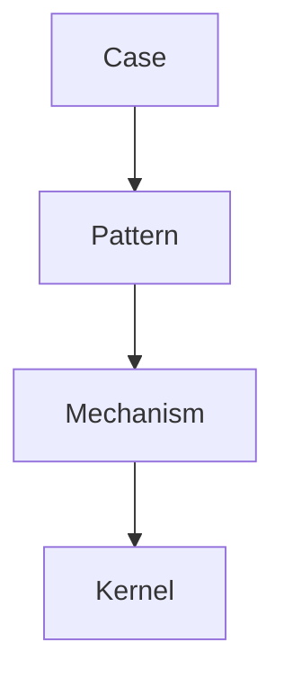
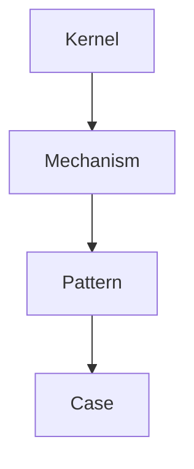
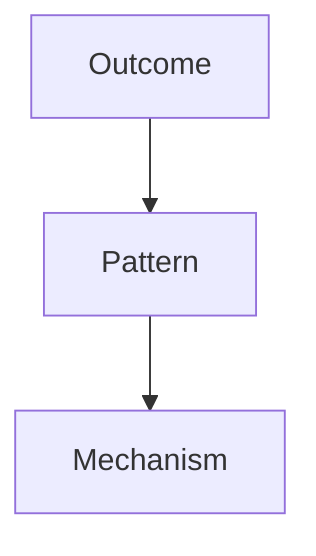
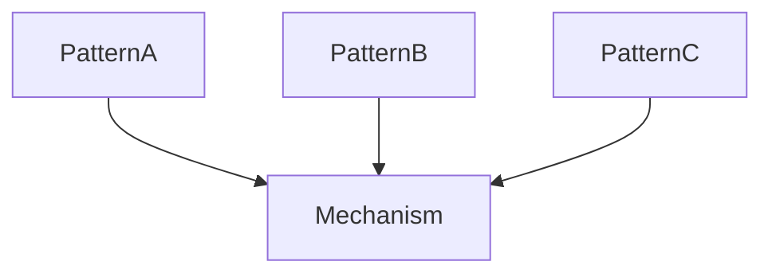
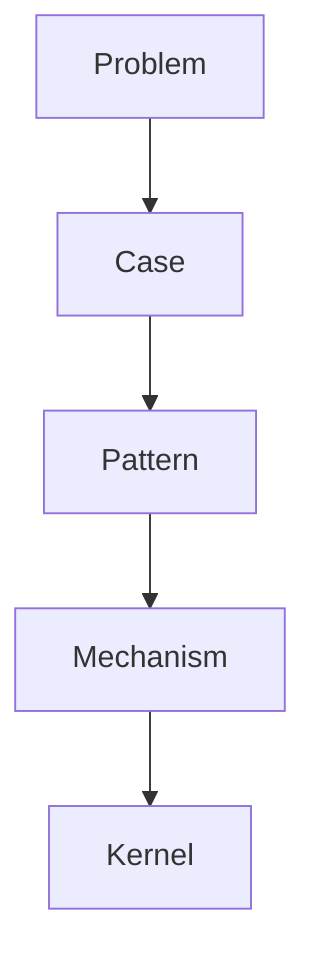

# Graph Traversal Rules

Graph Traversal Rules は  
**Knowledge Graph 上で推論や探索を行うための基本ルール**である。

Knowledge Graph はノードの集合ではなく  
**関係ネットワーク**である。

そのため

```
どの順序で辿るか
```

が推論の質を決める。

---

# Graph Traversal の目的

Graph Traversal の目的

- 推論経路の生成
- 関係発見
- 抽象化
- 問題解決

---

# 基本 Traversal

Knowledge Graph の基本探索は



---

# Traversal の種類

Knowledge Graph では  
主に次の4種類の traversal を使う。

|種類|目的|
|---|---|
|Abstraction Traversal|抽象化|
|Instantiation Traversal|具体化|
|Causal Traversal|原因探索|
|Analogy Traversal|類推|

---

# Abstraction Traversal

具体 → 抽象

```
Case → Pattern → Mechanism → Kernel
```

例

```
炎上事件
↓
炎上パターン
↓
評判メカニズム
↓
社会性原理
```

---

# Abstraction Traversal 図


---

# Instantiation Traversal

抽象 → 具体

```
Kernel → Mechanism → Pattern → Case
```

例

```
社会性
↓
同調
↓
炎上
↓
SNS事件
```

---

# Instantiation Traversal 図



---

# Causal Traversal

原因探索

```
Outcome → Cause
```

例

```
組織崩壊
↓
権力争い
↓
競争メカニズム
```

---

# Causal Traversal 図



---

# Analogy Traversal

類推探索

```
Pattern → Pattern
Mechanism → Mechanism
```

例

```
企業競争
政治競争
生物進化
```

共通

```
選択メカニズム
```

---

# Analogy Traversal 図



---

# Graph Traversal の基本ルール

---

## Rule1  
抽象度を意識する

```
case
pattern
mechanism
kernel
```

---

## Rule2  
relation を守る

主な relation

```
instance_of
is_a
causes
part_of
```

---

## Rule3  
探索目的を決める

探索には目的がある

例

```
原因探索
構造理解
予測
```

---

# Graph Traversal Strategy

推論は通常次の順序で行う

```
問題
↓
case
↓
pattern
↓
mechanism
↓
kernel
```

---

# Reasoning Path

Traversal は  
**Reasoning Path** を形成する。



---

# Traversal の失敗例

---

### 1 抽象ジャンプ

```
case → kernel
```

---

### 2 relation 無視

無関係ノードを辿る

---

### 3 pattern を飛ばす

```
case → mechanism
```

---

# Traversal と LLM

Knowledge Graph があると  
LLM は

- reasoning path を生成  
- causal explanation を構築  
- analogy 推論  

が可能になる。

---

# 関連ノート

- [[Knowledge Graph Structure]]
- [[02_zettelkasten/04_meta/knowledge_graph/Reasoning Strategy]]
- [[02_zettelkasten/04_meta/knowledge_graph/Question → Traversal Mapping]]
- [[Pattern]]
- [[Mechanism]]