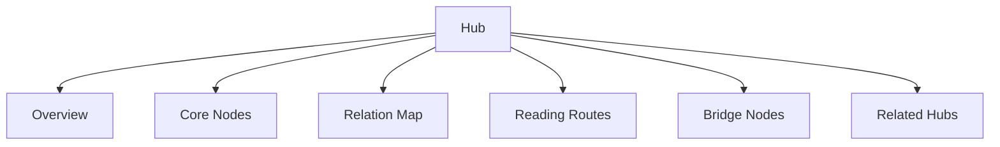
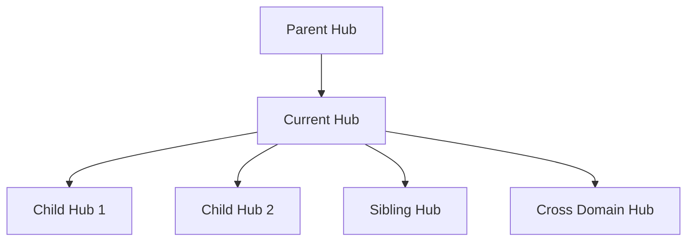

# Hub Design Rule

Hub Design Rule は、Knowledge Graph において  
**Hub ノートをどのように設計すれば、一覧ではなく思考導線として機能するか** を定めるルールである。

Hub は Vault の中心に見えやすいが、  
作り方を誤るとすぐに壊れる。

- 目次の羅列になる
- 個別ノートの中身を食い潰す
- 一覧と解説とルールが混ざる
- 重要ノードと周辺ノードの差が見えない
- 読む順番が分からない
- LLM が hub だけを読んで誤って満足する

Hub Design Rule は、Hub を  
**単なる集積点ではなく、Traversal を導く中継点** として設計するための規則である。

---

# 定義

Hub Design Rule とは、  
Hub ノートを **地図・導線・束ね・関係可視化** の役割に保つための設計規則である。

Hub の主目的は次の通りである。

1. ノード群の全体像を示す  
2. 重要ノードへの入口を与える  
3. 読む順序を明示する  
4. 抽象と具体の接続点を示す  
5. Bridge Node を見つけやすくする  
6. Traversal の中距離移動を助ける  

Hub は「内容の本体」ではなく、  
**内容へ辿るための構造ノード** である。

---

# なぜ必要か

Hub は便利なので、すぐに肥大化する。  
しかし肥大化した Hub は Graph を弱くする。

典型的な失敗は次の通りである。

## 1. 目次化
リンク一覧だけで、なぜ重要なのか分からない。

## 2. 百科事典化
各ノートの中身まで Hub に書いてしまい、個別ノートが不要になる。

## 3. 混載
Hub, Index, Rule, Framework, Note Collection が同じノートに同居する。

## 4. 導線不在
どこから読むべきか、どの順で辿るべきかが示されない。

## 5. 階層不明
重要ノードと補助ノードが同列に並ぶ。

## 6. Graph 非対応
Node Type や Edge Type の見取り図がなく、Traversal に使えない。

Hub Design Rule は、こうした崩れを防ぐ。

---

# 全体構造

```mermaid
graph TD

    A[Hub Design Rule] --> B[Hub Purpose]
    A --> C[Hub Structure]
    A --> D[Hub Sections]
    A --> E[Hub Writing Rules]
    A --> F[Hub Size Control]
    A --> G[Hub Network Rules]
    A --> H[Hub Failure Patterns]

    B --> B1[Map]
    B --> B2[Entry Point]
    B --> B3[Traversal Guide]
    B --> B4[Bridge Locator]

    C --> C1[Core Nodes]
    C --> C2[Relation View]
    C --> C3[Reading Routes]
    C --> C4[Linked Sub Hubs]

    D --> D1[Overview]
    D --> D2[Node Groups]
    D --> D3[Key Paths]
    D --> D4[Priority Reading Order]
    D --> D5[Related Hubs]

    E --> E1[Do Not Replace Child Notes]
    E --> E2[Explain Why Linked]
    E --> E3[Show Difference of Roles]
    E --> E4[Keep Mid Level Abstraction]

    F --> F1[Split Fat Hub]
    F --> F2[Separate Index]
    F --> F3[Separate Rules]
    F --> F4[Separate Cases]

    G --> G1[Parent Hub]
    G --> G2[Sibling Hub]
    G --> G3[Child Hub]
    G --> G4[Cross Domain Hub]

    H --> H1[Table of Contents Only]
    H --> H2[Mini Encyclopedia]
    H --> H3[Mixed Function Hub]
    H --> H4[Dead End Hub]
```



---

# Hub の本質

Hub の本質は、  
**一覧を作ること** ではなく  
**意味のある入口を作ること** にある。

Hub は次の4役を担う。

## 1. Map
何がこの領域にあるかを示す。

## 2. Entry Point
初めて読む人や LLM がどこから入ればよいかを示す。

## 3. Traversal Guide
どの順で辿ると理解が深まるかを示す。

## 4. Bridge Locator
どのノードが他領域へつながる橋なのかを示す。

この4つを満たさない Hub は、  
単なるリンク集になりやすい。

---

# 良い Hub の最小構成

良い Hub は、最低でも次の5要素を持つ。

1. この領域は何を扱うか  
2. 中核ノードは何か  
3. それらがどう関係するか  
4. どこから読むべきか  
5. 他のどの Hub へつながるか  

---

# Hub の標準構造



---

# 1. Overview

Hub の冒頭では、  
**この領域が何を扱うか** を短く定義する。

書くべきこと:
- 何のための Hub か
- 何を束ねるか
- どの node type が多いか
- 何に使うと便利か

悪い例:
- ここではいろいろなノートをまとめる

良い例:
- この Hub は、人間行動を説明する concept / mechanism / pattern を束ね、意思決定や観察の起点となる

---

# 2. Core Nodes

Hub には、全ノードではなく  
**中核ノード** を置く。

中核ノードとは:
- この領域の骨格になる
- 他ノードへの分岐点になる
- traversal 上の通り道になる
- 他領域と接続しやすい

たとえば Human Model Hub なら:
- 認知
- 感情
- 動機
- アイデンティティ
- 学習

などが Core Nodes になる。

---

# 3. Relation Map

Hub は、リンクの羅列でなく  
**関係の見取り図** を持つ必要がある。

たとえば:
- 認知は判断に関わる
- 感情は注意と評価を変形する
- 動機は選好と行動方向を与える
- アイデンティティは自己整合性に関わる

のように、  
ノード同士がどう結びつくかを書く。

---

# 4. Reading Routes

Hub の重要機能は、  
**どう読むかの順路** を与えることにある。

代表的には次のような順路を書く。

## 初学者向け
概念 → 代表 mechanism → 代表 pattern → 代表 case

## 分析向け
question → mechanism → structure → case

## 実務向け
framework → method → tool → case

読む順番がない Hub は、  
探索の起点になりにくい。

---

# 5. Bridge Nodes

Hub には、  
他領域へつながる橋ノードを明示すると強い。

たとえば Social Pattern Hub なら:
- 信頼
- 同調
- 規範
- 排除
- 正統性

などは、
psychology, politics, business, history をまたぎやすい。

Bridge Node を書くことで、
Graph 全体の横断性が見えやすくなる。

---

# 6. Related Hubs

Hub は孤立してはいけない。  
親 Hub・兄弟 Hub・子 Hub・横断 Hub への接続を示す。

種類:
- Parent Hub
- Sibling Hub
- Child Hub
- Cross Domain Hub

これにより、Hub 自体が Graph の node として機能する。

---

# Hub の推奨セクション

Hub は次のセクションで組むと安定しやすい。

```text
1. 概要
2. この Hub の役割
3. 中核ノード
4. ノード群の関係
5. 読む順序
6. 代表的な探索経路
7. Bridge Node
8. 関連 Hub
9. 関連する case / pattern / method
```

---

# Hub の標準テンプレート

```markdown
# ○○ Hub

## 概要
この Hub は何を扱うか。

## この Hub の役割
地図 / 入口 / 導線 / 橋のどれを担うか。

## 中核ノード
- [[A]]
- [[B]]
- [[C]]

## 関係の見取り図
A は B とどうつながり、C はどこを媒介するか。

## 読む順序
- 初学者向け: [[A]] → [[B]] → [[C]]
- 分析向け: [[B]] → [[D]] → [[E]]

## 代表的な探索経路
- Question → Mechanism → Pattern
- Case → Pattern → Kernel

## Bridge Node
- [[X]]
- [[Y]]

## 関連 Hub
- [[Parent Hub]]
- [[Sibling Hub]]
- [[Child Hub]]
```

---

# Hub に書いてよいこと / 書きすぎないこと

## 書いてよいこと
- 概要
- 関係の見取り図
- 優先順位
- 読む順序
- 重要差分
- 代表ノードの短い説明

## 書きすぎないこと
- 各子ノートの本文全文
- 事例の詳細叙述
- ルールの全文
- 巨大な一覧表
- method の詳細手順全部

Hub は「中継点」であり、
「終着点」ではない。

---

# Hub の抽象度

Hub は中位抽象を保つべきである。

低すぎる Hub:
- case の羅列
- 細かい observation の束

高すぎる Hub:
- 世界とは何か
- すべては関係である

良い Hub:
- ある領域の主要構成要素と主要経路が分かる
- 個別ノートに降りる余地がある

---

# Hub の分類

Hub にはいくつかの型がある。

---

## 1. Domain Hub

分野全体を束ねる。

例:
- History Hub
- Law Hub
- Business Hub
- Tourism Hub

役割:
- 分野入口
- 主要 sub hub の導線

---

## 2. Model Hub

モデル群や構成要素を束ねる。

例:
- Human Model Hub
- Decision Model Hub
- Reading Model Hub

役割:
- concept / mechanism / structure を整理する

---

## 3. Pattern Hub

反復現象を束ねる。

例:
- Social Pattern Hub
- Organization Pattern Hub
- Failure Pattern Hub

役割:
- case を pattern にまとめる
- pattern 間差分を見せる

---

## 4. Method Hub

分析法や思考法を束ねる。

例:
- Analysis Method Hub
- Inquiry Method Hub

役割:
- question から method への導線

---

## 5. Meta Hub

Vault 全体の設計原理を束ねる。

例:
- Knowledge Graph Hub
- Thinking Engine Hub
- Structure Hub

役割:
- 全体理解
- schema 理解
- 横断導線

---

# Hub 間の関係

Hub は単独で置くのでなく、  
Hub 自体がネットワーク化されるべきである。

---

## 親 Hub
より大きい領域を束ねる Hub

例:
- Human Model Hub → World Model Hub

## 子 Hub
特化領域を束ねる Hub

例:
- Social Pattern Hub → 排除パターン Hub

## 兄弟 Hub
同じ階層の別領域 Hub

例:
- Human Model Hub ↔ Social Structure Hub

## 横断 Hub
複数領域をつなぐ Hub

例:
- Knowledge Graph Hub
- Thinking Engine Hub

---

# Hub 関係の図



---

# Hub と Index の違い

これは非常に重要である。

## Hub
- 地図
- 関係を示す
- 読む順序を示す
- 重要度を示す

## Index
- 一覧
- 網羅
- 機械的配列
- 管理寄り

Index を Hub に入れすぎると、
Hub が目詰まりする。

---

# Hub と Framework の違い

## Hub
何があるか、どうつながるかを示す

## Framework
どう考えるか、どう処理するかを示す

Hub は地図、Framework は操作枠である。

---

# Hub と Rule の違い

## Hub
対象ノード群の見取り図

## Rule
書き方・判断基準・運用規則

Hub に Rule を大量に入れると機能がぼやける。

---

# 良い Hub の条件

## 1. 一読で領域の骨格が分かる
## 2. 中核ノードが見える
## 3. どこから読めばいいか分かる
## 4. 他 Hub への接続がある
## 5. 子ノートを読む意味が残っている
## 6. Traversal の経路が示されている

---

# 悪い Hub のパターン

## 1. Table of Contents Only
リンクだけ並んでいて意味がない

## 2. Mini Encyclopedia
Hub に内容を書きすぎて、個別ノートが死ぬ

## 3. Mixed Function Hub
Hub, rule, index, framework が混ざる

## 4. Dead End Hub
他の hub や core node につながらない

## 5. Flat Hub
全ノードが同列で、重要度差がない

---

# Hub を分割すべき条件

次のどれかに当てはまるなら分割を検討する。

1. セクションが多すぎる  
2. Core Node が多すぎる  
3. pattern / method / case が全部同居している  
4. 1ノートで読み順を示しきれない  
5. 個別ノートに書くべき内容が侵食されている  

---

# 分割の方向

## 1. 領域分割
例:
- Human Model Hub
- Human Emotion Hub
- Human Cognition Hub

## 2. 役割分割
例:
- Pattern Hub
- Method Hub
- Case Index

## 3. 抽象度分割
例:
- World Model Hub
- Domain Hub
- Case Hub

---

# LLM にとっての意味

良い Hub があると、LLM は

- どこが中核かを先に把握でき
- 周辺ノードに無駄に拡散せず
- 読む順序を参考に探索し
- bridge node を辿って横断しやすくなる

逆に悪い Hub だと、

- リンクの山から重要度を判別できず
- Hub 本文で誤って完結し
- 子ノートの探索が浅くなる

Hub は LLM にとって、  
**探索の優先順位を示す標識** である。

---

# この Vault における実装方針

この Vault では、Hub を作るとき最低限次を守る。

## 必須
- 概要
- 中核ノード
- 関係の見取り図
- 読む順序
- 関連 Hub

## 推奨
- Bridge Node
- 代表 traversal
- 初学者向け route
- 分析向け route

## 分離推奨
- 網羅一覧は Index
- 書き方規則は Rule
- 実務手順は Framework / Method
- 詳細解説は子ノート

---

# 他ノートとの接続

## 上位
- [[Knowledge Graph]]

## 近接
- [[Graph Maintenance]]
- [[Traversal]]
- [[02_zettelkasten/04_knowledge_graph/Reasoning Path]]
- [[Bridge Concept]]
- [[02_zettelkasten/04_knowledge_graph/Anchor Case]]

## 下位候補
- [[Domain Hub Rule]]
- [[Model Hub Rule]]
- [[Pattern Hub Rule]]
- [[Method Hub Rule]]
- [[Hub Template]]

---

# まとめ

Hub Design Rule は、Hub ノートを  
**一覧ではなく、思考導線として機能させるための設計規則** である。

Hub は、

- 地図であり
- 入口であり
- 導線であり
- 橋の所在を示す標識である

そのため良い Hub は、
内容を全部抱え込まず、

- 中核ノードを示し
- 関係の骨格を見せ
- 読む順番を与え
- 他 Hub へ接続する

形で設計されるべきである。

Hub が Graph の都市計画図だとすれば、  
個別ノートはその都市を構成する建物である。
