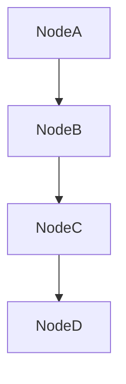
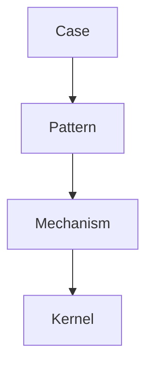
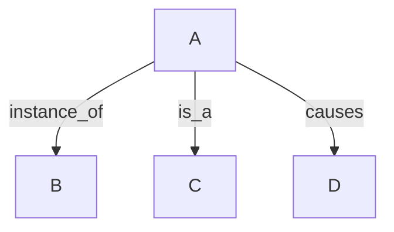
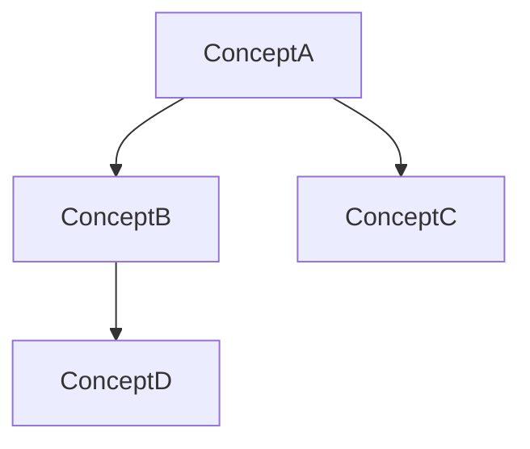
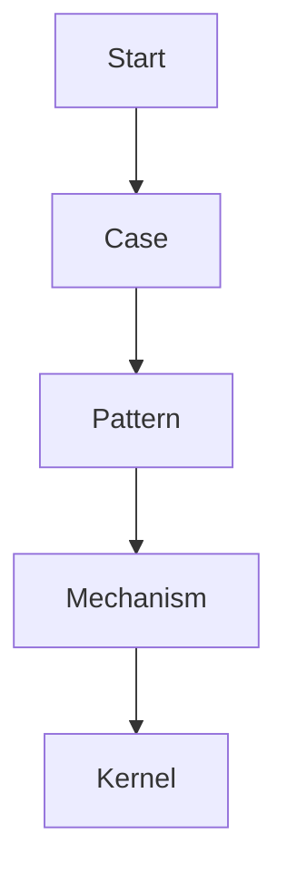

# Knowledge Graph Structure

Knowledge Graph Structure は  
**Zettelkasten 全体をグラフとして構造化するための設計ルール**である。

Knowledge Graph では、知識は  
**ノード（concept）とエッジ（relation）**で構成される。

---

# Knowledge Graph の目的

Knowledge Graph は次を目的とする。

- 知識の関係を明確化  
- 推論経路の生成  
- LLM 推論の補助  

---

# Knowledge Graph の基本要素

Knowledge Graph は次の2要素で構成される。

|要素|説明|
|---|---|
|Node|知識単位|
|Edge|関係|

---

# Knowledge Graph 基本図



---

# Node の種類

Knowledge Graph ではノードは階層構造を持つ。

```
Case
Pattern
Mechanism
Kernel
```

---

# Node 階層



---

# Case

Case は  
**具体的事例**である。

例

```
フランス革命
企業炎上
市場崩壊
```

---

# Pattern

Pattern は  
**複数 case に現れる構造**である。

例

```
革命パターン
炎上パターン
権力争いパターン
```

---

# Mechanism

Mechanism は  
**Pattern の原因となる因果プロセス**である。

例

```
同調
競争
評判
```

---

# Kernel

Kernel は  
**最も抽象的な原理**である。

例

```
社会性
競争
適応
```

---

# Knowledge Graph 全体図


---

# Edge の種類

Knowledge Graph では relation は複数存在する。

|relation|意味|
|---|---|
|instance_of|具体例|
|is_a|分類|
|part_of|構成要素|
|causes|因果|
|related_to|関連|

---

# Edge 図



---

# Knowledge Graph の特徴

Knowledge Graph は

- 階層構造  
- ネットワーク構造  

の両方を持つ。

---

# Hierarchy

抽象化構造


---

# Network

知識関係



---

# Knowledge Graph の探索

Knowledge Graph は  
**Traversal によって探索される。**

例

```
Case → Pattern → Mechanism → Kernel
```

---

# Traversal 図



---

# Knowledge Graph と Zettelkasten

Zettelkasten は

```
ノート集合
```

Knowledge Graph は

```
ノート関係構造
```

である。

---

# Knowledge Graph の利点

Knowledge Graph を使うと

- 知識検索が容易  
- 推論が可能  
- 構造理解が可能  

になる。

---

# Knowledge Graph と LLM

LLM は Knowledge Graph を使うことで

- reasoning path 生成  
- analogy 推論  
- causal 推論  

を行いやすくなる。

---

# 関連ノート

- [[Graph Traversal Rules]]
- [[Pattern]]
- [[Mechanism]]
- [[Kernel]]
- [[Bridge Concept]]
- [[Knowledge Graph]]