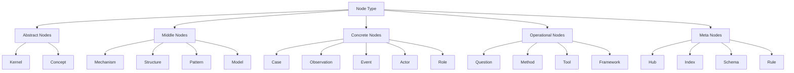
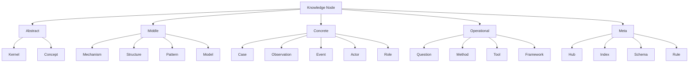
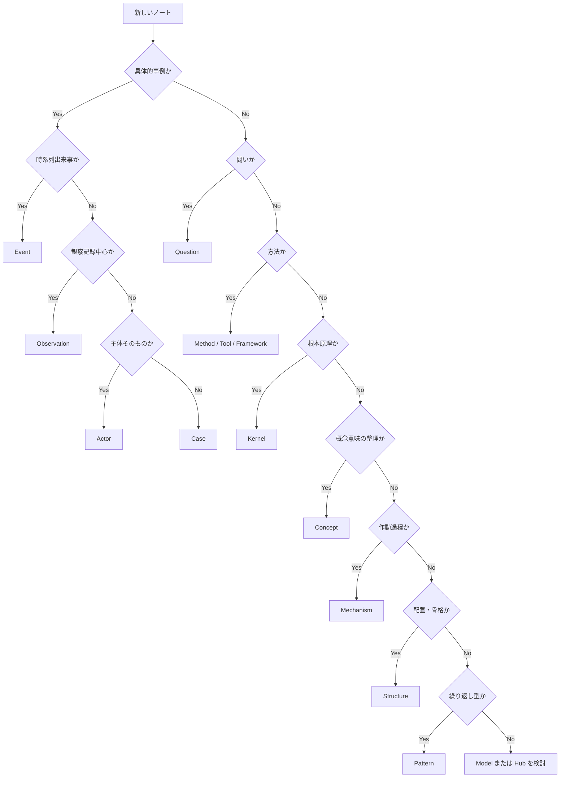

# Node Type

Node Type は、Knowledge Graph において  
**何を一つのノードとして扱うか**を定義するための分類構造である。

Knowledge Graph が壊れる最大の原因の一つは、  
「概念」「事例」「原理」「構造」「問い」「手法」が未分化のまま、  
全部同じ粒度で並べられることである。

Node Type はそれを防ぎ、  
各ノートが **どの役割の知識単位なのか** を明確にする。

---

# 定義

Node Type とは、  
Knowledge Graph を構成する各ノードの**知識上の役割分類**である。

Node Type の目的は、単なる整理ではない。  
主な目的は次の5つである。

1. ノードの役割を明確にする  
2. 異なる種類の知識を混同しない  
3. どの関係を結ぶべきかを判断しやすくする  
4. 抽象と具体の移動を安定させる  
5. LLM の探索経路を制御しやすくする  

---

# なぜ必要か

同じ「ノート」でも、知識上の役割は全く違う。

たとえば次は同列ではない。

- 帝国主義
- 韓国併合
- 非対称支配メカニズム
- 植民地化パターン
- 国家とは何か
- 比較史分析
- なぜ日本は韓国を併合したのか

これらを全部同じノードとして扱うと、

- 概念と事例が混ざる
- 質問と答えが混ざる
- 方法と対象が混ざる
- 原理と現象が混ざる

その結果、Graph は見た目だけつながっていても、
推論には使えない。

Node Type は、
「何をどのレイヤーの知識として置くか」を決めるための土台である。

---

# 全体構造

---

# Node Type の大分類

Node Type は大きく5群に分けると安定する。

## 1. Abstract Nodes
高抽象の知識単位。  
原理・意味・普遍概念を担う。

- Kernel
- Concept

## 2. Middle Nodes
抽象と具体の中間。  
「どう動くか」「どう組まれているか」「どう繰り返すか」を担う。

- Mechanism
- Structure
- Pattern
- Model

## 3. Concrete Nodes
現実に接地した知識単位。  
観察・事例・人物・出来事を担う。

- Case
- Observation
- Event
- Actor
- Role

## 4. Operational Nodes
問い・分析・実務への接続を担う。

- Question
- Method
- Tool
- Framework

## 5. Meta Nodes
知識体系の運用そのものを支える。

- Hub
- Index
- Schema
- Rule

---

# 各 Node Type の定義

## 1. Kernel

最も深い原理ノード。  
多数の現象や構造の背後にある、比較的普遍的な土台を表す。

例:
- 限定合理性
- 資源制約
- 情報非対称
- 権力偏在
- 制度は行動を方向づける

特徴:
- 抽象度が高い
- 長期的に有効
- 多くの mechanism / pattern を支える

向いている問い:
- 背後にある原理は何か
- なぜ繰り返し似た現象が起こるのか

---

## 2. Concept

重要概念だが、まだ原理や仕組みとしては確定していない意味単位。

例:
- 正統性
- 主権
- 競争
- 信頼
- 責任
- 物語
- 移行

特徴:
- 意味の輪郭を与える
- 他ノードへの入口になる
- 曖昧さを管理する

向いている問い:
- この言葉は何を意味するか
- 近い概念とどう違うか

---

## 3. Mechanism

結果を生む作動過程。  
「何がどう作用して、何が起きるか」を説明する。

例:
- 同調形成
- シグナリング
- フリーライダー化
- 注意の偏在
- 責任分散
- 動機づけ歪み

特徴:
- 因果的
- 動態的
- 説明力が高い

向いている問い:
- 何がどう動いてこうなったのか
- 結果に至る作動過程は何か

---

## 4. Structure

要素の配置・階層・接続関係。  
動いていなくても、現象を方向づける骨格を表す。

例:
- 中心周辺構造
- 寡占構造
- 主従構造
- ネットワーク構造
- 委任連鎖
- フィードバックループ

特徴:
- 静的または準静的
- 位置関係を重視する
- ボトルネック分析に強い

向いている問い:
- どういう配置だから起きやすいのか
- どこに偏りや詰まりがあるのか

---

## 5. Pattern

繰り返し現れる典型形。  
特定分野や複数分野で反復される現象の型。

例:
- 炎上パターン
- 責任回避パターン
- 外部敵形成パターン
- 制度疲労パターン
- 立ち上がり失敗パターン

特徴:
- 反復性がある
- case を束ねる
- 予測のたたき台になる

向いている問い:
- これはよくある型か
- 他にも似た例があるか

---

## 6. Model

複数の concept / mechanism / structure / pattern を統合した説明枠組み。

例:
- 行動モデル
- 国家形成モデル
- 学習モデル
- 営業プロセスモデル
- 認知処理モデル

特徴:
- 複合的
- ある範囲を体系的に説明する
- 単独ノードより大きいが、Hub よりは内容中心

向いている問い:
- この領域をどうまとめて理解するか
- どの構成要素がどうつながるか

---

## 7. Case

具体的事例ノード。  
特定の現実事象・歴史事例・案件・プロジェクトなどを扱う。

例:
- 韓国併合
- ドイツ革命
- 特定企業の炎上
- 特定案件の失敗
- ある制度改正

特徴:
- 具体的
- 時間・場所・主体を持つ
- 抽象化の素材になる

向いている問い:
- 実際には何が起きたのか
- この出来事は何の例か

---

## 8. Observation

まだ十分に解釈されていない観察単位。  
生データと case の中間に位置する。

例:
- 発言の記録
- 現場で見た挙動
- 数値の偏り
- 質的インタビューの一断片

特徴:
- 具体的だが未整理
- case の材料になる
- hypothesis の起点になる

向いている問い:
- 何が観察されたか
- どんな異変や兆候があるか

---

## 9. Event

時間的に区切られた出来事ノード。  
Case よりも出来事単位に焦点を当てる。

例:
- クーデター発生
- 法律制定
- 炎上発火
- 会議決裂
- 価格暴落

特徴:
- 時点・時系列が重要
- Event 同士で連鎖する
- case の中の部分としても使える

向いている問い:
- 何がいつ起きたか
- どの出来事が転換点か

---

## 10. Actor

行為主体ノード。  
個人・組織・国家・集団など、行為や判断の担い手。

例:
- ビスマルク
- 日本政府
- 消費者集団
- 経営陣
- 官僚制組織

特徴:
- 意思・資源・制約を持つ
- role と分けると整理しやすい
- event / case への埋め込み先になる

向いている問い:
- 誰が動いたのか
- 誰にどんな利害があったか

---

## 11. Role

Actor が特定文脈で担う役割ノード。  
主体そのものではなく、関係上の位置を表す。

例:
- 仲介者
- 監督者
- 支配者
- 被支配者
- 反対派
- 正統性供給者

特徴:
- Actor と切り分けると再利用しやすい
- 抽象比較に向く
- 組織・政治・物語分析で有用

向いている問い:
- この主体はその場でどんな役割を担っていたか
- 他事例でも同じ役割はあるか

---

## 12. Question

問いノード。  
調査・推論・読書・設計の入口を担う。

例:
- なぜ人は不合理な選択を続けるのか
- なぜ制度は自己目的化するのか
- なぜこの事業は立ち上がらないのか

特徴:
- Graph の起点になる
- 関連ノード群を束ね直せる
- AI にとって retrieval の入口になる

向いている問い:
- 何を知りたいのか
- どこから考え始めるべきか

---

## 13. Method

分析・思考・調査のやり方ノード。

例:
- causal chain analysis
- 比較分析
- five whys
- power mapping
- 構造分解

特徴:
- 対象そのものではなく、扱い方
- Question と対象ノードを橋渡しする

向いている問い:
- どう分析すればよいか
- どの順で考えればよいか

---

## 14. Tool

実務で使うテンプレート・チェックリスト・フォーム・プロンプト。

例:
- case 記述テンプレート
- 観察シート
- 問題切り分け表
- KPI チェックリスト

特徴:
- 即使える
- Method より実装寄り
- 知識を作業に変える

向いている問い:
- 実際に何を書けばいいか
- どの形式で記録するか

---

## 15. Framework

複数の視点や手順を整理した枠組みノード。  
Method と Model の中間に位置することが多い。

例:
- 3層分析フレーム
- 観察→仮説→検証フレーム
- 顧客課題→提案設計フレーム

特徴:
- 方法論の見取り図
- 操作順序を与える
- 複数 Method を束ねることが多い

---

## 16. Hub

ノード群を束ねる中枢ノード。  
単なる目次ではなく、関係の見取り図を示す。

例:
- Human Model Hub
- Social Structure Hub
- Knowledge Graph Hub
- Pattern Hub

特徴:
- Graph の可読性を上げる
- 読む順序を与える
- 中距離探索を助ける

---

## 17. Index

機械的・一覧的に並べる補助ノード。  
Hub より意味づけが薄い。

例:
- ノート一覧
- ID 一覧
- folder index

特徴:
- 管理寄り
- 検索補助
- 推論の中心にはしない

---

## 18. Schema

型や項目の定義ノード。  
Graph の設計原理を定める。

例:
- Node Type
- Edge Type
- Property Rule
- Case Template Schema

特徴:
- メタレベル
- 運用を揃える
- Vault 全体の安定化に寄与する

---

## 19. Rule

書き方・昇格条件・命名規則などの運用ルール。

例:
- Case の書き方ルール
- Pattern 昇格条件
- Hub 設計ルール
- relation 語彙ルール

特徴:
- 品質維持
- ばらつき防止
- LLM の読み取り安定化

---

# Node Type の階層関係

---

# 抽象度の並び

Knowledge Graph を安定させるには、  
ノードを抽象度順に見る癖が重要である。

おおむね次の順になる。

1. Kernel  
2. Concept  
3. Mechanism / Structure / Pattern / Model  
4. Case / Event / Observation / Actor / Role  
5. Tool / Method / Framework  
6. Hub / Schema / Rule / Index  

ただしこれは厳密な上下関係ではなく、  
「知識上の機能の違い」として理解する。

---

# どう使い分けるか

## Concept と Kernel の違い

- Concept は「重要な意味単位」
- Kernel は「背後にある根本原理」

例:
- 信頼 = Concept
- 情報不完備下で協力が不安定になる = Kernel

---

## Mechanism と Structure の違い

- Mechanism は「どう動くか」
- Structure は「どう組まれているか」

例:
- 責任分散 = Mechanism
- 多段委任構造 = Structure

---

## Pattern と Case の違い

- Pattern は「繰り返す型」
- Case は「具体的事例」

例:
- 炎上パターン = Pattern
- ある企業Xの炎上 = Case

---

## Actor と Role の違い

- Actor は「誰か」
- Role は「その文脈で何を担うか」

例:
- 日本政府 = Actor
- 併合推進主体 = Role

---

## Method と Tool の違い

- Method は「どう考えるか」
- Tool は「どう書くか・どう使うか」

例:
- 比較分析 = Method
- 比較表テンプレート = Tool

---

# Node Type 判定のための質問

新しいノートを作るときは、次の質問で判定できる。

## 1. これは具体例か
はい → Case / Event / Observation / Actor

## 2. これは繰り返し現れる型か
はい → Pattern

## 3. これは結果を生む作動過程か
はい → Mechanism

## 4. これは要素の配置や接続か
はい → Structure

## 5. これは広く効く原理か
はい → Kernel

## 6. これは重要概念の意味整理か
はい → Concept

## 7. これは問いの入口か
はい → Question

## 8. これは分析のやり方か
はい → Method

## 9. これはテンプレートや実務道具か
はい → Tool

## 10. これは一覧や束ねノートか
はい → Hub / Index / Schema / Rule

---

# Node Type 判定フロー

---

# 良い Node Type 設計の条件

## 1. 一つのノートに一つの主役
一ノートに mechanism と case と concept を全部詰め込まない。

## 2. 似た役割を混ぜない
特に Concept / Kernel / Mechanism / Pattern / Case を混ぜない。

## 3. 具体から抽象へ上がれる
Case を置いたら、少なくとも Pattern か Mechanism へつなぐ。

## 4. 抽象から具体へ降りられる
Kernel や Concept から、関連 Case を辿れるようにする。

## 5. Meta Node を増やしすぎない
Hub, Schema, Rule ばかり増えると中身の知識が痩せる。

---

# 悪い Node Type の典型

## 1. 何でも Concept にしてしまう
概念ノートが膨張し、仕組みや事例が埋もれる。

## 2. Case を Pattern と呼んでしまう
一回きりの事象を一般化しすぎる。

## 3. Mechanism と Structure の未分離
「責任分散」と「多段承認構造」が混ざる。

## 4. Actor と Role の混同
人そのものと、その場の機能が区別できなくなる。

## 5. Hub が内容ノートを食う
Hub が巨大化し、本来の個別ノートが不要になる。

---

# この Vault における実装方針

この Vault では、最低でも次の Node Type を中核に据えると安定する。

- Kernel
- Concept
- Mechanism
- Structure
- Pattern
- Case
- Question
- Method
- Tool
- Hub

補助的に必要に応じて追加する。

- Observation
- Event
- Actor
- Role
- Model
- Rule
- Schema
- Framework
- Index

---

# 最小セットと拡張セット

## 最小セット
最初はこれだけで十分回る。

- Concept
- Kernel
- Mechanism
- Structure
- Pattern
- Case
- Question
- Method
- Tool
- Hub

## 拡張セット
運用が進んだら追加する。

- Observation
- Event
- Actor
- Role
- Model
- Framework
- Rule
- Schema
- Index

---

# 他ノートとの接続

## 上位
- [[Knowledge Graph]]

## 近接
- [[02_zettelkasten/04_meta/knowledge_graph/Edge Type]]
- [[Traversal]]
- [[Graph Maintenance]]
- [[Hub Design Rule]]

## 下位候補
- [[Kernel]]
- [[Concept]]
- [[Mechanism]]
- [[Structure]]
- [[Pattern]]
- [[Case]]
- [[Question]]
- [[Method]]
- [[Tool]]

---

# まとめ

Node Type は、Knowledge Graph において  
「このノートは何者か」を定義するための基本分類である。

Node Type を明確にすることで、

- 抽象と具体が混ざらない
- 関係の型が決めやすい
- Hub が機能しやすい
- LLM の探索経路が安定する
- Vault 全体の知識設計が崩れにくくなる

知識の質は、内容量だけでなく  
**どの役割のノードとして置かれているか** に強く依存する。
