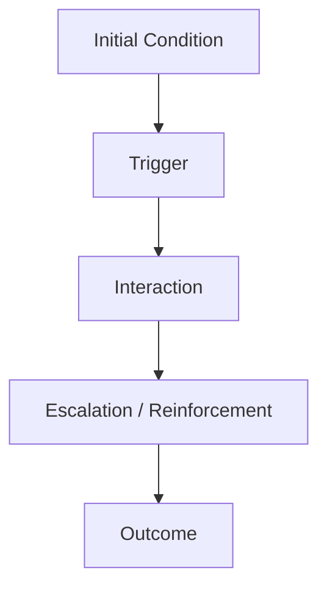
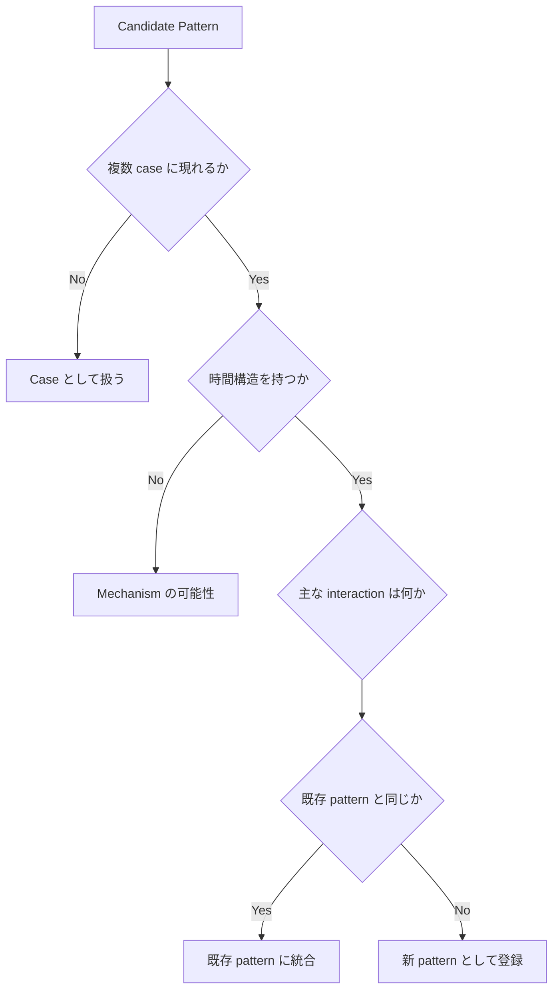
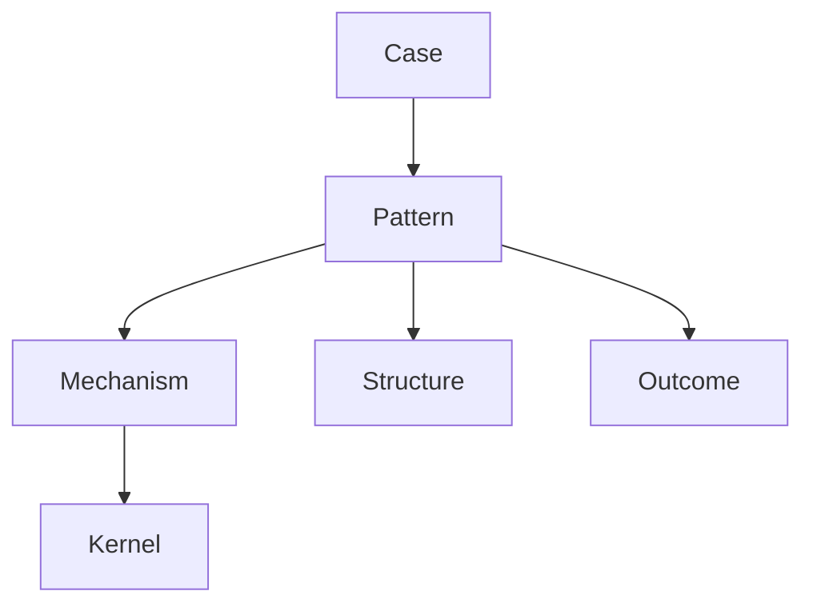
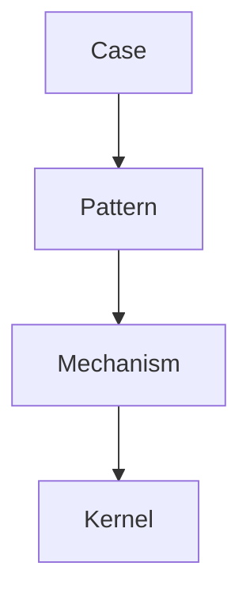

# Pattern Boundary Rule

Pattern Boundary Rule は、Knowledge Graph において  
**pattern 同士の境界を明確に保つための設計ルール**である。

Pattern は本来、現実に繰り返し現れる構造や進行を抽象化したものである。  
しかし pattern を増やしていくと、次の問題が必ず発生する。

- 似た pattern が増える  
- 同じ case が複数 pattern に当てはまる  
- pattern の定義が曖昧になる  
- pattern と mechanism が混ざる  

Pattern Boundary Rule は、これを防ぐ。

---

# Pattern 境界が崩れる理由

Pattern 境界が曖昧になるのは、主に次の理由による。

## 1. 抽象レベルの違い

例

- 炎上パターン
- 規範逸脱可視化パターン
- 評判崩壊パターン

これらは同じ現象を違う抽象度で見ている可能性がある。

---

## 2. mechanism と混同

例

- 同調パターン
- 社会的証明

これは実際には pattern と mechanism が混ざっている。

---

## 3. outcome を pattern としてしまう

例

- 崩壊パターン
- 成功パターン

結果だけを pattern にしてしまうと境界が不明瞭になる。

---

## 4. role を pattern にしてしまう

例

- リーダーパターン
- 裏切り者パターン

これは pattern ではなく role である可能性が高い。

---

## 5. case を pattern に昇格してしまう

例

- 〇〇炎上パターン
- △△崩壊パターン

特定事件に依存するものは pattern ではなく case である。

---

# Pattern Boundary の基本原則

Pattern の境界を安定させるには、次の原則を守る。

---

## 原則1  
pattern は **時間構造** を持つ。

pattern は

- 状態
- 変化
- 結果

の流れを含む。

つまり pattern は

```
状態 → 行動 → 反応 → 結果
```

という **進行構造** を持つ。

---

## 原則2  
pattern は **複数 case に現れる**。

1つの事例だけなら pattern ではない。

---

## 原則3  
pattern は **mechanism と区別する**。

mechanism は

「なぜ起きるか」

pattern は

「どういう形で起きるか」

である。

---

## 原則4  
pattern は **role を含めるが role ではない**。

pattern は多くの場合、

- actor
- role
- interaction

を含むが、

role 単体は pattern ではない。

---

## 原則5  
pattern は **結果ではない**

結果は outcome である。

pattern はその前の進行である。

---

# Pattern の基本構造

pattern は一般に次の構造を持つ。



---

# Pattern Boundary を決める方法

Pattern 境界は次の3つで決まる。

1. Trigger  
2. Interaction  
3. Outcome

この組み合わせが変わると  
別 pattern になる。

---

# Pattern 境界判定フロー



---

# Pattern の境界を作る3つの軸

Pattern の境界は次の軸で区別できる。

---

## 1 Trigger の違い

同じ結果でも、  
トリガーが違えば別 pattern。

例

- 規範逸脱トリガー
- 利益衝突トリガー
- 情報漏洩トリガー

---

## 2 Interaction の違い

同じトリガーでも  
相互作用が違えば別 pattern。

例

- 同調拡散
- 対立激化
- 集団分裂

---

## 3 Outcome の違い

進行が同じでも  
結果が違えば別 pattern。

例

- 炎上 → 沈静
- 炎上 → 社会制裁
- 炎上 → 文化変化

---

# Pattern と Mechanism の違い

|項目|Pattern|Mechanism|
|---|---|---|
|意味|起き方|原因|
|形式|進行|因果|
|時間|ある|ない場合もある|
|例|炎上パターン|同調メカニズム|

---

# Pattern と Structure の違い

|項目|Pattern|Structure|
|---|---|---|
|意味|進行|配置|
|時間|ある|ない|
|例|権力争いパターン|階層構造|

---

# Pattern と Case の違い

|項目|Pattern|Case|
|---|---|---|
|抽象度|高い|低い|
|再現性|ある|一度限り|
|例|規範逸脱炎上|具体事件|

---

# Pattern Boundary を守るためのルール

## Rule1  
pattern は **進行を持つこと**

---

## Rule2  
pattern は **最低3 case 以上**から抽象すること

---

## Rule3  
mechanism は pattern に入れない

---

## Rule4  
role は pattern にしない

---

## Rule5  
outcome は pattern 名にしない

---

# Pattern Boundary のチェックリスト

新しい pattern を作る前に次を確認する。

- 複数 case に現れるか  
- 時間進行があるか  
- mechanism ではないか  
- role ではないか  
- outcome ではないか  
- 既存 pattern に統合できないか  

---

# Pattern Boundary の図



---

# Pattern Boundary を破る典型例

## 1 抽象レベル混乱

例

- 炎上パターン
- SNS炎上パターン
- 企業炎上パターン

これは階層化すべき。

---

## 2 mechanism 混入

例

- 同調パターン

同調は mechanism である。

---

## 3 outcome pattern

例

- 崩壊パターン

これは結果。

---

# 良い Pattern の条件

良い pattern は次を満たす。

- 複数 case に出る  
- 進行が明確  
- actor / role が分かる  
- mechanism が説明できる  
- outcome が複数ありうる  

---

# Knowledge Graph での位置

Pattern は Knowledge Graph の中間層に位置する。



---

# LLM にとっての意味

Pattern Boundary が明確だと、

LLM は

- case を pattern に昇格できる
- pattern を mechanism に分解できる
- pattern 同士を比較できる

逆に境界が曖昧だと、

- 同じ現象を別名で語る
- mechanism と混同する
- reasoning が崩れる

---

# この Vault での運用

この Vault では次を推奨する。

pattern は

- domain/pattern
- model/pattern

などに置く。

各 pattern には必ず

- 代表 case
- mechanism
- outcome

を書く。

---

# 関連ノート

- [[Pattern]]
- [[02_zettelkasten/04_knowledge_graph/Representative Case Rule]]
- [[Mechanism]]
- [[Structure]]
- [[Knowledge Graph]]
- [[02_zettelkasten/04_knowledge_graph/Anchor Case]]
- [[old_zettelkasten/pattern/Pattern Hub]]