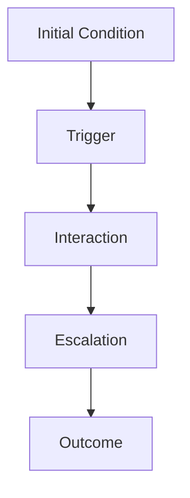
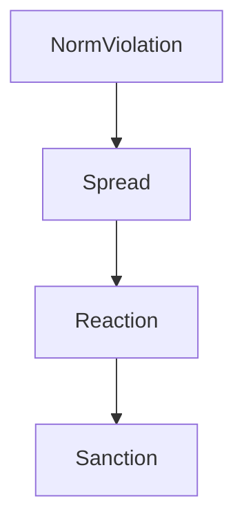
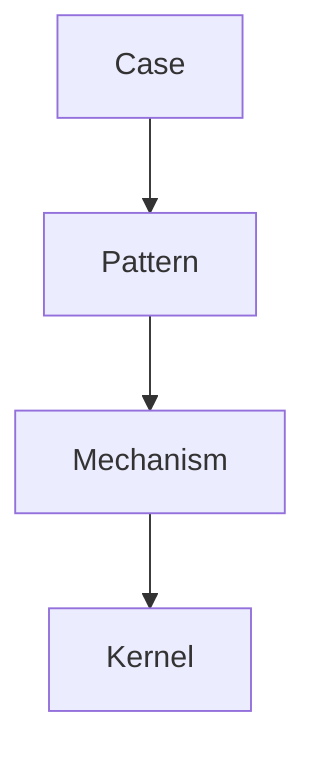

# Pattern

Pattern は、Knowledge Graph において  
**複数の case に繰り返し現れる進行構造（recurring structure）**を表すノードである。

Pattern は

- case の観察
- case の比較

から抽出される。

Pattern は単なる概念ではなく、  
**時間を伴う構造**である。

---

# Pattern の定義

Pattern とは

**複数の case に繰り返し現れる  
行動・相互作用・結果の進行構造**

である。

---

# Pattern の役割

Pattern は Knowledge Graph で次の役割を持つ。

---

## 1 Case の抽象化

```
case
case
case
 ↓
pattern
```

---

## 2 Mechanism の入口

Pattern は mechanism の表れである。

```
pattern
 ↓
mechanism
```

---

## 3 構造理解

複雑な出来事を構造として理解できる。

---

## 4 予測

Pattern が分かると  
将来の展開を予測できる。

---

# Pattern の基本構造

Pattern は通常  
次の構造を持つ。



---

# Pattern の構成要素

Pattern は次の要素から構成される。

|要素|説明|
|---|---|
|condition|初期状態|
|trigger|きっかけ|
|actor|主体|
|interaction|相互作用|
|outcome|結果|

---

# Pattern の例（抽象）

例

```
規範逸脱炎上
```

構造

```
規範逸脱
 ↓
SNS拡散
 ↓
集団反応
 ↓
評判制裁
```

---

# Pattern の図



---

# Pattern の種類

Pattern はいくつかの種類に分けられる。

---

## Social Pattern

社会行動のパターン

例

- 炎上
- 集団同調
- 排除

---

## Organizational Pattern

組織内のパターン

例

- 権力争い
- 官僚化

---

## Economic Pattern

市場のパターン

例

- バブル
- 競争

---

## Psychological Pattern

心理行動のパターン

例

- 認知バイアス
- 習慣形成

---

# Pattern と Case の違い

|項目|Pattern|Case|
|---|---|---|
|抽象度|高|低|
|再現性|ある|一回|
|例|炎上パターン|具体炎上事件|

---

# Pattern と Mechanism の違い

|項目|Pattern|Mechanism|
|---|---|---|
|意味|進行構造|因果構造|

---

# Pattern の作り方

Pattern は次の流れで作る。

```
case
 ↓
case comparison
 ↓
pattern
```

---

# Pattern ノートの構造

Pattern ノートには次を書く。

```
概要
構造
actor
trigger
interaction
outcome
representative case
mechanism
```

---

# Pattern の図



---

# Pattern の条件

良い pattern は次を満たす。

- 複数 case に現れる
- 構造が明確
- actor が存在
- mechanism と接続できる

---

# Pattern の注意

---

## 1 Outcome を pattern にしない

例

```
崩壊
```

これは結果。

---

## 2 Case を pattern にしない

例

```
〇〇事件
```

---

## 3 Mechanism と混同しない

例

```
同調
```

mechanism の可能性。

---

# Pattern と Knowledge Graph

Knowledge Graph では

```
case
 ↓
pattern
 ↓
mechanism
 ↓
kernel
```

という階層になる。

---

# LLM にとっての意味

Pattern があると  
LLM は

- case を抽象化  
- 新しい事例の理解  
- 予測  

を行いやすくなる。

---

# 関連ノート

- [[old_zettelkasten/pattern/Pattern Hub]]
- [[Pattern Extraction Method 1]]
- [[Pattern Comparison 1]]
- [[02_zettelkasten/04_knowledge_graph/Representative Case Rule]]
- [[Knowledge Graph]]