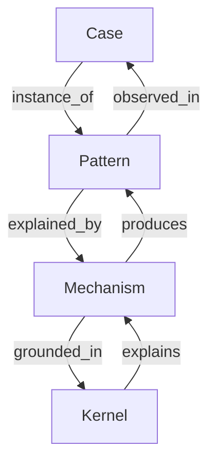
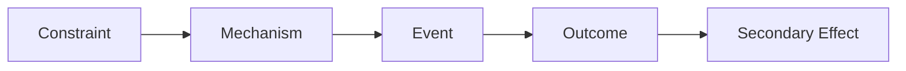
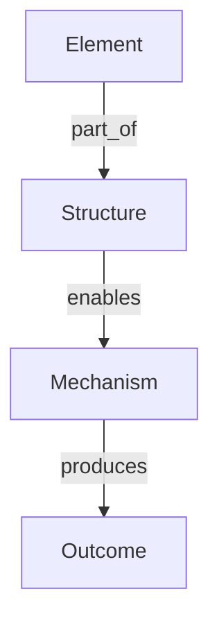
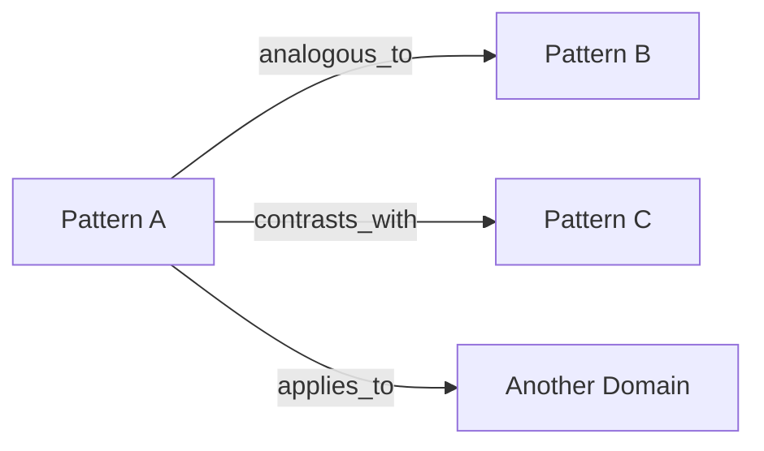
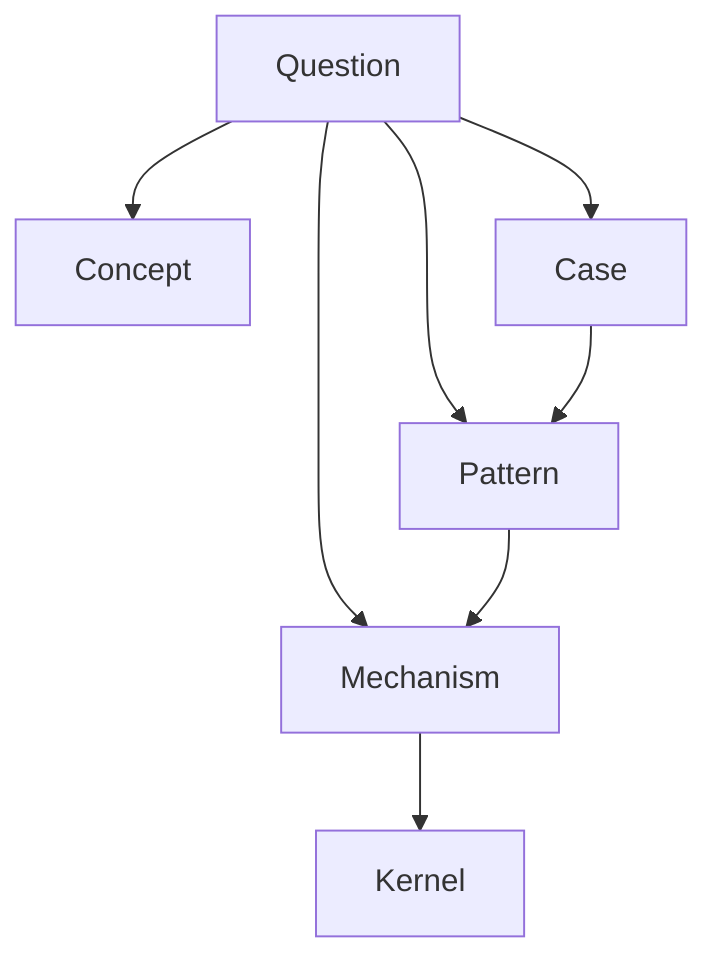
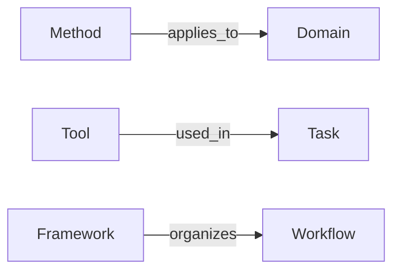

# Traversal

Traversal は、Knowledge Graph において  
**どのノードからどのノードへ、どの順序と規則で辿るか** を定義する構造である。

Knowledge Graph が存在しても、Traversal が設計されていなければ、  
知識は「つながっているだけ」で終わる。  
逆に Traversal が明確であれば、Graph は検索補助を超えて、  
**推論・比較・抽象化・設計** の基盤として機能する。

Node Type が「何があるか」を定め、  
Edge Type が「どうつながるか」を定めるなら、  
Traversal は「どう辿るか」を定める。

---

# 定義

Traversal とは、  
Knowledge Graph 上で知識ノードを**意味のある順路で移動するための探索構造**である。

単なるグラフ探索ではなく、次のような知的目的に応じて経路を選ぶ。

- 具体から抽象へ上がる
- 抽象から具体へ降りる
- 原因から結果へ辿る
- 結果から原因へ戻る
- 類似事例へ横断する
- 問いから説明候補へ絞る
- 方法から適用領域へ接続する

Traversal の目的は次の通りである。

1. Graph の探索方向を定義する  
2. 問いに応じた経路を選択できるようにする  
3. 無関係なノードへの拡散を防ぐ  
4. reasoning path を再現可能にする  
5. LLM の retrieval と explanation を安定させる  

---

# なぜ必要か

Knowledge Graph が大きくなると、問題は「情報不足」ではなく  
**探索の迷子** になることである。

典型的には次のような崩れ方をする。

1. 近い単語ばかり拾って本質に届かない  
2. 具体事例から抽象へ上がれない  
3. 抽象概念が具体に降りない  
4. 因果と類似を混同する  
5. 枝分かれしすぎて結論に辿り着かない  
6. 毎回違う経路を辿って回答が揺れる  

Traversal はこれを防ぐ。  
つまり Traversal は、Knowledge Graph を  
**歩ける地図** にするための構造である。

---

# 全体構造

```mermaid
graph TD

    A[Traversal] --> B[Vertical Traversal]
    A --> C[Causal Traversal]
    A --> D[Structural Traversal]
    A --> E[Lateral Traversal]
    A --> F[Question Driven Traversal]
    A --> G[Operational Traversal]
    A --> H[Meta Traversal]

    B --> B1[Abstract Upward]
    B --> B2[Concrete Downward]

    C --> C1[Cause to Result]
    C --> C2[Result to Cause]
    C --> C3[Condition Trace]

    D --> D1[Part to Whole]
    D --> D2[Whole to Part]
    D --> D3[Mechanism in Structure]

    E --> E1[Analogy Jump]
    E --> E2[Contrast Jump]
    E --> E3[Cross Domain Jump]

    F --> F1[Question to Concept]
    F --> F2[Question to Pattern]
    F --> F3[Question to Mechanism]
    F --> F4[Question to Case]

    G --> G1[Method to Domain]
    G --> G2[Tool to Task]
    G --> G3[Framework to Workflow]

    H --> H1[Hub Guided Traversal]
    H --> H2[Schema Guided Traversal]
    H --> H3[Maintenance Traversal]
```

---

# Traversal の基本原則

## 1. 探索には目的がある
Traversal は「何でも多く辿る」ことではない。  
問いに応じて最短で意味のある経路を選ぶことが重要である。

## 2. Edge Type に従って進む
Traversal は Node の近さではなく、  
**関係の型** に従って進む。

## 3. 抽象と具体を往復できることが重要
上がるだけでも、降りるだけでも不十分。  
往復可能性が Graph の質を決める。

## 4. 深く掘る方向と広げる方向を分ける
原因探索のように深く掘る動きと、  
類似事例を広げる動きは別である。

## 5. Traversal は止まる条件が必要
どこで探索を打ち切るかがないと、  
Graph は連想ゲームになる。

---

# Traversal の大分類

## 1. Vertical Traversal
抽象と具体のあいだを上下する探索。

## 2. Causal Traversal
原因と結果の連鎖を辿る探索。

## 3. Structural Traversal
部分と全体、配置と作動の関係を辿る探索。

## 4. Lateral Traversal
類似・対比・分野横断によって横に移る探索。

## 5. Question Driven Traversal
問いを起点に、答え候補へ絞っていく探索。

## 6. Operational Traversal
Method, Tool, Framework を実務や task に接続する探索。

## 7. Meta Traversal
Hub, Schema, Rule を使って Graph の歩き方自体を制御する探索。

---

# 1. Vertical Traversal

Vertical Traversal は、  
**具体から抽象へ上がる**、または  
**抽象から具体へ降りる** 探索である。

Knowledge Graph の中核はこの往復にある。

---

## 1-1. Abstract Upward

具体事例から上位の pattern / mechanism / kernel へ上がる。

典型経路:

- Case → Pattern
- Event → Pattern
- Pattern → Mechanism
- Mechanism → Kernel
- Concept → Kernel

例:
- 韓国併合
- 植民地化パターン
- 非対称支配メカニズム
- 権力偏在原理

用途:
- 事例の一般化
- 本質把握
- 理論化
- case の意味づけ

---

## 1-2. Concrete Downward

抽象概念や原理から、具体的事例や適用先へ降りる。

典型経路:

- Kernel → Mechanism
- Mechanism → Pattern
- Pattern → Case
- Model → Domain Case
- Concept → Example

例:
- 限定合理性
- 判断短絡メカニズム
- 誤判断パターン
- 就活時の企業選択失敗事例

用途:
- 抽象概念の理解
- 教材化
- 実務適用
- 例示

---

# Vertical Traversal の図

---

# 2. Causal Traversal

Causal Traversal は、  
原因と結果の流れを辿る探索である。

これは problem solving、historical analysis、organizational diagnosis で特に重要。

---

## 2-1. Cause to Result

原因から結果へ順方向に辿る。

典型経路:

- Constraint → Mechanism
- Mechanism → Event
- Event → Outcome
- Outcome → Secondary Effect

例:
- 情報非対称
- 逆選択
- 品質の悪い候補の流入
- 市場の信頼低下

用途:
- 将来予測
- 影響分析
- 施策の副作用確認
- シナリオ設計

---

## 2-2. Result to Cause

結果から原因へ逆向きに辿る。

典型経路:

- Failure → caused_by Mechanism
- Mechanism → caused_by Structure
- Structure → caused_by Constraint / Incentive

例:
- 意思決定遅延
- 承認多段化
- 責任分散
- リスク回避文化

用途:
- root cause analysis
- 診断
- なぜなぜ分析の補強
- 問題特定

---

## 2-3. Condition Trace

直接原因ではなく、成立条件や制約条件を辿る。

典型経路:

- Outcome → enabled_by Condition
- Mechanism → operates_in Structure
- Action → constrained_by Resource / Rule

例:
- 同調形成
- 集団可視性
- 共通規範
- 異論コストの高さ

用途:
- 「なぜ可能だったか」を見る
- 単純因果では拾えない背景条件を拾う
- 制度設計に使う

---

# Causal Traversal の図

---

# 3. Structural Traversal

Structural Traversal は、  
要素の配置、階層、部分全体、作動場所を辿る探索である。

Mechanism だけを見ると「動き」は分かるが、  
**どの配置だからそう動くか** が見えなくなる。  
Structural Traversal はそれを補う。

---

## 3-1. Part to Whole

部分から全体へ上がる。

典型経路:

- Step → Process
- Element → Structure
- Unit → System

例:
- 承認段階
- 多段承認構造
- 意思決定体制

用途:
- 全体像把握
- ボトルネックの位置確認
- 部分最適の発見

---

## 3-2. Whole to Part

全体から構成要素へ降りる。

典型経路:

- Structure → has_part Element
- System → has_part Unit
- Process → has_part Step

例:
- 総力戦体制
- 動員装置
- 情報統制機構
- 正統化装置

用途:
- 分解
- 設計
- チェックリスト化
- 欠落要素の確認

---

## 3-3. Mechanism in Structure

Mechanism がどの構造で作動するかを辿る。

典型経路:

- Mechanism → operates_in Structure
- Structure → enables Mechanism
- Structure → constrains Action

例:
- 責任分散
- 多段委任構造
- 承認責任の曖昧化

用途:
- 個人原因論の修正
- 組織問題の構造理解
- 再設計ポイントの特定

---

# Structural Traversal の図

---

# 4. Lateral Traversal

Lateral Traversal は、  
同じ抽象度の別ノードへ横移動する探索である。

これは発想の転用や、分野横断理解に不可欠。

---

## 4-1. Analogy Jump

類似構造を持つ別ノードへ飛ぶ。

典型経路:

- Pattern ↔ analogous_to Pattern
- Structure ↔ analogous_to Structure
- Case ↔ analogous_to Case

例:
- fandom 炎上
- 宗教的異端審問
- 規範逸脱者の可視化と排除

用途:
- 異分野比較
- 新しい見方の獲得
- 抽象化の確認

---

## 4-2. Contrast Jump

対比ノードへ飛ぶ。

典型経路:

- Concept ↔ contrasts_with Concept
- Pattern ↔ contrasts_with Pattern
- Strategy ↔ contrasts_with Strategy

例:
- 正統性 ↔ 強制
- 協力均衡 ↔ 裏切り均衡
- 分散型意思決定 ↔ 集中型意思決定

用途:
- 概念明確化
- 境界理解
- 誤認防止

---

## 4-3. Cross Domain Jump

別分野の適用先へ移動する。

典型経路:

- Mechanism → applies_to Domain
- Method → applies_to Domain
- Model → applies_to New Domain

例:
- シグナリング
- 就活市場
- 観光レビュー市場
- 政治的支持形成

用途:
- 横断知
- 応用設計
- domain OS の構築

---

# Lateral Traversal の図

---

# 5. Question Driven Traversal

Question Driven Traversal は、  
問いを起点に必要なノード群へ到達する探索である。

これは LLM にとって特に重要で、  
「何を答えるべきか」に応じて経路が変わる。

---

## 5-1. Question to Concept

問いの語彙や意味領域を特定する。

例:
- 植民地化とは何か
- 正統性とは何か
- 合理性とは何か

典型経路:

- Question → Concept
- Concept → contrasts_with Other Concept
- Concept → is_a Higher Concept

用途:
- 用語定義
- 概念整理
- 前提確認

---

## 5-2. Question to Pattern

問いが「よくある型か」を探る。

例:
- なぜまた炎上したのか
- なぜ組織が責任回避するのか

典型経路:

- Question → Pattern
- Pattern → Case Cluster
- Pattern → Mechanism

用途:
- 類例探索
- 再発理解
- 予測

---

## 5-3. Question to Mechanism

問いに対して「どう作用したか」を探る。

例:
- なぜ判断を誤ったのか
- なぜ集団が暴走したのか

典型経路:

- Question → Mechanism
- Mechanism → Kernel
- Mechanism → Structure

用途:
- 説明
- 介入点発見
- 問題解決

---

## 5-4. Question to Case

問いに対して具体例を探す。

例:
- その原理はどこに現れたか
- 類似事例は何か

典型経路:

- Question → Case
- Case → Pattern
- Case → Actor / Event

用途:
- 例示
- 歴史比較
- ケースベース reasoning

---

# Question Driven Traversal の図

---

# 6. Operational Traversal

Operational Traversal は、  
知識を実務・分析・設計・記録へつなぐ探索である。

Graph が思想や理解に留まらず、  
行動や作業に接続されるために必要。

---

## 6-1. Method to Domain

分析方法を適用先に接続する。

例:
- power mapping → 組織分析
- causal chain analysis → 事故分析
- comparative analysis → 歴史研究

用途:
- 適切な分析法選択
- method の使い分け

---

## 6-2. Tool to Task

Tool を具体作業へ接続する。

例:
- case template → 事例記述
- 観察シート → 現場記録
- 比較表 → 事例比較

用途:
- 即実行
- 作業の標準化
- LLM 出力テンプレ化

---

## 6-3. Framework to Workflow

Framework を実務プロセスへ接続する。

例:
- 観察→仮説→検証フレーム
- inquiry→reasoning→decision→solution design

用途:
- thinking engine 設計
- 業務OS構築
- step の可視化

---

# Operational Traversal の図

---

# 7. Meta Traversal

Meta Traversal は、  
Hub, Schema, Rule を使って探索自体を整理する探索である。

Graph が大きくなるほど、直接ノード探索だけでは不安定になる。  
そのため中継点として Meta Node が必要になる。

---

## 7-1. Hub Guided Traversal

Hub を経由して中距離探索を行う。

例:
- Human Model Hub
- Social Pattern Hub
- Knowledge Graph Hub

用途:
- 初学者の導線
- 関連群の把握
- 重要ノードへの到達

---

## 7-2. Schema Guided Traversal

Node Type, Edge Type, Rule に従って探索する。

用途:
- ノート作成判断
- relation の選定
- graph 品質維持

---

## 7-3. Maintenance Traversal

重複・孤立・弱リンクを点検する探索。

用途:
- Duplicate node の統合
- 孤立 case の昇格
- outdated link の修正

---

# 停止条件

Traversal には停止条件が必要である。  
止まらない探索は reasoning を壊す。

---

## 1. 十分な説明に達した
問いに対して、Kernel / Mechanism / Case が揃ったら一旦止める。

## 2. 新規情報が増えなくなった
同じようなノードばかり出てきたら打ち切る。

## 3. 問いから離れ始めた
類比や関連が広がりすぎ、問いとの距離が増えたら止める。

## 4. 必要な抽象度に達した
用語定義が目的なら Concept で止める。  
介入設計が目的なら Mechanism / Structure まで行く。

## 5. 実務に必要な出力形式に届いた
Method / Tool / Framework まで接続できたら止める。

---

# Traversal の典型パターン

## 1. 事例理解型
Case → Pattern → Mechanism → Kernel

## 2. 例示型
Concept → Pattern → Case

## 3. 診断型
Outcome → caused_by Mechanism → Structure → Constraint

## 4. 比較型
Case A → Pattern → analogous_to Pattern B → Case B

## 5. 定義型
Question → Concept → contrasts_with Related Concept

## 6. 実装型
Question → Method → Tool → Task

---

# Traversal の典型テンプレート

## 1. Why 系
「なぜXなのか」

推奨経路:
- Question → Outcome
- Outcome → caused_by Mechanism
- Mechanism → operates_in Structure
- Mechanism → grounded_in Kernel

---

## 2. What is 系
「Xとは何か」

推奨経路:
- Question → Concept
- Concept → is_a Higher Concept
- Concept → contrasts_with Neighbor Concept
- Concept → Case Example

---

## 3. How 系
「どうやってXが起きるか」

推奨経路:
- Question → Mechanism
- Mechanism → Step / Process
- Mechanism → operates_in Structure
- Mechanism → produces Pattern

---

## 4. Where else 系
「それは他にどこで見られるか」

推奨経路:
- Concept / Pattern → analogous_to Other Pattern
- Pattern → applies_to Other Domain
- Pattern → Case Cluster

---

## 5. What to do 系
「どう対処するか」

推奨経路:
- Problem → caused_by Mechanism
- Mechanism → constrains / enables
- Method → applies_to Problem Domain
- Tool → used_in Intervention Task

---

# Traversal の誤り

## 1. 近い単語だけで辿る
semantic similarity だけに頼ると、  
概念近接はあっても reasoning として弱い。

## 2. 何でも上位概念へ上がる
抽象化は便利だが、具体を失うと空論になる。

## 3. 何でも類比で飛ぶ
analogous_to は強力だが、飛びすぎると問いから逸脱する。

## 4. 因果と説明を混同する
explains を causes 扱いすると誤診断が増える。

## 5. 停止条件がない
Graph 全体を歩こうとすると、結論が遅れ、精度も落ちる。

---

# 良い Traversal の条件

## 1. 問いに応じて経路が選ばれている
## 2. Edge Type に従って移動している
## 3. 抽象と具体の往復ができる
## 4. 不要な拡散を抑えている
## 5. reasoning path を再記述できる

---

# LLM にとっての意味

Traversal が明確だと、LLM は

- 関連ノートを闇雲に集めるのでなく
- 問いに応じた探索順を持ち
- 抽象化と具体化を制御し
- 因果と類似を分けて辿り
- 説明経路を文章化しやすくなる

つまり Traversal は、  
LLM に「何を参照するか」だけでなく  
**どう考えるかの順路** を与える。

---

# この Vault における実装方針

本文や Hub に、Traversal の典型経路を明記しておくとよい。

記述例:

- この問いは **Question → Mechanism → Structure → Constraint** の順で辿る
- この case は **Case → Pattern → Mechanism → Kernel** で抽象化する
- この概念は **Concept → contrasts_with → Concept → Case** で輪郭化する

また、Hub に「読む順序」を書くことで、  
Hub Guided Traversal が機能する。

---

# 他ノートとの接続

## 上位
- [[Knowledge Graph]]

## 近接
- [[02_zettelkasten/04_meta/knowledge_graph/Node Type]]
- [[02_zettelkasten/04_meta/knowledge_graph/Edge Type]]
- [[Graph Maintenance]]
- [[02_zettelkasten/04_knowledge_graph/Reasoning Path]]
- [[Hub Design Rule]]

## 下位候補
- [[Abstract Upward Traversal]]
- [[Concrete Downward Traversal]]
- [[Causal Traversal]]
- [[Question Driven Traversal]]
- [[Operational Traversal]]

---

# まとめ

Traversal は、Knowledge Graph において  
ノード間を**意味ある順序で辿るための探索構造**である。

Traversal が整うことで、

- Graph が歩けるようになる
- 抽象と具体を往復できる
- 問いに応じた探索ができる
- reasoning path を再現できる
- LLM の retrieval と explanation が安定する

Knowledge Graph が「知識の地図」だとすれば、  
Traversal は「その地図の歩き方」である。
