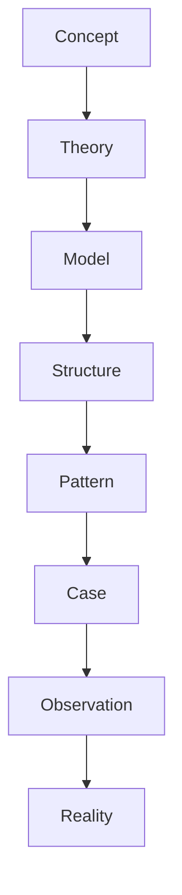
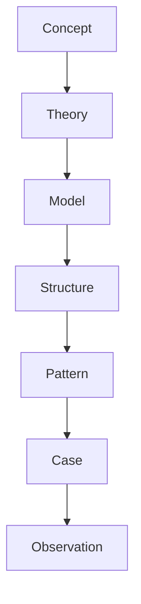
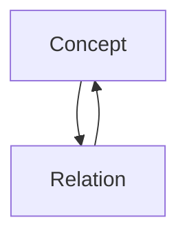
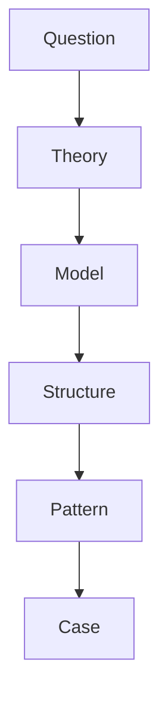

# Ontology

Ontology は Vault における知識の存在論を定義する。  
すべてのノートは Ontology に定義された型に属する。

Ontology は

- Concept Graph
- Theory
- Model
- Structure
- Pattern
- Case

の関係を統一する。

---

# Knowledge Ontology

---

# Layer Definitions

## Concept

世界を記述する基本語彙。

例

- Human
- Power
- Institution
- Decision

Concept は Vault の語彙体系である。

---

## Theory

複数の Concept 関係を説明する一般仮説。

例

- Limited Rationality Theory
- Institutional Theory
- Power Concentration Theory

---

## Model

Theory を形式化した分析モデル。

例

- Expected Value Model
- Bureaucracy Model
- Network Model

---

## Structure

関係配置またはシステム構造。

例

- Hierarchy
- Network
- Market
- Bureaucracy

---

## Pattern

繰り返し観測される現象。

例

- Conformity
- Bureaucratic delay
- Power concentration

---

## Case

具体事例。

例

- French Revolution
- Microsoft
- Tokugawa Shogunate

---

## Observation

観測された事実。

例

- 発言
- 行動
- 数値
- 記録

---

## Reality

Vault 外部の現実世界。

---

# Ontology Relations

---

# Layer Roles

| Layer | Role |
|------|------|
Concept | 語彙 |
Theory | 説明 |
Model | 形式化 |
Structure | メカニズム |
Pattern | 再現現象 |
Case | 実例 |
Observation | 記録 |
Reality | 現実 |

---

# Ontology Design Principles

1. 上位層ほど抽象度が高い  
2. 下位層ほど具体的  
3. Theory は Model を含む  
4. Pattern は Structure の現れ  
5. Case は Pattern の実例  

---

# Relation to Concept Graph

Concept Graph は Ontology の上で構築される。

---

# Relation to Reasoning

推論は Ontology を上から下へ辿る。

---

# 関連ノート

[[99_oldzettelkasten/Concept Hub]]

[[02_zettelkasten/04_meta/ontology/Concept Types]]

[[99_oldzettelkasten/04_knowledge_graph/Relation Types]]

[[Causal Relations]]