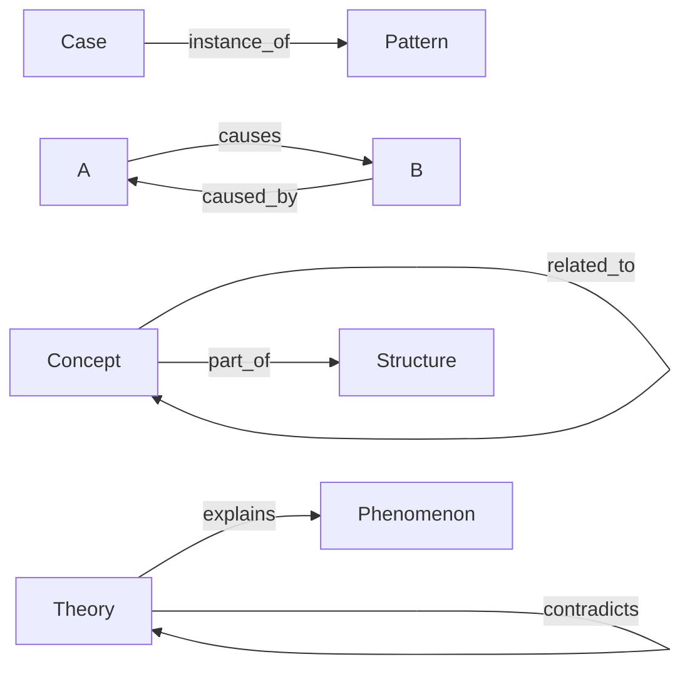

# Relation Ontology

Vaultのノートは単なるリンクではなく  
**意味付き関係（Relation）**で接続する。

これによりVaultは

Knowledge Graph  
として機能する。

---

# Relation Types

Vaultで使用するRelationは以下の10種類。

| relation | 意味 |
|---|---|
|is_a | 上位概念 |
|part_of | 構成要素 |
|instance_of | 具体例 |
|derived_from | 派生 |
|causes | 原因 |
|caused_by | 原因 |
|explains | 説明 |
|analogous_to | 類似 |
|contradicts | 矛盾 |
|related_to | 一般関連 |

---

# 1 is_a

上位概念との関係。

例

社会的証明  
is_a  
社会心理メカニズム

---

# 2 part_of

構造の構成要素。

例

注意資源制約  
part_of  
限定合理性

---

# 3 instance_of

具体例。

例

エムス電報事件  
instance_of  
引き金事件

---

# 4 derived_from

派生概念。

例

プロスペクト理論  
derived_from  
期待効用理論

---

# 5 causes

原因。

例

情報非対称  
causes  
逆選択

---

# 6 caused_by

原因の逆。

例

逆選択  
caused_by  
情報非対称

---

# 7 explains

説明関係。

例

プロスペクト理論  
explains  
リスク回避行動

---

# 8 analogous_to

類似。

例

都市交通ネットワーク  
analogous_to  
血管ネットワーク

---

# 9 contradicts

矛盾。

例

合理的選択理論  
contradicts  
プロスペクト理論

---

# 10 related_to

弱い関連。

例

写真フィールドワーク  
related_to  
都市観察

---

# Relation Usage Rule

原則

強い関係を優先する。

順序

1  
is_a

2  
part_of

3  
instance_of

4  
derived_from

5  
causal

6  
explanatory

7  
analogy

8  
weak relation

---

# Relation Graph



---

# Design Philosophy

Vaultは

知識のリストではない。

**知識グラフである。**

```
concept
↓
mechanism
↓
pattern
↓
case
```

すべてのノードは  
Relationで接続される。