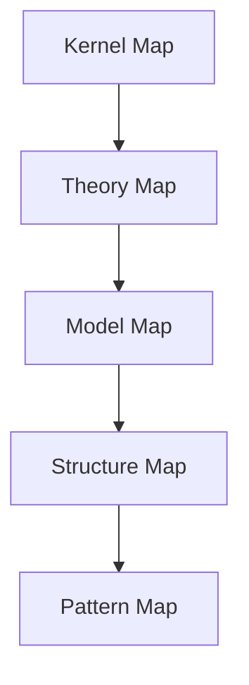

# Semantic Compression Hub

Semantic Compression はVault全体の知識をAIが理解しやすい形に圧縮する層である。

目的

- LLM推論高速化
- コンテキスト節約
- 知識骨格の提示

---

# 圧縮階層

---

# 圧縮ノート

- [[Kernel Map]]
- [[Theory Map]]
- [[Model Map]]
- [[Structure Map]]
- [[Pattern Map]]
- [[Reasoning Map]]