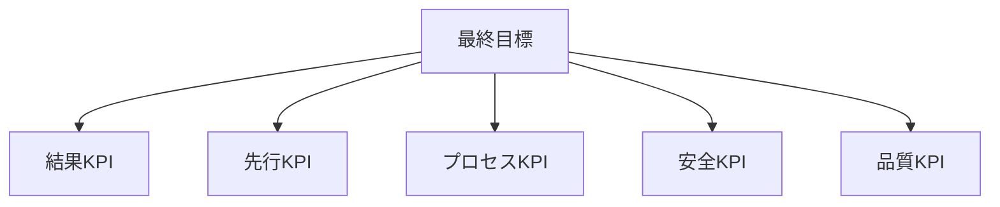

---  
layer: note  
folder: thinking_engine/solution_design  
status: stable  
updated: 2026-03-14  

---  
  
# KPI設計  
  
KPI設計とは、解決策が継続的に機能しているかを監視するための指標体系を作ることである。  
  
重要なのは、結果指標だけでなく、先行指標、プロセス指標、安全指標、品質指標も合わせて持つことである。    
結果だけを見ていると、問題が顕在化したときにはすでに手遅れになりやすい。  
  
---  
  
## 役割  
  
- 継続監視の軸を作る  
- 異常を早期に捉える  
- 実行プロセスの詰まりを見つける  
- 成果だけでなく健全性も監視する  
- 撤退や拡張の判断材料を供給する  
  
---  
  
## 指標の層  
  
- 結果指標  
- 先行指標  
- プロセス指標  
- 安全指標  
- 品質指標  
  
---  
  
## 基本構造  
  

---

## テンプレート

- 最終目標:    
- 結果KPI:    
- 先行KPI:    
- プロセスKPI:    
- 安全KPI:    
- 品質KPI:    
- 測定頻度:    
- 取得方法:    
- 責任者:    
- 閾値:    
- 見直し条件:    

---

## 注意点

- 測りやすいものだけを追わない    
- KPI のゲーム化に注意する    
- 取得コストが高すぎる指標を増やしすぎない    
- 一つの数値に全てを背負わせない