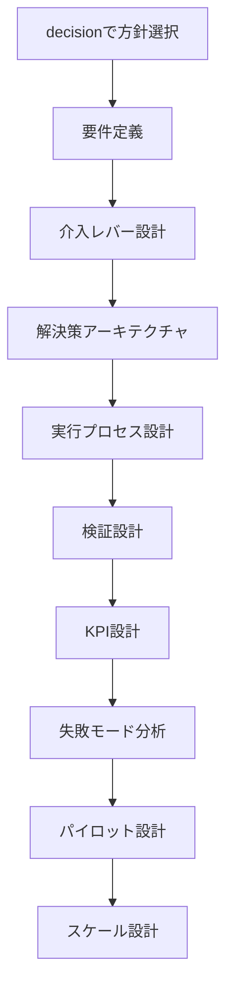

  
# Solution Design Hub  
# Solution Design

## 0. 目的
Problemに対して、structureとmechanismを操作し、
再利用可能なsolution（構造変換オペレーター）を生成する

---

## 1. 全体フロー

1. Problem
2. Structure特定
3. 歪み検出
4. Mechanism特定
5. Transformation設計
6. Solution生成
7. Decisionへ渡す

---

## 2. Step1: Structure特定

### 2.1 対象構造
- 人（人員 / スキル / 配置）
- 物（設備 / 資産）
- 金（収益 / コスト）
- 情報（可視性 / 非対称）
- 制度（ルール / 契約）
- ネットワーク（接続 / 関係）

### 2.2 出力
- 現状構造（As-Is）
- 理想構造（To-Be）

---

## 3. Step2: 歪み検出（Distortion Detection）

### 3.1 歪みタイプ辞書

- 不足（shortage）
- 過剰（excess）
- 偏在（imbalance）
- 断絶（disconnection）
- 過密（congestion）
- 非対称（asymmetry）
- ロックイン（lock-in）
- フィードバック暴走

### 3.2 出力
- 歪みの種類
- 発生箇所
- 強度

---

## 4. Step3: Mechanism特定

### 4.1 使用するmechanism

- フィードバック
- 非線形性
- ネットワーク
- 競争 / 協力
- 情報非対称
- ロックイン / 経路依存
- 適応 / 学習

### 4.2 出力
- 主因mechanism
- 補助mechanism

---

## 5. Step4: Transformation設計（中核）

### 5.1 Transformation Types

- 削減（reduce）
- 強化（increase）
- 再配線（rewire）
- 分離（separate）
- 集約（aggregate）
- 制約（constrain）
- 可視化（visualize）
- フィルタ（filter）

### 5.2 選択ロジック

歪み → Transformation

- 過剰 → 削減 / 制約
- 不足 → 強化
- 非対称 → 可視化
- 断絶 → 再配線
- ロックイン → 分離 or 再配線

### 5.3 出力
- 適用Transformation
- 作用対象

---

## 6. Step5: Solution生成

### 6.1 Solution構造

Solution =  
「どの構造に」  
「どのTransformationを」  
「どのmechanismで適用するか」

---

### 6.2 フォーマット

- Concept:
- Pattern:
- Instance:

---

### 6.3 複数生成（重要）

最低3案出す

- 保守的案
- 中間案
- 攻めた案

---

## 7. Step6: 制約付与

### 7.1 制約タイプ

- コスト
- 人員
- 法規制
- 技術制約
- 社会受容性

### 7.2 出力
- 適用可能範囲
- 禁止領域

---

## 8. Step7: Decision Designへ接続

出力：
- Solution候補一覧
- 各solutionの構造変化
- 副作用

→ Decision Designに渡す

---

## 9. チェックリスト（人力用）

- [ ] structureを特定したか
- [ ] 歪みを言語化したか
- [ ] mechanismを特定したか
- [ ] Transformationを選んだか
- [ ] solutionを3案以上出したか
- [ ] 制約を明示したか
- [ ] decisionに渡せる形になっているか

---

## 10. よくある失敗

### ❌ いきなりsolutionを考える
→ structure/mechanismを飛ばしている

### ❌ 解決策が1つしかない
→ exploration不足

### ❌ 抽象化されていない
→再利用不可

### ❌ mechanism不在
→ なぜ効くか説明できない

---

## 11. 他ノートとの接続

- [[Structure Analysis]]
- [[Mechanism Library]]
- [[Transformation Types]]
- [[Solution Routing]]
- [[Evaluation Hub]]

---

## 12. 最小実行テンプレ（超簡易）

Problem:
Structure:
Distortion:
Mechanism:
Transformation:
Solution案:
  
---  
  
## decision との違い  
  
decision は「何を選ぶか」を扱う。  
solution_design は「選んだものをどう動かすか」を扱う。  
  
つまり、decision が方向を決め、solution_design が仕組みを作る。  
  
---  
  
## 下位ノート  
  
- [[要件定義]]  
- [[介入レバー設計]]  
- [[解決策アーキテクチャ]]  
- [[実行プロセス設計]]  
- [[検証設計]]  
- [[KPI設計]]  
- [[失敗モード分析]]  
- [[パイロット設計]]  
- [[スケール設計]]  
  
---  
  
## 基本原則  
  
1. 解決策を思いつきで終わらせない  
2. 要件と手段を混同しない  
3. 仕組み・主体・フロー・測定をセットで設計する  
4. 例外処理と失敗モードを先に見る  
5. 小さく試し、学んでから広げる  
6. 維持運用まで含めて考える  
  
---  
  
## Solution Designフロー  
  

---

## 典型出力

- 解決策の仕様    
- 実行フロー    
- 担当主体    
- 観測指標    
- 検証方法    
- 失敗時対応    
- 小規模試行案    
- 拡張条件